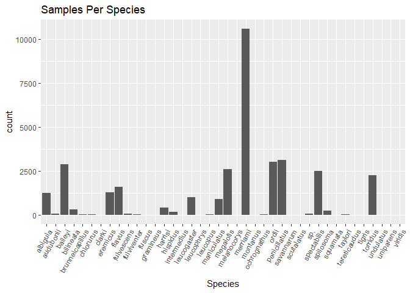
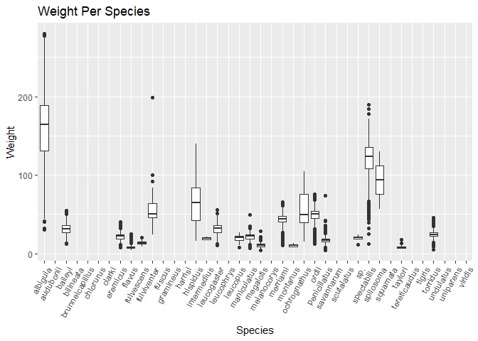
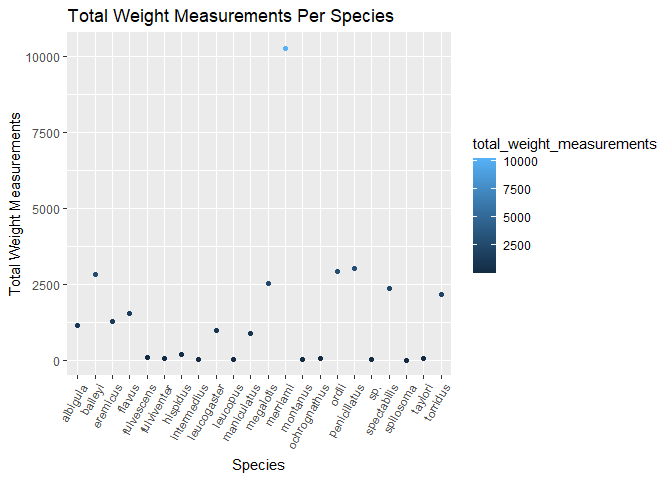
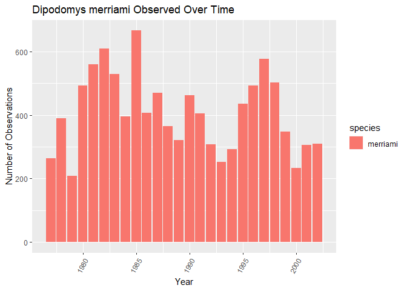
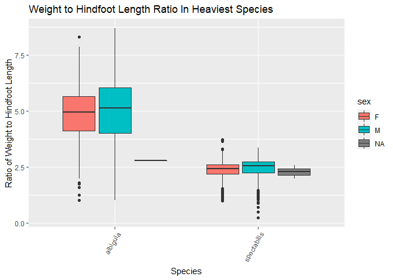

## Instructions
Answer the following questions and complete the exercises in RMarkdown. Please embed all of your code and push your final work to your repository. Your final lab report should be organized, clean, and run free from errors. Remember, you must remove the `#` for the included code chunks to run. Be sure to add your name to the author header above. For any included plots, make sure they are clearly labeled. You are free to use any plot type that you feel best communicates the results of your analysis.  

Make sure to use the formatting conventions of RMarkdown to make your report neat and clean!  

## Load the libraries

```r
library(tidyverse)
library(janitor)
library(here)
library(naniar)
```

## Desert Ecology
For this assignment, we are going to use a modified data set on [desert ecology](http://esapubs.org/archive/ecol/E090/118/). The data are from: S. K. Morgan Ernest, Thomas J. Valone, and James H. Brown. 2009. Long-term monitoring and experimental manipulation of a Chihuahuan Desert ecosystem near Portal, Arizona, USA. Ecology 90:1708.

```r
deserts <- read_csv(here("lab10", "data", "surveys_complete.csv"))
```

```
## 
## -- Column specification --------------------------------------------------------
## cols(
##   record_id = col_double(),
##   month = col_double(),
##   day = col_double(),
##   year = col_double(),
##   plot_id = col_double(),
##   species_id = col_character(),
##   sex = col_character(),
##   hindfoot_length = col_double(),
##   weight = col_double(),
##   genus = col_character(),
##   species = col_character(),
##   taxa = col_character(),
##   plot_type = col_character()
## )
```

1. Use the function(s) of your choice to get an idea of its structure, including how NA's are treated. Are the data tidy?  

```r
glimpse(deserts)
```

```
## Rows: 34,786
## Columns: 13
## $ record_id       <dbl> 1, 2, 3, 4, 5, 6, 7, 8, 9, 10, 11, 12, 13, 14, 15, ...
## $ month           <dbl> 7, 7, 7, 7, 7, 7, 7, 7, 7, 7, 7, 7, 7, 7, 7, 7, 7, ...
## $ day             <dbl> 16, 16, 16, 16, 16, 16, 16, 16, 16, 16, 16, 16, 16,...
## $ year            <dbl> 1977, 1977, 1977, 1977, 1977, 1977, 1977, 1977, 197...
## $ plot_id         <dbl> 2, 3, 2, 7, 3, 1, 2, 1, 1, 6, 5, 7, 3, 8, 6, 4, 3, ...
## $ species_id      <chr> "NL", "NL", "DM", "DM", "DM", "PF", "PE", "DM", "DM...
## $ sex             <chr> "M", "M", "F", "M", "M", "M", "F", "M", "F", "F", "...
## $ hindfoot_length <dbl> 32, 33, 37, 36, 35, 14, NA, 37, 34, 20, 53, 38, 35,...
## $ weight          <dbl> NA, NA, NA, NA, NA, NA, NA, NA, NA, NA, NA, NA, NA,...
## $ genus           <chr> "Neotoma", "Neotoma", "Dipodomys", "Dipodomys", "Di...
## $ species         <chr> "albigula", "albigula", "merriami", "merriami", "me...
## $ taxa            <chr> "Rodent", "Rodent", "Rodent", "Rodent", "Rodent", "...
## $ plot_type       <chr> "Control", "Long-term Krat Exclosure", "Control", "...
```
Using the glimpse() command, it appears NA's are only represented by "NA" and not values. We can then summarize the number of NA's in the data using the summarize() command, finding that there are 7,599 NA's present.

```r
deserts %>%
  summarize(number_nas = sum(is.na(deserts)))
```

```
## # A tibble: 1 x 1
##   number_nas
##        <int>
## 1       7599
```

```r
deserts %>%
  naniar::miss_var_summary()
```

```
## # A tibble: 13 x 3
##    variable        n_miss pct_miss
##    <chr>            <int>    <dbl>
##  1 hindfoot_length   3348     9.62
##  2 weight            2503     7.20
##  3 sex               1748     5.03
##  4 record_id            0     0   
##  5 month                0     0   
##  6 day                  0     0   
##  7 year                 0     0   
##  8 plot_id              0     0   
##  9 species_id           0     0   
## 10 genus                0     0   
## 11 species              0     0   
## 12 taxa                 0     0   
## 13 plot_type            0     0
```

```r
deserts
```

```
## # A tibble: 34,786 x 13
##    record_id month   day  year plot_id species_id sex   hindfoot_length weight
##        <dbl> <dbl> <dbl> <dbl>   <dbl> <chr>      <chr>           <dbl>  <dbl>
##  1         1     7    16  1977       2 NL         M                  32     NA
##  2         2     7    16  1977       3 NL         M                  33     NA
##  3         3     7    16  1977       2 DM         F                  37     NA
##  4         4     7    16  1977       7 DM         M                  36     NA
##  5         5     7    16  1977       3 DM         M                  35     NA
##  6         6     7    16  1977       1 PF         M                  14     NA
##  7         7     7    16  1977       2 PE         F                  NA     NA
##  8         8     7    16  1977       1 DM         M                  37     NA
##  9         9     7    16  1977       1 DM         F                  34     NA
## 10        10     7    16  1977       6 PF         F                  20     NA
## # ... with 34,776 more rows, and 4 more variables: genus <chr>, species <chr>,
## #   taxa <chr>, plot_type <chr>
```
The data appears tidy, following the three conventions of the tidyverse. Each variable has its own column, each observation has its own row, and each value has its own cell.


2. How many genera and species are represented in the data? What are the total number of observations? Which species is most/ least frequently sampled in the study?

```r
deserts %>%
  summarise(total_genus = n_distinct(genus, na.rm=T),
            total_species = n_distinct(species, na.rm=T),
            total_observations = n())
```

```
## # A tibble: 1 x 3
##   total_genus total_species total_observations
##         <int>         <int>              <int>
## 1          26            40              34786
```

```r
deserts %>%
  count(species) %>%
  arrange(desc(n))
```

```
## # A tibble: 40 x 2
##    species          n
##    <chr>        <int>
##  1 merriami     10596
##  2 penicillatus  3123
##  3 ordii         3027
##  4 baileyi       2891
##  5 megalotis     2609
##  6 spectabilis   2504
##  7 torridus      2249
##  8 flavus        1597
##  9 eremicus      1299
## 10 albigula      1252
## # ... with 30 more rows
```
Merriami is the most frequently sampled in the study with a total of 10,596 observations.

```r
deserts %>%
  count(species) %>%
  arrange(n)
```

```
## # A tibble: 40 x 2
##    species          n
##    <chr>        <int>
##  1 clarki           1
##  2 scutalatus       1
##  3 tereticaudus     1
##  4 tigris           1
##  5 uniparens        1
##  6 viridis          1
##  7 leucophrys       2
##  8 savannarum       2
##  9 fuscus           5
## 10 undulatus        5
## # ... with 30 more rows
```
Clarki, scultalatus, tereticaudus, tigris, uniparens, and viridis are the least frequently sampled species, all tying with a total of only 1 observation each.

The following bar graph is a visual representation of the observation counts per species.

```r
deserts %>%
  ggplot(aes(x=species)) +
  geom_bar() +
  theme(axis.text.x = element_text(angle = 60, hjust = 1)) +
  labs(title = "Samples Per Species", x="Species")
```

<!-- -->

3. What is the proportion of taxa included in this study? Show a table and plot that reflects this count.

```r
deserts %>%
  tabyl(taxa, na.rm=T)
```

```
##     taxa     n      percent
##     Bird   450 0.0129362387
##   Rabbit    75 0.0021560398
##  Reptile    14 0.0004024608
##   Rodent 34247 0.9845052607
```


```r
deserts %>%
  ggplot(aes(x=taxa, fill=taxa)) +
  geom_bar() +
  scale_y_log10() +
  theme(axis.text.x = element_text(angle = 60, hjust = 1)) +
  labs(title = "Counts Per Taxa", x="Taxa")
```

<!-- -->

4. For the taxa included in the study, use the fill option to show the proportion of individuals sampled by `plot_type.`

```r
deserts %>%
  ggplot(aes(x=taxa, fill=plot_type)) +
  geom_bar(position = "dodge") +
  scale_y_log10() +
  theme(axis.text.x = element_text(angle = 60, hjust = 1)) +
  labs(title = "Samples Per Taxa and Plot Type", x="Taxa")
```

<!-- -->

5. What is the range of weight for each species included in the study? Remove any observations of weight that are NA so they do not show up in the plot.

```r
deserts %>%
  group_by(species) %>%
  summarise(min_weight = min(weight, na.rm=T),
            max_weight = max(weight, na.rm=T),
            mean_weight = mean(weight, na.rm=T),
            median_weight = median(weight, na.rm=T),
            n=n())
```

```
## # A tibble: 40 x 6
##    species         min_weight max_weight mean_weight median_weight     n
##  * <chr>                <dbl>      <dbl>       <dbl>         <dbl> <int>
##  1 albigula                30        280      159.             164  1252
##  2 audubonii              Inf       -Inf      NaN               NA    75
##  3 baileyi                 12         55       31.7             31  2891
##  4 bilineata              Inf       -Inf      NaN               NA   303
##  5 brunneicapillus        Inf       -Inf      NaN               NA    50
##  6 chlorurus              Inf       -Inf      NaN               NA    39
##  7 clarki                 Inf       -Inf      NaN               NA     1
##  8 eremicus                 8         40       21.6             22  1299
##  9 flavus                   4         25        7.92             8  1597
## 10 fulvescens               9         20       13.4             13    75
## # ... with 30 more rows
```
The table above is a summary of weight ranges for each species. Since some species have no weights recorded at all, their minimum and maximum weights are represented by "Inf" and "-Inf". We can confirm that this is the case, by filtering for one of the species whose weight summaries are represented by "Inf" (for example: clarki) and select to view its recorded weights:

```r
deserts %>%
  filter(species=="clarki") %>%
  select(weight, species)
```

```
## # A tibble: 1 x 2
##   weight species
##    <dbl> <chr>  
## 1     NA clarki
```

```r
deserts %>%
  ggplot(aes(x=species, y=weight)) +
  geom_boxplot(na.rm=T) +
  theme(axis.text.x = element_text(angle = 60, hjust = 1)) +
  labs(title = "Weight Per Species", x="Species", y="Weight")
```

<!-- -->
<style>
div.blue { background-color:#e6f0ff; border-radius: 5px; padding: 20px;}
</style>
<div class = "blue">

6. Add another layer to your answer from #4 using `geom_point` to get an idea of how many measurements were taken for each species.

```r
deserts%>%
  filter(weight!="NA")%>%
  group_by(species) %>%
  summarise(total_weight_measurements = n_distinct(record_id))
```

```
## # A tibble: 22 x 2
##    species     total_weight_measurements
##  * <chr>                           <int>
##  1 albigula                         1152
##  2 baileyi                          2810
##  3 eremicus                         1260
##  4 flavus                           1548
##  5 fulvescens                         75
##  6 fulviventer                        41
##  7 hispidus                          172
##  8 intermedius                         8
##  9 leucogaster                       970
## 10 leucopus                           36
## # ... with 12 more rows
```

```r
deserts %>%
  filter(weight!="NA")%>%
  group_by(species)%>%
  summarise(total_weight_measurements = n_distinct(record_id)) %>%
  ggplot(aes(x=species, y=total_weight_measurements, color=total_weight_measurements)) +
  geom_point() + 
  theme(axis.text.x = element_text(angle = 60, hjust = 1)) +
  labs(title = "Total Weight Measurements Per Species", x="Species", y="Total Weight Measurements")
```

<!-- -->
</div>

7. [Dipodomys merriami](https://en.wikipedia.org/wiki/Merriam's_kangaroo_rat) is the most frequently sampled animal in the study. How have the number of observations of this species changed over the years included in the study?

```r
deserts %>%
  filter(species == "merriami") %>%
  count(species, year) %>%
  select(year, n)
```

```
## # A tibble: 26 x 2
##     year     n
##    <dbl> <int>
##  1  1977   264
##  2  1978   389
##  3  1979   209
##  4  1980   493
##  5  1981   559
##  6  1982   609
##  7  1983   528
##  8  1984   396
##  9  1985   667
## 10  1986   406
## # ... with 16 more rows
```

```r
deserts %>%
  filter(species == "merriami") %>%
  ggplot(aes(x=year, fill=species)) +
  geom_bar() +
  theme(axis.text.x = element_text(angle = 60, hjust = 1))+
  labs(title = "Dipodomys merriami Observed Over Time",x="Year",y="Number of Observations")
```

<!-- -->

8. What is the relationship between `weight` and `hindfoot` length? Consider whether or not over plotting is an issue.

```r
deserts %>%
  ggplot(aes(x=weight, y=hindfoot_length)) +
  geom_jitter(na.rm=T, size=0.25) +
  theme(axis.text.x = element_text(angle = 60, hjust = 1))+
  labs(title = "Weight Versus Hindfood Lenght",x="Weight",y="Hindfoot Length")
```

<!-- -->

There is no distinguishable relationship between the two variables due to over plotting.

9. Which two species have, on average, the highest weight? Once you have identified them, make a new column that is a ratio of `weight` to `hindfoot_length`. Make a plot that shows the range of this new ratio and fill by sex.

```r
deserts %>%
  group_by(species) %>%
  summarise(avg_weight = mean(weight, na.rm=T)) %>%
  arrange(desc(avg_weight))
```

```
## # A tibble: 40 x 2
##    species      avg_weight
##    <chr>             <dbl>
##  1 albigula          159. 
##  2 spectabilis       120. 
##  3 spilosoma          93.5
##  4 hispidus           65.6
##  5 fulviventer        58.9
##  6 ochrognathus       55.4
##  7 ordii              48.9
##  8 merriami           43.2
##  9 baileyi            31.7
## 10 leucogaster        31.6
## # ... with 30 more rows
```

```r
 deserts %>%
  filter(species == "albigula" | species == "spectabilis") %>%
  mutate(weight_to_hindfoot = (weight/hindfoot_length)) %>%
  ggplot(aes(x=species, y=weight_to_hindfoot, fill=sex)) +
  geom_boxplot(na.rm=T) +
  theme(axis.text.x = element_text(angle = 60, hjust = 1)) +
  labs(title = "Weight to Hindfoot Length Ratio In Heaviest Species", x="Species", y="Ratio of Weight to Hindfoot Length")
```

<!-- -->

10. Make one plot of your choice! Make sure to include at least two of the aesthetics options you have learned.
Below, I have compared the hindfoot lengths of males and females for each genus that had available data.

```r
deserts %>%
  filter(sex != "NA" & hindfoot_length != "NA") %>%
  group_by(genus, sex) %>%
  summarise(avg_hindfoot_length = mean(hindfoot_length),
            min_hf_length = min(hindfoot_length),
            max_hf_length = max(hindfoot_length),
            median_hf_length = median(hindfoot_length),
            n=n())
```

```
## # A tibble: 18 x 7
## # Groups:   genus [9]
##    genus sex   avg_hindfoot_le~ min_hf_length max_hf_length median_hf_length
##    <chr> <chr>            <dbl>         <dbl>         <dbl>            <dbl>
##  1 Baio~ F                 13.2             7            16               13
##  2 Baio~ M                 12.6             6            14               13
##  3 Chae~ F                 23.8            11            41               24
##  4 Chae~ M                 23.9             2            47               23
##  5 Dipo~ F                 37.9            16            64               36
##  6 Dipo~ M                 37.9            21            58               36
##  7 Neot~ F                 32.0            21            38               32
##  8 Neot~ M                 32.6            21            42               33
##  9 Onyc~ F                 20.3            13            50               20
## 10 Onyc~ M                 20.4            12            39               20
## 11 Pero~ F                 15.8             7            38               16
## 12 Pero~ M                 15.8             9            28               16
## 13 Pero~ F                 20.3            10            32               20
## 14 Pero~ M                 20.3            11            36               20
## 15 Reit~ F                 16.4             9            22               17
## 16 Reit~ M                 16.5             6            22               17
## 17 Sigm~ F                 27.9            15            36               28
## 18 Sigm~ M                 27.3            21            39               27
## # ... with 1 more variable: n <int>
```


```r
deserts %>%
  filter(sex != "NA" & hindfoot_length != "NA") %>%
  ggplot(aes(x=genus, y=hindfoot_length, fill=sex)) +
  geom_boxplot(size=0.75, na.rm=T) +
  theme(axis.text.x = element_text(angle = 60, hjust = 1))+
  labs(title = "Relationship between Sex and Average Hindfoot Length By Genus", x="Genus", y="Hindfoot Length")
```

<!-- -->

It appears, that given the data we have, males and females do not differ much in their hindfoot lengths in each genus.

## Push your final code to GitHub!
Please be sure that you check the `keep md` file in the knit preferences. 
