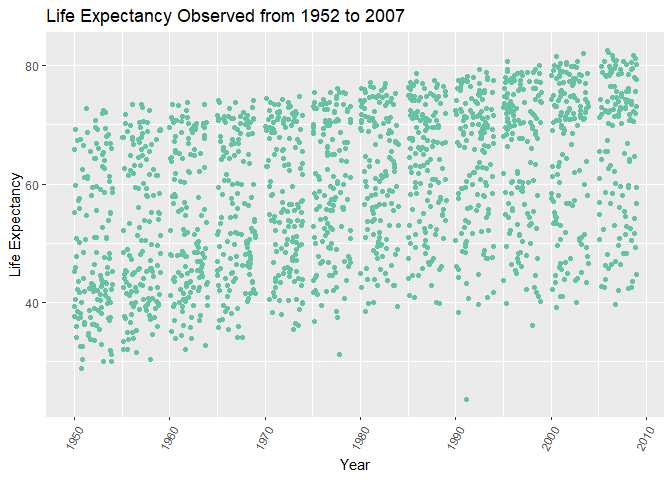
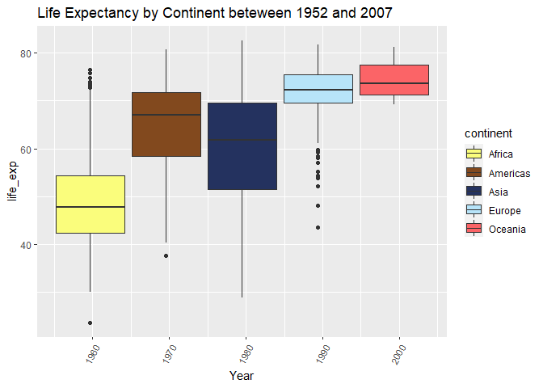
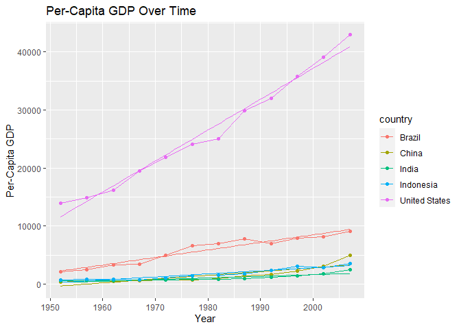
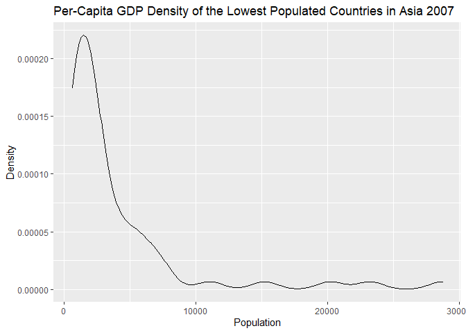
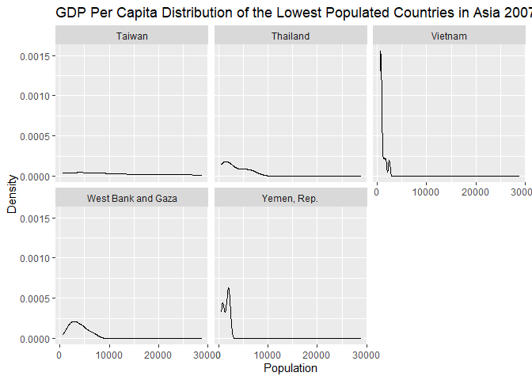

## Instructions
Answer the following questions and complete the exercises in RMarkdown. Please embed all of your code and push your final work to your repository. Your final lab report should be organized, clean, and run free from errors. Remember, you must remove the `#` for the included code chunks to run. Be sure to add your name to the author header above. For any included plots, make sure they are clearly labeled. You are free to use any plot type that you feel best communicates the results of your analysis.  

**In this homework, you should make use of the aesthetics you have learned. It's OK to be flashy!**

Make sure to use the formatting conventions of RMarkdown to make your report neat and clean!  

## Load the libraries

```r
library(tidyverse)
library(janitor)
library(here)
library(naniar)
library(RColorBrewer)
library(paletteer)
library(ggthemes)
library(wesanderson)
```


```r
library("ggsci")
library("ggplot2")
library("gridExtra")
```

```
## 
## Attaching package: 'gridExtra'
```

```
## The following object is masked from 'package:dplyr':
## 
##     combine
```

```r
data("diamonds")

p1 = ggplot(subset(diamonds, carat >= 2.2),
       aes(x = table, y = price, colour = cut)) +
  geom_point(alpha = 0.7) +
  geom_smooth(method = "loess", alpha = 0.05, size = 1, span = 1) +
  theme_bw()

p2 = ggplot(subset(diamonds, carat > 2.2 & depth > 55 & depth < 70),
       aes(x = depth, fill = cut)) +
  geom_histogram(colour = "black", binwidth = 1, position = "dodge") +
  theme_bw()
```

## Resources
The idea for this assignment came from [Rebecca Barter's](http://www.rebeccabarter.com/blog/2017-11-17-ggplot2_tutorial/) ggplot tutorial so if you get stuck this is a good place to have a look.  

## Gapminder
For this assignment, we are going to use the dataset [gapminder](https://cran.r-project.org/web/packages/gapminder/index.html). Gapminder includes information about economics, population, and life expectancy from countries all over the world. You will need to install it before use. This is the same data that we will use for midterm 2 so this is good practice.

```r
#install.packages("gapminder")
library("gapminder")
```

## Questions
The questions below are open-ended and have many possible solutions. Your approach should, where appropriate, include numerical summaries and visuals. Be creative; assume you are building an analysis that you would ultimately present to an audience of stakeholders. Feel free to try out different `geoms` if they more clearly present your results.  

**1. Use the function(s) of your choice to get an idea of the overall structure of the data frame, including its dimensions, column names, variable classes, etc. As part of this, determine how NA's are treated in the data.**  

```r
dim(gapminder)
```

```
## [1] 1704    6
```

```r
names(gapminder)
```

```
## [1] "country"   "continent" "year"      "lifeExp"   "pop"       "gdpPercap"
```

```r
summary(gapminder)
```

```
##         country        continent        year         lifeExp     
##  Afghanistan:  12   Africa  :624   Min.   :1952   Min.   :23.60  
##  Albania    :  12   Americas:300   1st Qu.:1966   1st Qu.:48.20  
##  Algeria    :  12   Asia    :396   Median :1980   Median :60.71  
##  Angola     :  12   Europe  :360   Mean   :1980   Mean   :59.47  
##  Argentina  :  12   Oceania : 24   3rd Qu.:1993   3rd Qu.:70.85  
##  Australia  :  12                  Max.   :2007   Max.   :82.60  
##  (Other)    :1632                                                
##       pop              gdpPercap       
##  Min.   :6.001e+04   Min.   :   241.2  
##  1st Qu.:2.794e+06   1st Qu.:  1202.1  
##  Median :7.024e+06   Median :  3531.8  
##  Mean   :2.960e+07   Mean   :  7215.3  
##  3rd Qu.:1.959e+07   3rd Qu.:  9325.5  
##  Max.   :1.319e+09   Max.   :113523.1  
## 
```

```r
glimpse(gapminder)
```

```
## Rows: 1,704
## Columns: 6
## $ country   <fct> Afghanistan, Afghanistan, Afghanistan, Afghanistan, Afghani…
## $ continent <fct> Asia, Asia, Asia, Asia, Asia, Asia, Asia, Asia, Asia, Asia,…
## $ year      <int> 1952, 1957, 1962, 1967, 1972, 1977, 1982, 1987, 1992, 1997,…
## $ lifeExp   <dbl> 28.801, 30.332, 31.997, 34.020, 36.088, 38.438, 39.854, 40.…
## $ pop       <int> 8425333, 9240934, 10267083, 11537966, 13079460, 14880372, 1…
## $ gdpPercap <dbl> 779.4453, 820.8530, 853.1007, 836.1971, 739.9811, 786.1134,…
```


```r
naniar::miss_var_summary(gapminder)
```

```
## # A tibble: 6 x 3
##   variable  n_miss pct_miss
##   <chr>      <int>    <dbl>
## 1 country        0        0
## 2 continent      0        0
## 3 year           0        0
## 4 lifeExp        0        0
## 5 pop            0        0
## 6 gdpPercap      0        0
```

```r
gapminder
```

```
## # A tibble: 1,704 x 6
##    country     continent  year lifeExp      pop gdpPercap
##    <fct>       <fct>     <int>   <dbl>    <int>     <dbl>
##  1 Afghanistan Asia       1952    28.8  8425333      779.
##  2 Afghanistan Asia       1957    30.3  9240934      821.
##  3 Afghanistan Asia       1962    32.0 10267083      853.
##  4 Afghanistan Asia       1967    34.0 11537966      836.
##  5 Afghanistan Asia       1972    36.1 13079460      740.
##  6 Afghanistan Asia       1977    38.4 14880372      786.
##  7 Afghanistan Asia       1982    39.9 12881816      978.
##  8 Afghanistan Asia       1987    40.8 13867957      852.
##  9 Afghanistan Asia       1992    41.7 16317921      649.
## 10 Afghanistan Asia       1997    41.8 22227415      635.
## # … with 1,694 more rows
```
After going through the data set, NA's do not appear to be represented by values. The naniar function did not find any NA's represented by "NA", so we can assume that this data is complete.

```r
gapminder <- janitor::clean_names(gapminder)
gapminder
```

```
## # A tibble: 1,704 x 6
##    country     continent  year life_exp      pop gdp_percap
##    <fct>       <fct>     <int>    <dbl>    <int>      <dbl>
##  1 Afghanistan Asia       1952     28.8  8425333       779.
##  2 Afghanistan Asia       1957     30.3  9240934       821.
##  3 Afghanistan Asia       1962     32.0 10267083       853.
##  4 Afghanistan Asia       1967     34.0 11537966       836.
##  5 Afghanistan Asia       1972     36.1 13079460       740.
##  6 Afghanistan Asia       1977     38.4 14880372       786.
##  7 Afghanistan Asia       1982     39.9 12881816       978.
##  8 Afghanistan Asia       1987     40.8 13867957       852.
##  9 Afghanistan Asia       1992     41.7 16317921       649.
## 10 Afghanistan Asia       1997     41.8 22227415       635.
## # … with 1,694 more rows
```

**2. Among the interesting variables in gapminder is life expectancy. How has global life expectancy changed between 1952 and 2007?**

```r
gapminder %>%
  ggplot(aes(x=year, y=life_exp, color="#D16103")) +
  geom_jitter() +
  scale_color_brewer(palette="Set2") +
  theme(axis.text.x = element_text(angle = 60, hjust = 1),
        legend.position = "NA") +
  labs(title = "Life Expectancy Observed from 1952 to 2007",x="Year",y="Life Expectancy")
```

<!-- -->

By plotting all observed life expectancies for each year, there appears to be a general trend of life expectancy increasing over time. We can also take a cleaner examination of the change in life expectancy over the years of 1952 to 2007 by observing the means of life expectancy in their respective year:


```r
life_exp_52_07 <- 
  gapminder %>%
  group_by(year) %>%
  summarise(life_exp_means = mean(life_exp))
```

```
## `summarise()` ungrouping output (override with `.groups` argument)
```

```r
life_exp_52_07
```

```
## # A tibble: 12 x 2
##     year life_exp_means
##    <int>          <dbl>
##  1  1952           49.1
##  2  1957           51.5
##  3  1962           53.6
##  4  1967           55.7
##  5  1972           57.6
##  6  1977           59.6
##  7  1982           61.5
##  8  1987           63.2
##  9  1992           64.2
## 10  1997           65.0
## 11  2002           65.7
## 12  2007           67.0
```

```r
life_exp_52_07 %>%
  ggplot(aes(x=year, y=life_exp_means, color=life_exp_means)) +
  geom_jitter(shape=8, size=3, color="#3C5488B2") +
  geom_line() +
  theme(axis.text.x = element_text(angle = 60, hjust = 1),
        legend.position="NA") +
  labs(title = "Life Expectancy Observed from 1952 to 2007",x="Year",y="Life Expectancy")
```

<!-- -->

**3. How do the distributions of life expectancy compare for the years 1952 and 2007?**


```r
gapminder %>%
  filter(year == "1952" | year == "2007") %>%
  group_by(year) %>%
  summarise(min_exp = min(life_exp),
            max_exp = max(life_exp),
            median_exp = median(life_exp),
            mean_exp = mean(life_exp),
            total_observations = n())
```

```
## `summarise()` ungrouping output (override with `.groups` argument)
```

```
## # A tibble: 2 x 6
##    year min_exp max_exp median_exp mean_exp total_observations
##   <int>   <dbl>   <dbl>      <dbl>    <dbl>              <int>
## 1  1952    28.8    72.7       45.1     49.1                142
## 2  2007    39.6    82.6       71.9     67.0                142
```

```r
gapminder %>%
  filter(year == "1952" | year == "2007") %>%
  ggplot(aes(x=year, y=life_exp, group=year, fill="#D16103")) +
  geom_boxplot() +
  theme(axis.text.x = element_text(angle = 60, hjust = 1),
        legend.position = "NA") +
  labs(title = "Life Expectancy Observed in 1952 and 2007",x="Year",y="Life Expectancy")
```

<!-- -->

**4. Your answer above doesn't tell the whole story since life expectancy varies by region. Make a summary that shows the min, mean, and max life expectancy by continent for all years represented in the data.**

```r
gapminder %>%
  group_by(continent, year) %>%
  summarise(min_exp = min(life_exp),
            max_exp = max(life_exp),
            mean_exp = mean(life_exp),
            total_observations = n())
```

```
## `summarise()` regrouping output by 'continent' (override with `.groups` argument)
```

```
## # A tibble: 60 x 6
## # Groups:   continent [5]
##    continent  year min_exp max_exp mean_exp total_observations
##    <fct>     <int>   <dbl>   <dbl>    <dbl>              <int>
##  1 Africa     1952    30      52.7     39.1                 52
##  2 Africa     1957    31.6    58.1     41.3                 52
##  3 Africa     1962    32.8    60.2     43.3                 52
##  4 Africa     1967    34.1    61.6     45.3                 52
##  5 Africa     1972    35.4    64.3     47.5                 52
##  6 Africa     1977    36.8    67.1     49.6                 52
##  7 Africa     1982    38.4    69.9     51.6                 52
##  8 Africa     1987    39.9    71.9     53.3                 52
##  9 Africa     1992    23.6    73.6     53.6                 52
## 10 Africa     1997    36.1    74.8     53.6                 52
## # … with 50 more rows
```

```r
gapminder%>%
  group_by(year, continent)%>%
  ggplot(aes(x=year,y=life_exp, fill=continent))+
  geom_boxplot()+
  scale_fill_rickandmorty(palette="schwifty") +
  theme(axis.text.x = element_text(angle = 60, hjust = 1))+
  labs(title = "Life Expectancy by Continent beteween 1952 and 2007",
       x = "Year")
```

<!-- -->

**5. How has life expectancy changed between 1952-2007 for each continent?**

```r
gapminder %>%
  group_by(continent, year) %>%
  filter(between(year, 1952, 2007)) %>%
  summarise(mean_exp = mean(life_exp)) %>%
  ggplot(aes(x=year, y=mean_exp)) +
  geom_line(color="yellow") +
  geom_point(shape=7, color="#3C5488B2") +
  facet_wrap(~continent)
```

```
## `summarise()` regrouping output by 'continent' (override with `.groups` argument)
```

<!-- -->
  
**6. We are interested in the relationship between per capita GDP and life expectancy; i.e. does having more money help you live longer?**

```r
gapminder %>%
  ggplot(aes(x=log10(gdp_percap), y=life_exp, color=continent, shape=continent)) +
  geom_point() + 
  scale_color_brewer(palette="Accent") +
  labs(title = "Life Expectancy Versus Per Capita GDP",x="Per Capita GDP",y="Life Expectancy")
```

<!-- -->

For most regions, it appears that there is a positive correlation between having more money and having a longer life expectancy. 


**7. Which countries have had the largest population growth since 1952?**

```r
gapminder %>%
  ggplot(aes(x=year, y=pop, color=country)) +
  geom_line() + 
  geom_smooth(method="lm", se=F, formula=y~x, size=0.5) +
  geom_point() +
  theme(legend.position="NA")
```

<!-- -->
I used the above plot to get an overview of the changes in population since 1952 for all countries, omitting the legend because it was too long and interfered with the space for the graph. Seeing that the two countries with the largest population growth had more than 250000000 people in 1952, I filtered for populations greater than that amount to created a new plot to specifically show and identify those two countries.

```r
gapminder %>%
  filter(pop>250000000) %>%
  ggplot(aes(x=year, y=pop, color=country)) +
  geom_line() + 
  geom_smooth(method="lm", se=F, formula=y~x, size=0.5) +
  geom_point() +
  labs(title = "Change in Population Over Time", x = "Year", y = "Population")
```

<!-- -->

China and India had the largest population growth since 1952.

**8. Use your results from the question above to plot population growth for the top five countries since 1952.**

```r
pop_change <- gapminder %>%
  group_by(country) %>%
  filter(year==2007|year==1952) %>%
  mutate(change_in_pop = pop - lag(pop, default = first(pop))) %>%
  arrange(desc(change_in_pop))
pop_change %>%
  select(country, change_in_pop)
```

```
## # A tibble: 284 x 2
## # Groups:   country [142]
##    country       change_in_pop
##    <fct>                 <int>
##  1 China             762419569
##  2 India             738396331
##  3 United States     143586947
##  4 Indonesia         141495000
##  5 Brazil            133408087
##  6 Pakistan          127924057
##  7 Bangladesh        103561480
##  8 Nigeria           101912068
##  9 Mexico             78556574
## 10 Philippines        68638596
## # … with 274 more rows
```

```r
gapminder %>%
  filter(country=="China" | country=="India" | country=="United States" | country=="Indonesia" | country=="Brazil") %>%
  ggplot(aes(x=year, y=pop, color=country)) +
  geom_line() + 
  geom_smooth(method="lm", se=F, formula=y~x, size=0.5) +
  geom_point() +
  labs(title = "Change in Population Over Time", x = "Year", y = "Population")
```

<!-- -->

**9. How does per-capita GDP growth compare between these same five countries?**

```r
gapminder %>%
  filter(country=="China" | country=="India" | country=="United States" | country=="Indonesia" | country=="Brazil") %>%
  ggplot(aes(x=year, y=gdp_percap, color=country)) +
  geom_line() + 
  geom_smooth(method="lm", se=F, formula=y~x, size=0.5) +
  geom_point() +
  labs(title = "Per-Capita GDP Over Time", x = "Year", y = "Per-Capita GDP")
```

<!-- -->

**10. Make one plot of your choice that uses faceting!**

```r
gapminder %>%
  filter(year==2007 & continent=="Asia") %>%
  arrange(pop) %>%
  top_n(5, country)
```

```
## # A tibble: 5 x 6
##   country            continent  year life_exp      pop gdp_percap
##   <fct>              <fct>     <int>    <dbl>    <int>      <dbl>
## 1 West Bank and Gaza Asia       2007     73.4  4018332      3025.
## 2 Yemen, Rep.        Asia       2007     62.7 22211743      2281.
## 3 Taiwan             Asia       2007     78.4 23174294     28718.
## 4 Thailand           Asia       2007     70.6 65068149      7458.
## 5 Vietnam            Asia       2007     74.2 85262356      2442.
```

```r
lowest_pops <- gapminder %>%
  filter(country=="West Bank and Gaza" | country=="Yemen, Rep." | country=="Taiwan" | country=="Thailand" | country=="Vietnam") %>%
  ggplot(aes(x=gdp_percap)) +
  geom_density() +
  labs(title="Per-Capita GDP Density of the Lowest Populated Countries in Asia 2007", x="Population", y="Density")
lowest_pops
```

<!-- -->

```r
lowest_pops+facet_wrap(~country)+
  labs(title="GDP Per Capita Distribution of the Lowest Populated Countries in Asia 2007")
```

<!-- -->

## Push your final code to GitHub!
Please be sure that you check the `keep md` file in the knit preferences. 
