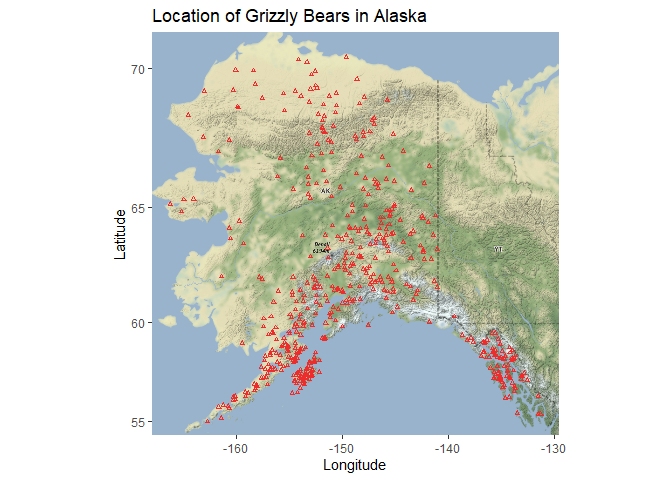
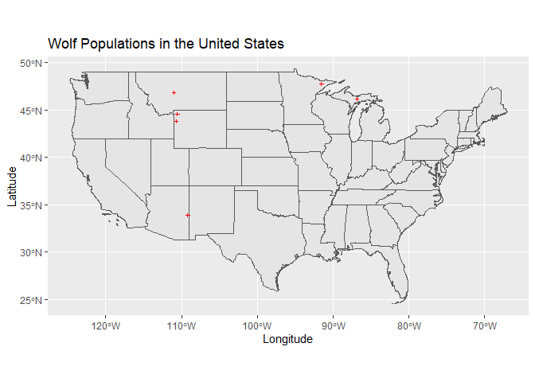
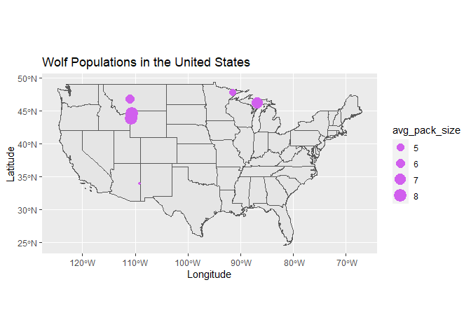

## Instructions
Answer the following questions and complete the exercises in RMarkdown. Please embed all of your code and push your final work to your repository. Your final lab report should be organized, clean, and run free from errors. Remember, you must remove the `#` for the included code chunks to run. Be sure to add your name to the author header above. For any included plots, make sure they are clearly labeled. You are free to use any plot type that you feel best communicates the results of your analysis.  

Make sure to use the formatting conventions of RMarkdown to make your report neat and clean!  

## Load the libraries

```r
library(tidyverse)
library(janitor)
library(here)
library(ggmap)
library(albersusa)
```

## Load the Data
We will use two separate data sets for this homework.  

1. The first [data set](https://rcweb.dartmouth.edu/~f002d69/workshops/index_rspatial.html) represent sightings of grizzly bears (Ursos arctos) in Alaska.  
2. The second data set is from Brandell, Ellen E (2021), Serological dataset and R code for: Patterns and processes of pathogen exposure in gray wolves across North America, Dryad, [Dataset](https://doi.org/10.5061/dryad.5hqbzkh51).  

1. Load the `grizzly` data and evaluate its structure. As part of this step, produce a summary that provides the range of latitude and longitude so you can build an appropriate bounding box.

```r
grizzly <- read_csv(here("lab12", "data", "bear-sightings.csv")) %>% clean_names()
```

```

── Column specification ────────────────────────────────────────────────────────
cols(
  bear.id = col_double(),
  longitude = col_double(),
  latitude = col_double()
)
```

```r
grizzly
```

```
# A tibble: 494 x 3
   bear_id longitude latitude
     <dbl>     <dbl>    <dbl>
 1       7     -149.     62.7
 2      57     -153.     58.4
 3      69     -145.     62.4
 4      75     -153.     59.9
 5     104     -143.     61.1
 6     108     -150.     62.9
 7     115     -152.     68.0
 8     116     -147.     62.6
 9     125     -157.     60.2
10     135     -156.     58.9
# … with 484 more rows
```


```r
grizzly %>%
  select(longitude, latitude) %>%
  summary()
```

```
   longitude         latitude    
 Min.   :-166.2   Min.   :55.02  
 1st Qu.:-154.2   1st Qu.:58.13  
 Median :-151.0   Median :60.97  
 Mean   :-149.1   Mean   :61.41  
 3rd Qu.:-145.6   3rd Qu.:64.13  
 Max.   :-131.3   Max.   :70.37  
```

2. Use the range of the latitude and longitude to build an appropriate bounding box for your map.

```r
lat <- c(55.02, 70.37)
long <- c(-166.2, -131.3)
bbox <- make_bbox(long, lat, f = 0.05)
```

3. Load a map from `stamen` in a terrain style projection and display the map.

```r
grizzly_map1 <- get_map(bbox, maptype = "terrain", source = "stamen")
```


```r
ggmap(grizzly_map1)
```

<!-- -->

4. Build a final map that overlays the recorded observations of grizzly bears in Alaska.

```r
ggmap(grizzly_map1) +
  geom_point(data=grizzly, aes(longitude, latitude), size=0.75, shape=2, color="firebrick2") +
  labs(x="Longitude", y="Latitude", title="Location of Grizzly Bears in Alaska")
```

<!-- -->

5. Let's switch to the wolves data. Load the data and evaluate its structure.

```r
wolves <- read_csv(here("lab12", "data", "wolves_data", "wolves_dataset.csv"))
```

```

── Column specification ────────────────────────────────────────────────────────
cols(
  .default = col_double(),
  pop = col_character(),
  age.cat = col_character(),
  sex = col_character(),
  color = col_character()
)
ℹ Use `spec()` for the full column specifications.
```

```r
#wolves <- list.files(path = "data/wolves", pattern = ".csv") also works
wolves
```

```
# A tibble: 1,986 x 23
   pop     year age.cat sex   color   lat  long habitat human pop.density
   <chr>  <dbl> <chr>   <chr> <chr> <dbl> <dbl>   <dbl> <dbl>       <dbl>
 1 AK.PEN  2006 S       F     G      57.0 -158.    254.  10.4           8
 2 AK.PEN  2006 S       M     G      57.0 -158.    254.  10.4           8
 3 AK.PEN  2006 A       F     G      57.0 -158.    254.  10.4           8
 4 AK.PEN  2006 S       M     B      57.0 -158.    254.  10.4           8
 5 AK.PEN  2006 A       M     B      57.0 -158.    254.  10.4           8
 6 AK.PEN  2006 A       M     G      57.0 -158.    254.  10.4           8
 7 AK.PEN  2006 A       F     G      57.0 -158.    254.  10.4           8
 8 AK.PEN  2006 P       M     G      57.0 -158.    254.  10.4           8
 9 AK.PEN  2006 S       F     G      57.0 -158.    254.  10.4           8
10 AK.PEN  2006 P       M     G      57.0 -158.    254.  10.4           8
# … with 1,976 more rows, and 13 more variables: pack.size <dbl>,
#   standard.habitat <dbl>, standard.human <dbl>, standard.pop <dbl>,
#   standard.packsize <dbl>, standard.latitude <dbl>, standard.longitude <dbl>,
#   cav.binary <dbl>, cdv.binary <dbl>, cpv.binary <dbl>, chv.binary <dbl>,
#   neo.binary <dbl>, toxo.binary <dbl>
```

```r
summary(wolves)
```

```
     pop                 year        age.cat              sex           
 Length:1986        Min.   :1992   Length:1986        Length:1986       
 Class :character   1st Qu.:2006   Class :character   Class :character  
 Mode  :character   Median :2011   Mode  :character   Mode  :character  
                    Mean   :2010                                        
                    3rd Qu.:2016                                        
                    Max.   :2019                                        
                                                                        
    color                lat             long            habitat       
 Length:1986        Min.   :33.89   Min.   :-157.84   Min.   :  254.1  
 Class :character   1st Qu.:44.60   1st Qu.:-123.73   1st Qu.:10375.2  
 Mode  :character   Median :46.83   Median :-110.99   Median :11211.3  
                    Mean   :50.43   Mean   :-116.86   Mean   :12797.4  
                    3rd Qu.:57.89   3rd Qu.:-110.55   3rd Qu.:11860.8  
                    Max.   :80.50   Max.   : -82.42   Max.   :34676.6  
                                                                       
     human          pop.density      pack.size    standard.habitat  
 Min.   :   0.02   Min.   : 3.74   Min.   :3.55   Min.   :-1.63390  
 1st Qu.:  80.60   1st Qu.: 7.40   1st Qu.:5.62   1st Qu.:-0.30620  
 Median :2787.67   Median :11.63   Median :6.37   Median :-0.19650  
 Mean   :2335.38   Mean   :14.91   Mean   :6.47   Mean   : 0.01158  
 3rd Qu.:3973.47   3rd Qu.:25.32   3rd Qu.:8.25   3rd Qu.:-0.11130  
 Max.   :6228.64   Max.   :33.96   Max.   :9.56   Max.   : 2.88180  
                                                                    
 standard.human     standard.pop      standard.packsize standard.latitude  
 Min.   :-0.9834   Min.   :-1.13460   Min.   :-1.7585   Min.   :-1.805900  
 1st Qu.:-0.9444   1st Qu.:-0.74630   1st Qu.:-0.5418   1st Qu.:-0.636900  
 Median : 0.3648   Median :-0.29760   Median :-0.1009   Median :-0.392600  
 Mean   : 0.1461   Mean   : 0.05084   Mean   :-0.0422   Mean   :-0.000006  
 3rd Qu.: 0.9383   3rd Qu.: 1.15480   3rd Qu.: 1.0041   3rd Qu.: 0.814300  
 Max.   : 2.0290   Max.   : 2.07150   Max.   : 1.7742   Max.   : 3.281900  
                                                                           
 standard.longitude    cav.binary       cdv.binary       cpv.binary    
 Min.   :-2.144100   Min.   :0.0000   Min.   :0.0000   Min.   :0.0000  
 1st Qu.:-0.359500   1st Qu.:1.0000   1st Qu.:0.0000   1st Qu.:1.0000  
 Median : 0.306900   Median :1.0000   Median :0.0000   Median :1.0000  
 Mean   :-0.000005   Mean   :0.8529   Mean   :0.2219   Mean   :0.7943  
 3rd Qu.: 0.330200   3rd Qu.:1.0000   3rd Qu.:0.0000   3rd Qu.:1.0000  
 Max.   : 1.801500   Max.   :1.0000   Max.   :1.0000   Max.   :1.0000  
                     NA's   :321      NA's   :21       NA's   :7       
   chv.binary       neo.binary      toxo.binary    
 Min.   :0.0000   Min.   :0.0000   Min.   :0.0000  
 1st Qu.:1.0000   1st Qu.:0.0000   1st Qu.:0.0000  
 Median :1.0000   Median :0.0000   Median :0.0000  
 Mean   :0.8018   Mean   :0.2804   Mean   :0.4832  
 3rd Qu.:1.0000   3rd Qu.:1.0000   3rd Qu.:1.0000  
 Max.   :1.0000   Max.   :1.0000   Max.   :1.0000  
 NA's   :548      NA's   :538      NA's   :827     
```

```r
names(wolves)
```

```
 [1] "pop"                "year"               "age.cat"           
 [4] "sex"                "color"              "lat"               
 [7] "long"               "habitat"            "human"             
[10] "pop.density"        "pack.size"          "standard.habitat"  
[13] "standard.human"     "standard.pop"       "standard.packsize" 
[16] "standard.latitude"  "standard.longitude" "cav.binary"        
[19] "cdv.binary"         "cpv.binary"         "chv.binary"        
[22] "neo.binary"         "toxo.binary"       
```


6. How many distinct wolf populations are included in this study? Make a new object that restricts the data to the wolf populations in the lower 48 US states.

```r
wolves %>%
  summarise(distinct_wolf_pops = n_distinct(pop, na.rm=T))
```

```
# A tibble: 1 x 1
  distinct_wolf_pops
               <int>
1                 17
```


```r
wolf_48 <- wolves %>%
  filter(lat<=48)
wolf_48
```

```
# A tibble: 1,169 x 23
   pop    year age.cat sex   color   lat  long habitat human pop.density
   <chr> <dbl> <chr>   <chr> <chr> <dbl> <dbl>   <dbl> <dbl>       <dbl>
 1 GTNP   2012 P       M     G      43.8 -111.  10375. 3924.        34.0
 2 GTNP   2012 P       F     G      43.8 -111.  10375. 3924.        34.0
 3 GTNP   2012 P       F     G      43.8 -111.  10375. 3924.        34.0
 4 GTNP   2012 P       M     B      43.8 -111.  10375. 3924.        34.0
 5 GTNP   2013 A       F     G      43.8 -111.  10375. 3924.        34.0
 6 GTNP   2013 A       M     G      43.8 -111.  10375. 3924.        34.0
 7 GTNP   2013 P       M     G      43.8 -111.  10375. 3924.        34.0
 8 GTNP   2013 P       M     G      43.8 -111.  10375. 3924.        34.0
 9 GTNP   2013 P       M     G      43.8 -111.  10375. 3924.        34.0
10 GTNP   2013 P       F     G      43.8 -111.  10375. 3924.        34.0
# … with 1,159 more rows, and 13 more variables: pack.size <dbl>,
#   standard.habitat <dbl>, standard.human <dbl>, standard.pop <dbl>,
#   standard.packsize <dbl>, standard.latitude <dbl>, standard.longitude <dbl>,
#   cav.binary <dbl>, cdv.binary <dbl>, cpv.binary <dbl>, chv.binary <dbl>,
#   neo.binary <dbl>, toxo.binary <dbl>
```

```r
wolf_48 %>%
  summarise(distinct_wolf_pops = n_distinct(pop, na.rm=T))
```

```
# A tibble: 1 x 1
  distinct_wolf_pops
               <int>
1                  6
```

7. Use the `albersusa` package to make a base map of the lower 48 US states.

```r
us_comp <- usa_sf() %>%
  filter(name!="Alaska" & name!="Hawaii")
```


```r
ggplot() +
  geom_sf(data = us_comp, size = 0.125)
```

<!-- -->

8. Use the relimited data to plot the distribution of wolf populations in the lower 48 US states.

```r
ggplot() +
  geom_sf(data = us_comp, size = 0.125)+
  geom_point(data = wolf_48, aes(long, lat), size=0.75, shape=3, color="red") +
  labs(title="Wolf Populations in the United States", x="Longitude", y="Latitude")
```

<!-- -->

9. What is the average pack size for the wolves in this study by region?

```r
avg_size <- wolf_48 %>%
  group_by(pop) %>%
  summarise(avg_pack_size = mean(pack.size, na.rm=T),
            avg_latitude = mean(lat, na.rm=T),
            avg_longitude = mean(long, na.rm=T),
            n=n())
avg_size
```

```
# A tibble: 6 x 5
  pop     avg_pack_size avg_latitude avg_longitude     n
* <chr>           <dbl>        <dbl>         <dbl> <int>
1 GTNP             8.1          43.8        -111.     60
2 MEXICAN          4.04         33.9        -109.    181
3 MI               7.12         46.1         -86.8   102
4 MT               5.62         46.8        -111.    351
5 SNF              4.81         47.7         -91.5    92
6 YNP              8.25         44.6        -111.    383
```

10. Make a new map that shows the distribution of wolves in the lower 48 US states but which has the size of location markers adjusted by pack size.

```r
ggplot() +
  geom_sf(data = us_comp, size = 0.125)+
  geom_point(data = avg_size, aes(avg_longitude, avg_latitude, size=avg_pack_size), color="mediumorchid2") +
  labs(title="Wolf Populations in the United States", x="Longitude", y="Latitude")
```

<!-- -->

## Push your final code to GitHub!
Please be sure that you check the `keep md` file in the knit preferences. 
