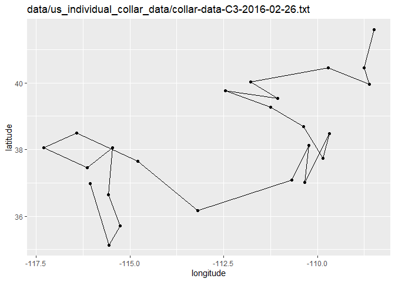
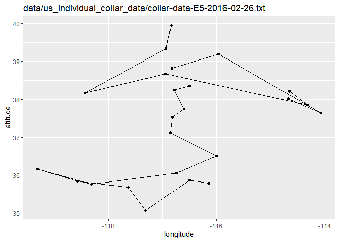
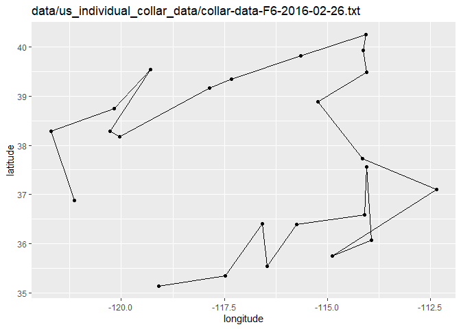
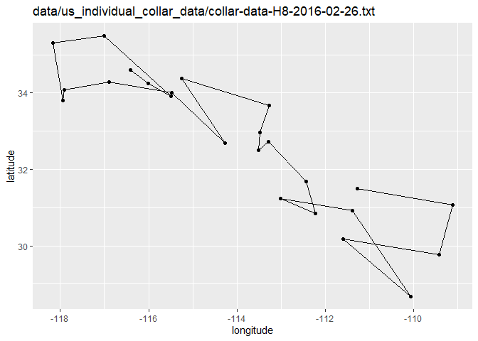
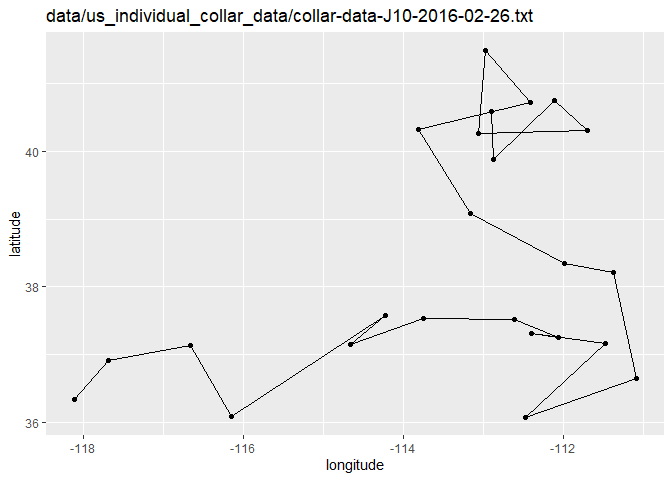
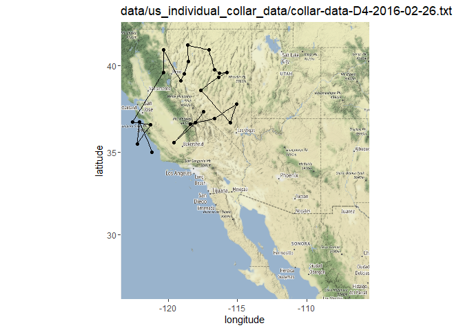
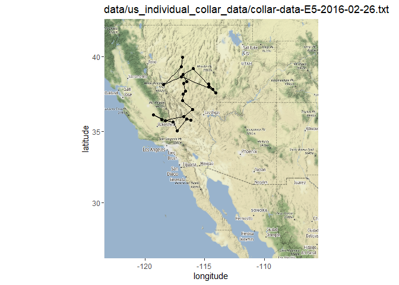
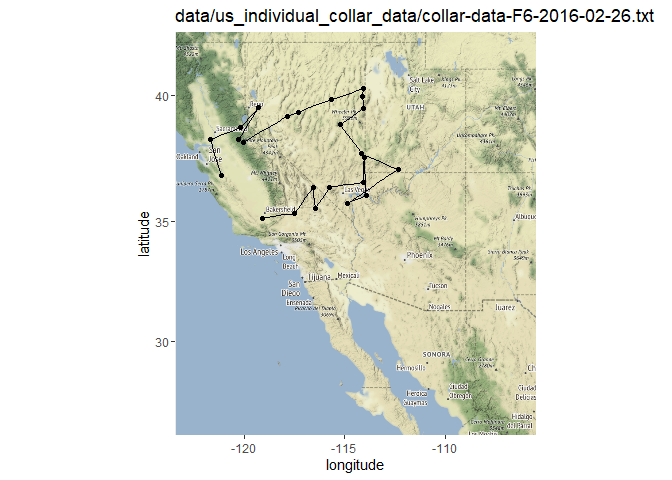
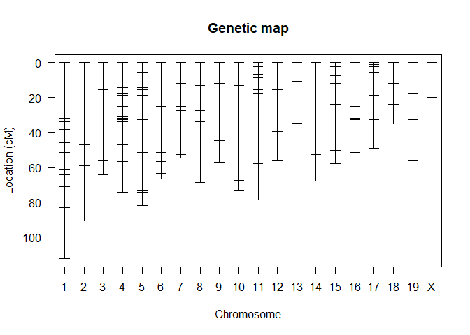
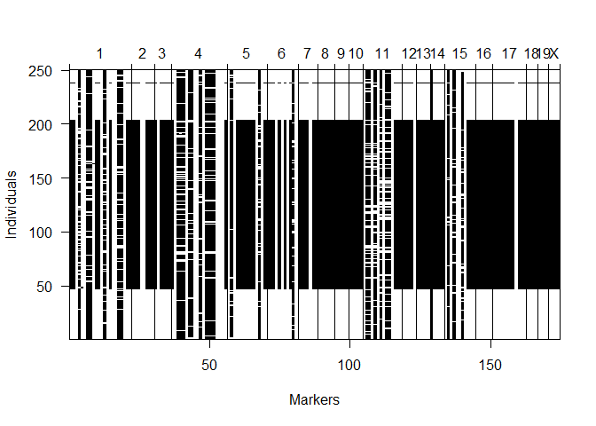

## Instructions
Answer the following questions and complete the exercises in RMarkdown. Please embed all of your code and push your final work to your repository. Your final lab report should be organized, clean, and run free from errors. Remember, you must remove the `#` for the included code chunks to run. Be sure to add your name to the author header above. For any included plots, make sure they are clearly labeled. You are free to use any plot type that you feel best communicates the results of your analysis.  

Make sure to use the formatting conventions of RMarkdown to make your report neat and clean!  

## Load the libraries

```r
library(qtl)
library(qtlcharts)
library(tidyverse)
library(ggmap)
library(lubridate)
```

**1. We have a satellite collars on a number of different individuals and want to be able to quickly look at all of their recent movements at once. Please load all the data files from `us_individual_collar_data` and use for loop to create plots for all different individuals of the path they move on longitude and latitude.**

```r
collar_files <- list.files("data/us_individual_collar_data", pattern = "collar-data-*", full.names = TRUE)
collar_files
```

```
 [1] "data/us_individual_collar_data/collar-data-A1-2016-02-26.txt" 
 [2] "data/us_individual_collar_data/collar-data-B2-2016-02-26.txt" 
 [3] "data/us_individual_collar_data/collar-data-C3-2016-02-26.txt" 
 [4] "data/us_individual_collar_data/collar-data-D4-2016-02-26.txt" 
 [5] "data/us_individual_collar_data/collar-data-E5-2016-02-26.txt" 
 [6] "data/us_individual_collar_data/collar-data-F6-2016-02-26.txt" 
 [7] "data/us_individual_collar_data/collar-data-G7-2016-02-26.txt" 
 [8] "data/us_individual_collar_data/collar-data-H8-2016-02-26.txt" 
 [9] "data/us_individual_collar_data/collar-data-I9-2016-02-26.txt" 
[10] "data/us_individual_collar_data/collar-data-J10-2016-02-26.txt"
```

```r
for (i in 1:length(collar_files)){
  data0 <- as.data.frame(read_csv(collar_files[i]))
  print(
    ggplot(data0, aes(x=long,y=lat))+
      geom_path()+
      geom_point()+
      labs(title = collar_files[i], x = "longitude", y = "latitude")
  )
}
```

<!-- --><!-- --><!-- --><!-- --><!-- --><!-- --><!-- --><!-- --><!-- --><!-- -->


**2. Please load all the data files from `us_individual_collar_data` and combine all data into one data frame. Create a summary to show what is the maximum and minimum of recorded data points on longitude and latitude.**

```r
collar_merge0 <- lapply(collar_files, read_csv) %>%
  bind_rows()
collar_merge0
```

```
# A tibble: 240 x 6
      X1 date       collar time                  lat  long
   <dbl> <date>     <chr>  <dttm>              <dbl> <dbl>
 1     1 2016-02-26 A1     2016-02-26 00:00:00  37.0 -116.
 2     2 2016-02-26 A1     2016-02-26 01:00:00  38.4 -117.
 3     3 2016-02-26 A1     2016-02-26 02:00:00  37.9 -117.
 4     4 2016-02-26 A1     2016-02-26 03:00:00  38.1 -115.
 5     5 2016-02-26 A1     2016-02-26 04:00:00  35.4 -116.
 6     6 2016-02-26 A1     2016-02-26 05:00:00  36.6 -114.
 7     7 2016-02-26 A1     2016-02-26 06:00:00  36.9 -115.
 8     8 2016-02-26 A1     2016-02-26 07:00:00  37.3 -115.
 9     9 2016-02-26 A1     2016-02-26 08:00:00  35.6 -114.
10    10 2016-02-26 A1     2016-02-26 09:00:00  35.9 -114.
# ... with 230 more rows
```

```r
collar_merge0 %>%
  summarise(min_lat = min(lat, na.rm=T),
            max_lat = max(lat, na.rm=T),
            min_long = min(long, na.rm=T),
            max_long = max(long, na.rm=T),
            n=n())
```

```
# A tibble: 1 x 5
  min_lat max_lat min_long max_long     n
    <dbl>   <dbl>    <dbl>    <dbl> <int>
1    26.6    41.6    -123.    -106.   240
```

**3. Use the range of the latitude and longitude from Q2 to build an appropriate bounding box for your map and load a map from `stamen` in a terrain style projection and display the map. Then, build a final map that overlays the recorded path from Q1.**

```r
lat <- c(26.6116, 41.58802)
long <- c(-122.6017, -106.3343)
bbox <- make_bbox(long, lat, f = 0.05)
collar_map <- get_map(bbox, maptype = "terrain", source = "stamen")
ggmap(collar_map)
```

<!-- -->

```r
for (i in 1:length(collar_files)){
  data1 <- as.data.frame(read_csv(collar_files[i]))
  print(
    ggmap(collar_map)+
      geom_path(data = data1, aes(long,lat))+
      geom_point(data = data1, aes(long,lat))+
      labs(title = collar_files[i], x = "longitude", y = "latitude")
  )
}
```

<!-- --><!-- --><!-- --><!-- --><!-- --><!-- --><!-- --><!-- --><!-- --><!-- -->


## Load the Data
We will use the data from an experiment on hypertension in the mouse [Sugiyama et al., Genomics 71:70-77, 2001](https://www.sciencedirect.com/science/article/pii/S0888754300964012?via%3Dihub)

```r
#?hyper
data(hyper)
```

**4. Create a summary of the hypertension data. How many individuals and phenotypes are included in this data set? How many gene markers and chromosomes are included in this data set? Please create a table to show the number of markers on each chromosome.**

```r
summary(hyper)
```

```
    Backcross

    No. individuals:    250 

    No. phenotypes:     2 
    Percent phenotyped: 100 100 

    No. chromosomes:    20 
        Autosomes:      1 2 3 4 5 6 7 8 9 10 11 12 13 14 15 16 17 18 19 
        X chr:          X 

    Total markers:      174 
    No. markers:        22 8 6 20 14 11 7 6 5 5 14 5 5 5 11 6 12 4 4 4 
    Percent genotyped:  47.7 
    Genotypes (%):    
          Autosomes:    BB:50.1  BA:49.9 
       X chromosome:    BY:53.0  AY:47.0 
```


```r
plot.map(hyper)
```

<!-- -->

```r
nmar(hyper)
```

```
 1  2  3  4  5  6  7  8  9 10 11 12 13 14 15 16 17 18 19  X 
22  8  6 20 14 11  7  6  5  5 14  5  5  5 11  6 12  4  4  4 
```

**5. Please make an interactive genetic map of markers for the hypertension data.**

```r
iplotMap(hyper)
```

```{=html}
<div id="htmlwidget-525df79e9432ed10fa12" style="width:672px;height:480px;" class="iplotMap html-widget"></div>
<script type="application/json" data-for="htmlwidget-525df79e9432ed10fa12">{"x":{"data":{"chr":["1","1","1","1","1","1","1","1","1","1","1","1","1","1","1","1","1","1","1","1","1","1","2","2","2","2","2","2","2","2","3","3","3","3","3","3","4","4","4","4","4","4","4","4","4","4","4","4","4","4","4","4","4","4","4","4","5","5","5","5","5","5","5","5","5","5","5","5","5","5","6","6","6","6","6","6","6","6","6","6","6","7","7","7","7","7","7","7","8","8","8","8","8","8","9","9","9","9","9","10","10","10","10","10","11","11","11","11","11","11","11","11","11","11","11","11","11","11","12","12","12","12","12","13","13","13","13","13","14","14","14","14","14","15","15","15","15","15","15","15","15","15","15","15","16","16","16","16","16","16","17","17","17","17","17","17","17","17","17","17","17","17","18","18","18","18","19","19","19","19","X","X","X","X"],"pos":[3.3,19.7,32.8,35,37.2,41.5,43.7,43.7,49.2,54.6,64.5,67.8,69.9,74.3,75.4,82,82,82,82,86.3,94,115.8,7.7,17.5,29.5,49.2,54.6,66.7,85.2,98.4,2.2,17.5,37.2,44.8,57.9,66.7,0,14.2,16.4,17.5,18.6,21.9,23,23,25.1,28.4,29.5,30.6,31.7,31.7,32.8,33.9,35,47,56.8,74.3,0,5.5,10.9,14.2,15.3,18.6,32.8,51.4,60.1,66.7,73.2,74.3,77.6,82,0,9.8,21.9,25.1,29.5,40.4,51.4,56.8,63.4,65.6,66.7,1.1,13.1,26.2,28.4,37.2,53.6,55.6,6.6,19.7,33.9,40.4,59,75.4,12,24,40.4,56.8,68.9,2.2,15.3,50.3,69.9,75.4,2.2,4.4,4.4,8.7,8.7,10.9,13.1,17.5,17.5,19.7,25.1,43.7,60.1,80.9,1.1,16.4,23,40.4,56.8,5.7,7.7,16.4,40.4,59,0,16.4,36.1,52.5,67.8,5.5,5.5,7.7,13.1,16.4,16.4,17.5,17.5,29.5,55.7,63.4,0,25.1,31.7,32.8,51.4,51.4,1.1,1.1,1.1,2.2,3.3,3.3,5.5,6.6,10.9,19.7,33.9,50.3,2.2,14.2,26.2,37.2,0,17.5,32.8,55.7,1.1,20.8,29.5,43.7],"marker":["D1Mit296","D1Mit123","D1Mit156","D1Mit178","D1Mit19","D1Mit7","D1Mit46","D1Mit132","D1Mit334","D1Mit305","D1Mit26","D1Mit94","D1Mit218","D1Mit100","D1Mit102","D1Mit14","D1Mit105","D1Mit159","D1Mit267","D1Mit15","D1Mit456","D1Mit155","D2Mit359","D2Mit82","D2Mit241","D2Mit14","D2Mit62","D2Mit280","D2Mit229","D2Mit266","D3Mit164","D3Mit6","D3Mit11","D3Mit14","D3Mit44","D3Mit19","D4Mit149","D4Mit41","D4Mit108","D4Mit237","D4Mit286","D4Mit214","D4Mit53","D4Mit89","D4Mit111","D4Mit288","D4Mit164","D4Mit178","D4Mit80","D4Mit81","D4Mit276","D4Mit152","D4Mit302","D4Mit175","D4Mit16","D4Mit14","D5Mit193","D5Mit61","D5Mit387","D5Mit148","D5Mit13","D5Mit55","D5Mit312","D5Mit188","D5Mit213","D5Mit31","D5Mit99","D5Mit101","D5Mit409","D5Mit169","D6Mit86","D6Mit273","D6Mit188","D6Mit8","D6Mit213","D6Mit36","D6Mit135","D6Mit59","D6Mit295","D6Mit201","D6Mit15","D7Mit306","D7Mit25","D7Mit297","D7Mit30","D7Mit37","D7Mit71","D7Nds4","D8Mit3","D8Mit292","D8Mit25","D8Mit45","D8Mit271","D8Mit156","D9Mit297","D9Mit27","D9Mit8","D9Mit24","D9Mit18","D10Mit166","D10Mit214","D10Mit11","D10Mit14","D10Mit297","D11Mit74","D11Mit2","D11Mit78","D11Mit79","D11Mit80","D11Mit82","D11Mit163","D11Mit110","D11Mit136","D11Mit20","D11Mit310","D11Mit35","D11Mit67","D11Mit48","D12Mit37","D12Mit110","D12Mit34","D12Mit118","D12Mit20","D13Mit16","D13Mit59","D13Mit91","D13Mit148","D13Mit78","D14Mit48","D14Mit14","D14Mit37","D14Mit7","D14Mit266","D15Mit11","D15Mit175","D15Mit53","D15Mit111","D15Mit56","D15Mit22","D15Mit206","D15Mit152","D15Mit156","D15Mit108","D15Mit79","D16Mit32","D16Mit4","D16Mit171","D16Mit5","D16Mit70","D16Mit106","D17Mit164","D17Mit143","D17Mit57","D17Mit113","D17Mit131","D17Mit46","D17Mit45","D17Mit23","D17Mit11","D17Mit10","D17Mit53","D17Mit221","D18Mit67","D18Mit17","D18Mit50","D18Mit4","D19Mit59","D19Mit40","D19Mit53","D19Mit137","DXMit55","DXMit22","DXMit16","DXMit130"],"chrname":["1","2","3","4","5","6","7","8","9","10","11","12","13","14","15","16","17","18","19","X"]},"chartOpts":{"shiftStart":false}},"evals":[],"jsHooks":[]}</script>
```

**6. Make a plot shows the pattern of missing genotype data in the hypertension dataset. Please reorder the recorded individuals according to their blood pressure phenotypes. Is there a specific pattern of missing genotype? Please explain it.**

```r
plotMissing(hyper, main="", reorder=1)
```

<!-- -->
Most of the missing genotypes occur between 50-200 individuals.

**7. Based on your answer from previous question, you probably noticed that there are gene markers without data. Please use the function `drop.nullmarkers` to remove markers that have no genotype data. After this, make a new summary to show the number of markers on each chromosome. How many gene markers were dropped? Where were the dropped markers located? Please use the data without nullmarkers for the following questions.**

```r
drop.nullmarkers(hyper)
```

```
  This is an object of class "cross".
  It is too complex to print, so we provide just this summary.
    Backcross

    No. individuals:    250 

    No. phenotypes:     2 
    Percent phenotyped: 100 100 

    No. chromosomes:    20 
        Autosomes:      1 2 3 4 5 6 7 8 9 10 11 12 13 14 15 16 17 18 19 
        X chr:          X 

    Total markers:      173 
    No. markers:        22 8 6 20 14 11 7 6 5 5 14 5 5 4 11 6 12 4 4 4 
    Percent genotyped:  48 
    Genotypes (%):    
          Autosomes:    BB:50.1  BA:49.9 
       X chromosome:    BY:53.0  AY:47.0 
```

```r
summary(hyper)
```

```
    Backcross

    No. individuals:    250 

    No. phenotypes:     2 
    Percent phenotyped: 100 100 

    No. chromosomes:    20 
        Autosomes:      1 2 3 4 5 6 7 8 9 10 11 12 13 14 15 16 17 18 19 
        X chr:          X 

    Total markers:      174 
    No. markers:        22 8 6 20 14 11 7 6 5 5 14 5 5 5 11 6 12 4 4 4 
    Percent genotyped:  47.7 
    Genotypes (%):    
          Autosomes:    BB:50.1  BA:49.9 
       X chromosome:    BY:53.0  AY:47.0 
```

```r
hyper_new <- drop.nullmarkers(hyper)
summary(hyper_new)
```

```
    Backcross

    No. individuals:    250 

    No. phenotypes:     2 
    Percent phenotyped: 100 100 

    No. chromosomes:    20 
        Autosomes:      1 2 3 4 5 6 7 8 9 10 11 12 13 14 15 16 17 18 19 
        X chr:          X 

    Total markers:      173 
    No. markers:        22 8 6 20 14 11 7 6 5 5 14 5 5 4 11 6 12 4 4 4 
    Percent genotyped:  48 
    Genotypes (%):    
          Autosomes:    BB:50.1  BA:49.9 
       X chromosome:    BY:53.0  AY:47.0 
```
Only 1 gene marker total was dropped from chromosome 14.

**8. Please conduct single-QTL analysis and create a table to give the maximum LOD score on each chromosome based on their blood pressure phenotypes. Which gene marker has the higiest LOD score? Which chromosome contains the gene marker that has the highest LOD score? Then, creates an interactive chart with LOD curves from a genome scan for all chromosomes.**

```r
hyper_calcLOD <- calc.genoprob(hyper_new, step=1)
hyper_scores <- scanone(hyper_calcLOD)
hyper_scores
```

```
          chr   pos          lod
D1Mit296    1   3.3 4.117448e-01
c1.loc1     1   4.3 4.256930e-01
c1.loc2     1   5.3 4.385622e-01
c1.loc3     1   6.3 4.500490e-01
c1.loc4     1   7.3 4.598666e-01
c1.loc5     1   8.3 4.677428e-01
c1.loc6     1   9.3 4.734542e-01
c1.loc7     1  10.3 4.768268e-01
c1.loc8     1  11.3 4.777478e-01
c1.loc9     1  12.3 4.761722e-01
c1.loc10    1  13.3 4.721261e-01
c1.loc11    1  14.3 4.657072e-01
c1.loc12    1  15.3 4.570783e-01
c1.loc13    1  16.3 4.464742e-01
c1.loc14    1  17.3 4.341670e-01
c1.loc15    1  18.3 4.204707e-01
c1.loc16    1  19.3 4.057181e-01
D1Mit123    1  19.7 3.995971e-01
c1.loc17    1  20.3 4.508175e-01
c1.loc18    1  21.3 5.433096e-01
c1.loc19    1  22.3 6.435876e-01
c1.loc20    1  23.3 7.499236e-01
c1.loc21    1  24.3 8.602405e-01
c1.loc22    1  25.3 9.723147e-01
c1.loc23    1  26.3 1.083972e+00
c1.loc24    1  27.3 1.193255e+00
c1.loc25    1  28.3 1.298508e+00
c1.loc26    1  29.3 1.398416e+00
c1.loc27    1  30.3 1.491992e+00
c1.loc28    1  31.3 1.578553e+00
c1.loc29    1  32.3 1.657673e+00
D1Mit156    1  32.8 1.694372e+00
c1.loc30    1  33.3 1.707122e+00
c1.loc31    1  34.3 1.691829e+00
D1Mit178    1  35.0 1.651994e+00
c1.loc32    1  35.3 1.843815e+00
c1.loc33    1  36.3 2.459929e+00
D1Mit19     1  37.2 2.944148e+00
c1.loc34    1  37.3 2.950735e+00
c1.loc35    1  38.3 3.010586e+00
c1.loc36    1  39.3 3.059853e+00
c1.loc37    1  40.3 3.098968e+00
c1.loc38    1  41.3 3.128205e+00
D1Mit7      1  41.5 3.132878e+00
c1.loc39    1  42.3 3.231014e+00
c1.loc40    1  43.3 3.317505e+00
D1Mit46     1  43.7 3.342187e+00
D1Mit132    1  43.7 3.342187e+00
c1.loc41    1  44.3 3.387052e+00
c1.loc42    1  45.3 3.447292e+00
c1.loc43    1  46.3 3.490557e+00
c1.loc44    1  47.3 3.517783e+00
c1.loc45    1  48.3 3.529452e+00
D1Mit334    1  49.2 3.526704e+00
c1.loc46    1  49.3 3.510983e+00
c1.loc47    1  50.3 3.329680e+00
c1.loc48    1  51.3 3.102652e+00
c1.loc49    1  52.3 2.826315e+00
c1.loc50    1  53.3 2.498271e+00
c1.loc51    1  54.3 2.124402e+00
D1Mit305    1  54.6 2.006569e+00
c1.loc52    1  55.3 2.059839e+00
c1.loc53    1  56.3 2.124785e+00
c1.loc54    1  57.3 2.176021e+00
c1.loc55    1  58.3 2.213446e+00
c1.loc56    1  59.3 2.237311e+00
c1.loc57    1  60.3 2.248043e+00
c1.loc58    1  61.3 2.246155e+00
c1.loc59    1  62.3 2.232212e+00
c1.loc60    1  63.3 2.206845e+00
c1.loc61    1  64.3 2.170783e+00
D1Mit26     1  64.5 2.162361e+00
c1.loc62    1  65.3 2.584748e+00
c1.loc63    1  66.3 2.978416e+00
c1.loc64    1  67.3 3.257581e+00
D1Mit94     1  67.8 3.362918e+00
c1.loc65    1  68.3 3.342944e+00
c1.loc66    1  69.3 3.220749e+00
D1Mit218    1  69.9 3.096373e+00
c1.loc67    1  70.3 3.172136e+00
c1.loc68    1  71.3 3.299773e+00
c1.loc69    1  72.3 3.338664e+00
c1.loc70    1  73.3 3.294229e+00
c1.loc71    1  74.3 3.175861e+00
D1Mit100    1  74.3 3.175861e+00
c1.loc72    1  75.3 3.216347e+00
D1Mit102    1  75.4 3.219835e+00
c1.loc73    1  76.3 3.363839e+00
c1.loc74    1  77.3 3.455821e+00
c1.loc75    1  78.3 3.476983e+00
c1.loc76    1  79.3 3.431500e+00
c1.loc77    1  80.3 3.325261e+00
c1.loc78    1  81.3 3.166189e+00
D1Mit14     1  82.0 3.029099e+00
D1Mit105    1  82.0 3.029099e+00
D1Mit159    1  82.0 3.029217e+00
D1Mit267    1  82.0 3.029217e+00
c1.loc79    1  82.3 2.957400e+00
c1.loc80    1  83.3 2.675915e+00
c1.loc81    1  84.3 2.331015e+00
c1.loc82    1  85.3 1.933110e+00
c1.loc83    1  86.3 1.512487e+00
D1Mit15     1  86.3 1.512487e+00
c1.loc84    1  87.3 1.499329e+00
c1.loc85    1  88.3 1.482691e+00
c1.loc86    1  89.3 1.462261e+00
c1.loc87    1  90.3 1.437674e+00
c1.loc88    1  91.3 1.408508e+00
c1.loc89    1  92.3 1.374287e+00
c1.loc90    1  93.3 1.334515e+00
D1Mit456    1  94.0 1.303128e+00
c1.loc91    1  94.3 1.294538e+00
c1.loc92    1  95.3 1.263618e+00
c1.loc93    1  96.3 1.229213e+00
c1.loc94    1  97.3 1.191407e+00
c1.loc95    1  98.3 1.150334e+00
c1.loc96    1  99.3 1.106176e+00
c1.loc97    1 100.3 1.059167e+00
c1.loc98    1 101.3 1.009590e+00
c1.loc99    1 102.3 9.577744e-01
c1.loc100   1 103.3 9.040998e-01
c1.loc101   1 104.3 8.489877e-01
c1.loc102   1 105.3 7.928990e-01
c1.loc103   1 106.3 7.363254e-01
c1.loc104   1 107.3 6.797791e-01
c1.loc105   1 108.3 6.237795e-01
c1.loc106   1 109.3 5.688371e-01
c1.loc107   1 110.3 5.154374e-01
c1.loc108   1 111.3 4.640237e-01
c1.loc109   1 112.3 4.149806e-01
c1.loc110   1 113.3 3.686322e-01
c1.loc111   1 114.3 3.252182e-01
c1.loc112   1 115.3 2.849054e-01
D1Mit155    1 115.8 2.659435e-01
D2Mit359    2   7.7 2.247897e-01
c2.loc1     2   8.7 2.645578e-01
c2.loc2     2   9.7 3.063387e-01
c2.loc3     2  10.7 3.486135e-01
c2.loc4     2  11.7 3.896415e-01
c2.loc5     2  12.7 4.277313e-01
c2.loc6     2  13.7 4.614408e-01
c2.loc7     2  14.7 4.897297e-01
c2.loc8     2  15.7 5.120196e-01
c2.loc9     2  16.7 5.281822e-01
D2Mit82     2  17.5 5.368659e-01
c2.loc10    2  17.7 5.439595e-01
c2.loc11    2  18.7 5.792167e-01
c2.loc12    2  19.7 6.137385e-01
c2.loc13    2  20.7 6.470051e-01
c2.loc14    2  21.7 6.785253e-01
c2.loc15    2  22.7 7.078508e-01
c2.loc16    2  23.7 7.346046e-01
c2.loc17    2  24.7 7.584854e-01
c2.loc18    2  25.7 7.792732e-01
c2.loc19    2  26.7 7.968354e-01
c2.loc20    2  27.7 8.111152e-01
c2.loc21    2  28.7 8.221327e-01
D2Mit241    2  29.5 8.286552e-01
c2.loc22    2  29.7 8.392324e-01
c2.loc23    2  30.7 8.925159e-01
c2.loc24    2  31.7 9.459371e-01
c2.loc25    2  32.7 9.987163e-01
c2.loc26    2  33.7 1.050028e+00
c2.loc27    2  34.7 1.099035e+00
c2.loc28    2  35.7 1.144931e+00
c2.loc29    2  36.7 1.186969e+00
c2.loc30    2  37.7 1.224480e+00
c2.loc31    2  38.7 1.256902e+00
c2.loc32    2  39.7 1.283781e+00
c2.loc33    2  40.7 1.304779e+00
c2.loc34    2  41.7 1.319679e+00
c2.loc35    2  42.7 1.328380e+00
c2.loc36    2  43.7 1.330908e+00
c2.loc37    2  44.7 1.327412e+00
c2.loc38    2  45.7 1.318175e+00
c2.loc39    2  46.7 1.303611e+00
c2.loc40    2  47.7 1.284259e+00
c2.loc41    2  48.7 1.260772e+00
D2Mit14     2  49.2 1.247706e+00
c2.loc42    2  49.7 1.339822e+00
c2.loc43    2  50.7 1.497585e+00
c2.loc44    2  51.7 1.594565e+00
c2.loc45    2  52.7 1.612404e+00
c2.loc46    2  53.7 1.551728e+00
D2Mit62     2  54.6 1.445167e+00
c2.loc47    2  54.7 1.448669e+00
c2.loc48    2  55.7 1.479618e+00
c2.loc49    2  56.7 1.502134e+00
c2.loc50    2  57.7 1.514944e+00
c2.loc51    2  58.7 1.517074e+00
c2.loc52    2  59.7 1.507893e+00
c2.loc53    2  60.7 1.487131e+00
c2.loc54    2  61.7 1.454910e+00
c2.loc55    2  62.7 1.411760e+00
c2.loc56    2  63.7 1.358640e+00
c2.loc57    2  64.7 1.296937e+00
c2.loc58    2  65.7 1.228419e+00
c2.loc59    2  66.7 1.155125e+00
D2Mit280    2  66.7 1.155125e+00
c2.loc60    2  67.7 1.050643e+00
c2.loc61    2  68.7 9.454863e-01
c2.loc62    2  69.7 8.404592e-01
c2.loc63    2  70.7 7.365047e-01
c2.loc64    2  71.7 6.347035e-01
c2.loc65    2  72.7 5.362708e-01
c2.loc66    2  73.7 4.425293e-01
c2.loc67    2  74.7 3.548666e-01
c2.loc68    2  75.7 2.746698e-01
c2.loc69    2  76.7 2.032345e-01
c2.loc70    2  77.7 1.416981e-01
c2.loc71    2  78.7 9.090400e-02
c2.loc72    2  79.7 5.136724e-02
c2.loc73    2  80.7 2.323142e-02
c2.loc74    2  81.7 6.305447e-03
c2.loc75    2  82.7 6.438469e-05
c2.loc76    2  83.7 3.762446e-03
c2.loc77    2  84.7 1.649312e-02
D2Mit229    2  85.2 2.593693e-02
c2.loc78    2  85.7 2.700710e-02
c2.loc79    2  86.7 2.918845e-02
c2.loc80    2  87.7 3.140493e-02
c2.loc81    2  88.7 3.363052e-02
c2.loc82    2  89.7 3.583703e-02
c2.loc83    2  90.7 3.800070e-02
c2.loc84    2  91.7 4.008232e-02
c2.loc85    2  92.7 4.205817e-02
c2.loc86    2  93.7 4.390301e-02
c2.loc87    2  94.7 4.559538e-02
c2.loc88    2  95.7 4.711841e-02
c2.loc89    2  96.7 4.845748e-02
c2.loc90    2  97.7 4.961314e-02
D2Mit266    2  98.4 5.030940e-02
D3Mit164    3   2.2 3.703274e-02
c3.loc1     3   3.2 1.776899e-02
c3.loc2     3   4.2 4.697914e-03
c3.loc3     3   5.2 2.474810e-06
c3.loc4     3   6.2 5.826888e-03
c3.loc5     3   7.2 2.389910e-02
c3.loc6     3   8.2 5.498167e-02
c3.loc7     3   9.2 9.848260e-02
c3.loc8     3  10.2 1.524162e-01
c3.loc9     3  11.2 2.137576e-01
c3.loc10    3  12.2 2.790807e-01
c3.loc11    3  13.2 3.451588e-01
c3.loc12    3  14.2 4.093433e-01
c3.loc13    3  15.2 4.697214e-01
c3.loc14    3  16.2 5.250634e-01
c3.loc15    3  17.2 5.747443e-01
D3Mit6      3  17.5 5.885099e-01
c3.loc16    3  18.2 6.006449e-01
c3.loc17    3  19.2 6.178849e-01
c3.loc18    3  20.2 6.349102e-01
c3.loc19    3  21.2 6.516011e-01
c3.loc20    3  22.2 6.678342e-01
c3.loc21    3  23.2 6.834810e-01
c3.loc22    3  24.2 6.984131e-01
c3.loc23    3  25.2 7.125033e-01
c3.loc24    3  26.2 7.256272e-01
c3.loc25    3  27.2 7.376664e-01
c3.loc26    3  28.2 7.485101e-01
c3.loc27    3  29.2 7.580578e-01
c3.loc28    3  30.2 7.662212e-01
c3.loc29    3  31.2 7.729268e-01
c3.loc30    3  32.2 7.781173e-01
c3.loc31    3  33.2 7.817539e-01
c3.loc32    3  34.2 7.838177e-01
c3.loc33    3  35.2 7.843111e-01
c3.loc34    3  36.2 7.832582e-01
c3.loc35    3  37.2 7.807048e-01
D3Mit11     3  37.2 7.807048e-01
c3.loc36    3  38.2 5.489945e-01
c3.loc37    3  39.2 3.394395e-01
c3.loc38    3  40.2 1.679596e-01
c3.loc39    3  41.2 5.141111e-02
c3.loc40    3  42.2 1.639793e-03
c3.loc41    3  43.2 1.982390e-02
c3.loc42    3  44.2 9.672653e-02
D3Mit14     3  44.8 1.651760e-01
c3.loc43    3  45.2 1.629122e-01
c3.loc44    3  46.2 1.571982e-01
c3.loc45    3  47.2 1.514201e-01
c3.loc46    3  48.2 1.455899e-01
c3.loc47    3  49.2 1.397256e-01
c3.loc48    3  50.2 1.338445e-01
c3.loc49    3  51.2 1.279642e-01
c3.loc50    3  52.2 1.221028e-01
c3.loc51    3  53.2 1.162786e-01
c3.loc52    3  54.2 1.105095e-01
c3.loc53    3  55.2 1.048134e-01
c3.loc54    3  56.2 9.920511e-02
c3.loc55    3  57.2 9.370624e-02
D3Mit44     3  57.9 8.992874e-02
c3.loc56    3  58.2 8.717620e-02
c3.loc57    3  59.2 7.761290e-02
c3.loc58    3  60.2 6.761867e-02
c3.loc59    3  61.2 5.747075e-02
c3.loc60    3  62.2 4.748256e-02
c3.loc61    3  63.2 3.797641e-02
c3.loc62    3  64.2 2.924450e-02
c3.loc63    3  65.2 2.153903e-02
c3.loc64    3  66.2 1.501219e-02
D3Mit19     3  66.7 1.221712e-02
D4Mit149    4   0.0 2.061924e+00
c4.loc1     4   1.0 2.317346e+00
c4.loc2     4   2.0 2.582583e+00
c4.loc3     4   3.0 2.853421e+00
c4.loc4     4   4.0 3.125668e+00
c4.loc5     4   5.0 3.395519e+00
c4.loc6     4   6.0 3.659757e+00
c4.loc7     4   7.0 3.915797e+00
c4.loc8     4   8.0 4.161615e+00
c4.loc9     4   9.0 4.395645e+00
c4.loc10    4  10.0 4.616646e+00
c4.loc11    4  11.0 4.823589e+00
c4.loc12    4  12.0 5.015542e+00
c4.loc13    4  13.0 5.191582e+00
c4.loc14    4  14.0 5.350702e+00
D4Mit41     4  14.2 5.380397e+00
c4.loc15    4  15.0 5.523762e+00
c4.loc16    4  16.0 5.531748e+00
D4Mit108    4  16.4 5.485436e+00
c4.loc17    4  17.0 6.563385e+00
D4Mit237    4  17.5 6.557876e+00
c4.loc18    4  18.0 6.536449e+00
D4Mit286    4  18.6 6.509250e+00
c4.loc19    4  19.0 6.572621e+00
c4.loc20    4  20.0 6.701573e+00
c4.loc21    4  21.0 6.794140e+00
D4Mit214    4  21.9 6.849671e+00
c4.loc22    4  22.0 6.794676e+00
c4.loc23    4  23.0 5.842222e+00
D4Mit53     4  23.0 5.842222e+00
D4Mit89     4  23.0 5.842222e+00
c4.loc24    4  24.0 6.218547e+00
c4.loc25    4  25.0 6.316692e+00
D4Mit111    4  25.1 6.307900e+00
c4.loc26    4  26.0 6.290307e+00
c4.loc27    4  27.0 6.254650e+00
c4.loc28    4  28.0 6.203261e+00
D4Mit288    4  28.4 6.178436e+00
c4.loc29    4  29.0 7.472751e+00
D4Mit164    4  29.5 8.093661e+00
c4.loc30    4  30.0 7.640598e+00
D4Mit178    4  30.6 6.374922e+00
c4.loc31    4  31.0 6.348310e+00
D4Mit80     4  31.7 5.137589e+00
D4Mit81     4  31.7 5.137589e+00
c4.loc32    4  32.0 5.119870e+00
D4Mit276    4  32.8 4.887561e+00
c4.loc33    4  33.0 4.866401e+00
D4Mit152    4  33.9 4.764850e+00
c4.loc34    4  34.0 4.694565e+00
c4.loc35    4  35.0 3.728673e+00
D4Mit302    4  35.0 3.728673e+00
c4.loc36    4  36.0 3.675329e+00
c4.loc37    4  37.0 3.616906e+00
c4.loc38    4  38.0 3.553286e+00
c4.loc39    4  39.0 3.484368e+00
c4.loc40    4  40.0 3.410069e+00
c4.loc41    4  41.0 3.330329e+00
c4.loc42    4  42.0 3.245116e+00
c4.loc43    4  43.0 3.154439e+00
c4.loc44    4  44.0 3.058357e+00
c4.loc45    4  45.0 2.957005e+00
c4.loc46    4  46.0 2.850617e+00
c4.loc47    4  47.0 2.739565e+00
D4Mit175    4  47.0 2.739565e+00
c4.loc48    4  48.0 2.848913e+00
c4.loc49    4  49.0 2.933073e+00
c4.loc50    4  50.0 2.986540e+00
c4.loc51    4  51.0 3.005353e+00
c4.loc52    4  52.0 2.987290e+00
c4.loc53    4  53.0 2.931932e+00
c4.loc54    4  54.0 2.840757e+00
c4.loc55    4  55.0 2.717286e+00
c4.loc56    4  56.0 2.567186e+00
D4Mit16     4  56.8 2.433001e+00
c4.loc57    4  57.0 2.444104e+00
c4.loc58    4  58.0 2.496393e+00
c4.loc59    4  59.0 2.542522e+00
c4.loc60    4  60.0 2.581516e+00
c4.loc61    4  61.0 2.612546e+00
c4.loc62    4  62.0 2.634943e+00
c4.loc63    4  63.0 2.648206e+00
c4.loc64    4  64.0 2.651993e+00
c4.loc65    4  65.0 2.646116e+00
c4.loc66    4  66.0 2.630532e+00
c4.loc67    4  67.0 2.605338e+00
c4.loc68    4  68.0 2.570769e+00
c4.loc69    4  69.0 2.527198e+00
c4.loc70    4  70.0 2.475147e+00
c4.loc71    4  71.0 2.415286e+00
c4.loc72    4  72.0 2.348436e+00
c4.loc73    4  73.0 2.275560e+00
c4.loc74    4  74.0 2.197745e+00
D4Mit14     4  74.3 2.173612e+00
D5Mit193    5   0.0 3.728646e-01
c5.loc1     5   1.0 3.682948e-01
c5.loc2     5   2.0 3.523428e-01
c5.loc3     5   3.0 3.250162e-01
c5.loc4     5   4.0 2.884047e-01
c5.loc5     5   5.0 2.463322e-01
D5Mit61     5   5.5 2.246562e-01
c5.loc6     5   6.0 2.070219e-01
c5.loc7     5   7.0 1.729629e-01
c5.loc8     5   8.0 1.410057e-01
c5.loc9     5   9.0 1.117025e-01
c5.loc10    5  10.0 8.552311e-02
D5Mit387    5  10.9 6.492093e-02
c5.loc11    5  11.0 6.624613e-02
c5.loc12    5  12.0 8.013036e-02
c5.loc13    5  13.0 9.502738e-02
c5.loc14    5  14.0 1.107276e-01
D5Mit148    5  14.2 1.139451e-01
c5.loc15    5  15.0 1.492727e-01
D5Mit13     5  15.3 1.630031e-01
c5.loc16    5  16.0 2.026673e-01
c5.loc17    5  17.0 2.605245e-01
c5.loc18    5  18.0 3.125877e-01
D5Mit55     5  18.6 3.380438e-01
c5.loc19    5  19.0 3.180798e-01
c5.loc20    5  20.0 2.685648e-01
c5.loc21    5  21.0 2.203122e-01
c5.loc22    5  22.0 1.742967e-01
c5.loc23    5  23.0 1.315939e-01
c5.loc24    5  24.0 9.332448e-02
c5.loc25    5  25.0 6.057602e-02
c5.loc26    5  26.0 3.430530e-02
c5.loc27    5  27.0 1.523414e-02
c5.loc28    5  28.0 3.782072e-03
c5.loc29    5  29.0 1.579821e-08
c5.loc30    5  30.0 3.604356e-03
c5.loc31    5  31.0 1.402559e-02
c5.loc32    5  32.0 3.049083e-02
D5Mit312    5  32.8 4.742018e-02
c5.loc33    5  33.0 4.896144e-02
c5.loc34    5  34.0 5.710291e-02
c5.loc35    5  35.0 6.596335e-02
c5.loc36    5  36.0 7.552452e-02
c5.loc37    5  37.0 8.576019e-02
c5.loc38    5  38.0 9.662067e-02
c5.loc39    5  39.0 1.080533e-01
c5.loc40    5  40.0 1.199918e-01
c5.loc41    5  41.0 1.323605e-01
c5.loc42    5  42.0 1.450764e-01
c5.loc43    5  43.0 1.580515e-01
c5.loc44    5  44.0 1.711951e-01
c5.loc45    5  45.0 1.844164e-01
c5.loc46    5  46.0 1.976270e-01
c5.loc47    5  47.0 2.107422e-01
c5.loc48    5  48.0 2.236837e-01
c5.loc49    5  49.0 2.363800e-01
c5.loc50    5  50.0 2.487679e-01
c5.loc51    5  51.0 2.607913e-01
D5Mit188    5  51.4 2.654893e-01
c5.loc52    5  52.0 2.759096e-01
c5.loc53    5  53.0 2.932108e-01
c5.loc54    5  54.0 3.102936e-01
c5.loc55    5  55.0 3.270118e-01
c5.loc56    5  56.0 3.432283e-01
c5.loc57    5  57.0 3.588191e-01
c5.loc58    5  58.0 3.736763e-01
c5.loc59    5  59.0 3.877088e-01
c5.loc60    5  60.0 4.008459e-01
D5Mit213    5  60.1 4.021080e-01
c5.loc61    5  61.0 5.523188e-01
c5.loc62    5  62.0 7.397255e-01
c5.loc63    5  63.0 9.339516e-01
c5.loc64    5  64.0 1.121662e+00
c5.loc65    5  65.0 1.294591e+00
c5.loc66    5  66.0 1.448780e+00
D5Mit31     5  66.7 1.544770e+00
c5.loc67    5  67.0 1.548922e+00
c5.loc68    5  68.0 1.554072e+00
c5.loc69    5  69.0 1.546512e+00
c5.loc70    5  70.0 1.527286e+00
c5.loc71    5  71.0 1.497529e+00
c5.loc72    5  72.0 1.458415e+00
c5.loc73    5  73.0 1.411165e+00
D5Mit99     5  73.2 1.400852e+00
c5.loc74    5  74.0 1.383307e+00
D5Mit101    5  74.3 1.352388e+00
c5.loc75    5  75.0 1.366438e+00
c5.loc76    5  76.0 1.362578e+00
c5.loc77    5  77.0 1.329560e+00
D5Mit409    5  77.6 1.296112e+00
c5.loc78    5  78.0 1.319219e+00
c5.loc79    5  79.0 1.359789e+00
c5.loc80    5  80.0 1.375573e+00
c5.loc81    5  81.0 1.367060e+00
c5.loc82    5  82.0 1.335299e+00
D5Mit169    5  82.0 1.335299e+00
D6Mit86     6   0.0 1.172057e-01
c6.loc1     6   1.0 1.782575e-01
c6.loc2     6   2.0 2.555185e-01
c6.loc3     6   3.0 3.467135e-01
c6.loc4     6   4.0 4.462823e-01
c6.loc5     6   5.0 5.462297e-01
c6.loc6     6   6.0 6.382443e-01
c6.loc7     6   7.0 7.157566e-01
c6.loc8     6   8.0 7.750951e-01
c6.loc9     6   9.0 8.155407e-01
D6Mit273    6   9.8 8.353447e-01
c6.loc10    6  10.0 8.543155e-01
c6.loc11    6  11.0 9.508641e-01
c6.loc12    6  12.0 1.048968e+00
c6.loc13    6  13.0 1.146871e+00
c6.loc14    6  14.0 1.242921e+00
c6.loc15    6  15.0 1.335679e+00
c6.loc16    6  16.0 1.423980e+00
c6.loc17    6  17.0 1.506937e+00
c6.loc18    6  18.0 1.583916e+00
c6.loc19    6  19.0 1.654493e+00
c6.loc20    6  20.0 1.718414e+00
c6.loc21    6  21.0 1.775555e+00
D6Mit188    6  21.9 1.821166e+00
c6.loc22    6  22.0 1.827804e+00
c6.loc23    6  23.0 1.862040e+00
c6.loc24    6  24.0 1.850521e+00
c6.loc25    6  25.0 1.805372e+00
D6Mit8      6  25.1 1.799307e+00
c6.loc26    6  26.0 1.672506e+00
c6.loc27    6  27.0 1.498274e+00
c6.loc28    6  28.0 1.291016e+00
c6.loc29    6  29.0 1.060038e+00
D6Mit213    6  29.5 9.416038e-01
c6.loc30    6  30.0 9.686284e-01
c6.loc31    6  31.0 1.020105e+00
c6.loc32    6  32.0 1.066863e+00
c6.loc33    6  33.0 1.107428e+00
c6.loc34    6  34.0 1.140485e+00
c6.loc35    6  35.0 1.164955e+00
c6.loc36    6  36.0 1.180051e+00
c6.loc37    6  37.0 1.185327e+00
c6.loc38    6  38.0 1.180714e+00
c6.loc39    6  39.0 1.166563e+00
c6.loc40    6  40.0 1.143656e+00
D6Mit36     6  40.4 1.132296e+00
c6.loc41    6  41.0 1.142600e+00
c6.loc42    6  42.0 1.154658e+00
c6.loc43    6  43.0 1.159450e+00
c6.loc44    6  44.0 1.156153e+00
c6.loc45    6  45.0 1.144223e+00
c6.loc46    6  46.0 1.123453e+00
c6.loc47    6  47.0 1.094018e+00
c6.loc48    6  48.0 1.056490e+00
c6.loc49    6  49.0 1.011819e+00
c6.loc50    6  50.0 9.612791e-01
c6.loc51    6  51.0 9.063733e-01
D6Mit135    6  51.4 8.835489e-01
c6.loc52    6  52.0 9.018409e-01
c6.loc53    6  53.0 9.175342e-01
c6.loc54    6  54.0 9.139489e-01
c6.loc55    6  55.0 8.919032e-01
c6.loc56    6  56.0 8.538147e-01
D6Mit59     6  56.8 8.142006e-01
c6.loc57    6  57.0 8.335839e-01
c6.loc58    6  58.0 9.250587e-01
c6.loc59    6  59.0 9.999143e-01
c6.loc60    6  60.0 1.049059e+00
c6.loc61    6  61.0 1.066772e+00
c6.loc62    6  62.0 1.051934e+00
c6.loc63    6  63.0 1.008223e+00
D6Mit295    6  63.4 9.842685e-01
c6.loc64    6  64.0 9.466352e-01
c6.loc65    6  65.0 7.873967e-01
D6Mit201    6  65.6 6.410131e-01
c6.loc66    6  66.0 6.667164e-01
D6Mit15     6  66.7 6.595297e-01
D7Mit306    7   1.1 1.369747e-01
c7.loc1     7   2.1 1.406909e-01
c7.loc2     7   3.1 1.436216e-01
c7.loc3     7   4.1 1.456086e-01
c7.loc4     7   5.1 1.465171e-01
c7.loc5     7   6.1 1.462521e-01
c7.loc6     7   7.1 1.447699e-01
c7.loc7     7   8.1 1.420852e-01
c7.loc8     7   9.1 1.382735e-01
c7.loc9     7  10.1 1.334655e-01
c7.loc10    7  11.1 1.278367e-01
c7.loc11    7  12.1 1.215881e-01
c7.loc12    7  13.1 1.149397e-01
D7Mit25     7  13.1 1.149397e-01
c7.loc13    7  14.1 1.344947e-01
c7.loc14    7  15.1 1.555058e-01
c7.loc15    7  16.1 1.777400e-01
c7.loc16    7  17.1 2.009146e-01
c7.loc17    7  18.1 2.247041e-01
c7.loc18    7  19.1 2.487598e-01
c7.loc19    7  20.1 2.727286e-01
c7.loc20    7  21.1 2.962723e-01
c7.loc21    7  22.1 3.190823e-01
c7.loc22    7  23.1 3.408915e-01
c7.loc23    7  24.1 3.614809e-01
c7.loc24    7  25.1 3.806823e-01
c7.loc25    7  26.1 3.983802e-01
D7Mit297    7  26.2 4.000641e-01
c7.loc26    7  27.1 3.087214e-01
c7.loc27    7  28.1 1.880019e-01
D7Mit30     7  28.4 1.540588e-01
c7.loc28    7  29.1 1.380574e-01
c7.loc29    7  30.1 1.162435e-01
c7.loc30    7  31.1 9.586013e-02
c7.loc31    7  32.1 7.712150e-02
c7.loc32    7  33.1 6.022056e-02
c7.loc33    7  34.1 4.531666e-02
c7.loc34    7  35.1 3.252448e-02
c7.loc35    7  36.1 2.190708e-02
c7.loc36    7  37.1 1.347181e-02
D7Mit37     7  37.2 1.274700e-02
c7.loc37    7  38.1 1.035325e-02
c7.loc38    7  39.1 7.840182e-03
c7.loc39    7  40.1 5.552280e-03
c7.loc40    7  41.1 3.563860e-03
c7.loc41    7  42.1 1.949210e-03
c7.loc42    7  43.1 7.858521e-04
c7.loc43    7  44.1 1.313799e-04
c7.loc44    7  45.1 2.925572e-05
c7.loc45    7  46.1 5.023533e-04
c7.loc46    7  47.1 1.555770e-03
c7.loc47    7  48.1 3.160084e-03
c7.loc48    7  49.1 5.269858e-03
c7.loc49    7  50.1 7.819258e-03
c7.loc50    7  51.1 1.072929e-02
c7.loc51    7  52.1 1.391410e-02
c7.loc52    7  53.1 1.728721e-02
D7Mit71     7  53.6 1.901848e-02
c7.loc53    7  54.1 3.668836e-02
c7.loc54    7  55.1 8.451563e-02
D7Nds4      7  55.6 1.093732e-01
D8Mit3      8   6.6 5.740902e-02
c8.loc1     8   7.6 5.216647e-02
c8.loc2     8   8.6 4.688434e-02
c8.loc3     8   9.6 4.162552e-02
c8.loc4     8  10.6 3.645711e-02
c8.loc5     8  11.6 3.144780e-02
c8.loc6     8  12.6 2.666501e-02
c8.loc7     8  13.6 2.217189e-02
c8.loc8     8  14.6 1.801786e-02
c8.loc9     8  15.6 1.426458e-02
c8.loc10    8  16.6 1.093811e-02
c8.loc11    8  17.6 8.060957e-03
c8.loc12    8  18.6 5.643180e-03
c8.loc13    8  19.6 3.682956e-03
D8Mit292    8  19.7 3.511702e-03
c8.loc14    8  20.6 3.346407e-03
c8.loc15    8  21.6 3.151702e-03
c8.loc16    8  22.6 2.946934e-03
c8.loc17    8  23.6 2.734144e-03
c8.loc18    8  24.6 2.515750e-03
c8.loc19    8  25.6 2.294459e-03
c8.loc20    8  26.6 2.073154e-03
c8.loc21    8  27.6 1.854764e-03
c8.loc22    8  28.6 1.642133e-03
c8.loc23    8  29.6 1.437902e-03
c8.loc24    8  30.6 1.238807e-03
c8.loc25    8  31.6 1.059770e-03
c8.loc26    8  32.6 8.945253e-04
c8.loc27    8  33.6 7.440515e-04
D8Mit25     8  33.9 7.018864e-04
c8.loc28    8  34.6 6.772559e-05
c8.loc29    8  35.6 3.419713e-04
c8.loc30    8  36.6 2.085158e-03
c8.loc31    8  37.6 5.290088e-03
c8.loc32    8  38.6 9.853470e-03
c8.loc33    8  39.6 1.558406e-02
D8Mit45     8  40.4 2.084151e-02
c8.loc34    8  40.6 2.326602e-02
c8.loc35    8  41.6 3.765603e-02
c8.loc36    8  42.6 5.597442e-02
c8.loc37    8  43.6 7.838622e-02
c8.loc38    8  44.6 1.049773e-01
c8.loc39    8  45.6 1.357416e-01
c8.loc40    8  46.6 1.705860e-01
c8.loc41    8  47.6 2.092795e-01
c8.loc42    8  48.6 2.515240e-01
c8.loc43    8  49.6 2.969304e-01
c8.loc44    8  50.6 3.450475e-01
c8.loc45    8  51.6 3.953855e-01
c8.loc46    8  52.6 4.474384e-01
c8.loc47    8  53.6 5.007059e-01
c8.loc48    8  54.6 5.547094e-01
c8.loc49    8  55.6 6.090044e-01
c8.loc50    8  56.6 6.631885e-01
c8.loc51    8  57.6 7.169049e-01
c8.loc52    8  58.6 7.698438e-01
D8Mit271    8  59.0 7.907409e-01
c8.loc53    8  59.6 7.904592e-01
c8.loc54    8  60.6 7.875110e-01
c8.loc55    8  61.6 7.812066e-01
c8.loc56    8  62.6 7.713076e-01
c8.loc57    8  63.6 7.576405e-01
c8.loc58    8  64.6 7.401328e-01
c8.loc59    8  65.6 7.188156e-01
c8.loc60    8  66.6 6.938363e-01
c8.loc61    8  67.6 6.654643e-01
c8.loc62    8  68.6 6.340901e-01
c8.loc63    8  69.6 6.002165e-01
c8.loc64    8  70.6 5.644396e-01
c8.loc65    8  71.6 5.274153e-01
c8.loc66    8  72.6 4.898422e-01
c8.loc67    8  73.6 4.523829e-01
c8.loc68    8  74.6 4.156473e-01
D8Mit156    8  75.4 3.871433e-01
D9Mit297    9  12.0 1.098127e-01
c9.loc1     9  13.0 1.021163e-01
c9.loc2     9  14.0 9.440259e-02
c9.loc3     9  15.0 8.672402e-02
c9.loc4     9  16.0 7.913505e-02
c9.loc5     9  17.0 7.169101e-02
c9.loc6     9  18.0 6.444670e-02
c9.loc7     9  19.0 5.745495e-02
c9.loc8     9  20.0 5.076513e-02
c9.loc9     9  21.0 4.442178e-02
c9.loc10    9  22.0 3.845890e-02
c9.loc11    9  23.0 3.291850e-02
c9.loc12    9  24.0 2.781789e-02
D9Mit27     9  24.0 2.781789e-02
c9.loc13    9  25.0 3.126052e-02
c9.loc14    9  26.0 3.492258e-02
c9.loc15    9  27.0 3.877059e-02
c9.loc16    9  28.0 4.277742e-02
c9.loc17    9  29.0 4.690563e-02
c9.loc18    9  30.0 5.111212e-02
c9.loc19    9  31.0 5.534951e-02
c9.loc20    9  32.0 5.956779e-02
c9.loc21    9  33.0 6.371628e-02
c9.loc22    9  34.0 6.774561e-02
c9.loc23    9  35.0 7.160975e-02
c9.loc24    9  36.0 7.526771e-02
c9.loc25    9  37.0 7.868502e-02
c9.loc26    9  38.0 8.183473e-02
c9.loc27    9  39.0 8.469788e-02
c9.loc28    9  40.0 8.726358e-02
D9Mit8      9  40.4 8.820560e-02
c9.loc29    9  41.0 9.304230e-02
c9.loc30    9  42.0 1.013574e-01
c9.loc31    9  43.0 1.099021e-01
c9.loc32    9  44.0 1.185541e-01
c9.loc33    9  45.0 1.271831e-01
c9.loc34    9  46.0 1.356125e-01
c9.loc35    9  47.0 1.436838e-01
c9.loc36    9  48.0 1.512324e-01
c9.loc37    9  49.0 1.581052e-01
c9.loc38    9  50.0 1.641703e-01
c9.loc39    9  51.0 1.693250e-01
c9.loc40    9  52.0 1.735017e-01
c9.loc41    9  53.0 1.766709e-01
c9.loc42    9  54.0 1.788330e-01
c9.loc43    9  55.0 1.800494e-01
c9.loc44    9  56.0 1.803770e-01
D9Mit24     9  56.8 1.800599e-01
c9.loc45    9  57.0 1.890791e-01
c9.loc46    9  58.0 2.385554e-01
c9.loc47    9  59.0 2.948556e-01
c9.loc48    9  60.0 3.565589e-01
c9.loc49    9  61.0 4.213570e-01
c9.loc50    9  62.0 4.863050e-01
c9.loc51    9  63.0 5.482696e-01
c9.loc52    9  64.0 6.044208e-01
c9.loc53    9  65.0 6.525918e-01
c9.loc54    9  66.0 6.914535e-01
c9.loc55    9  67.0 7.205270e-01
c9.loc56    9  68.0 7.400833e-01
D9Mit18     9  68.9 7.502459e-01
D10Mit166  10   2.2 2.143123e-01
c10.loc1   10   3.2 2.234829e-01
c10.loc2   10   4.2 2.320672e-01
c10.loc3   10   5.2 2.398615e-01
c10.loc4   10   6.2 2.466793e-01
c10.loc5   10   7.2 2.523254e-01
c10.loc6   10   8.2 2.566576e-01
c10.loc7   10   9.2 2.595672e-01
c10.loc8   10  10.2 2.609931e-01
c10.loc9   10  11.2 2.609257e-01
c10.loc10  10  12.2 2.594076e-01
c10.loc11  10  13.2 2.565252e-01
c10.loc12  10  14.2 2.524221e-01
c10.loc13  10  15.2 2.472535e-01
D10Mit214  10  15.3 2.466849e-01
c10.loc14  10  16.2 2.392323e-01
c10.loc15  10  17.2 2.305273e-01
c10.loc16  10  18.2 2.213900e-01
c10.loc17  10  19.2 2.118219e-01
c10.loc18  10  20.2 2.018474e-01
c10.loc19  10  21.2 1.914949e-01
c10.loc20  10  22.2 1.808017e-01
c10.loc21  10  23.2 1.698145e-01
c10.loc22  10  24.2 1.585897e-01
c10.loc23  10  25.2 1.472143e-01
c10.loc24  10  26.2 1.357248e-01
c10.loc25  10  27.2 1.242196e-01
c10.loc26  10  28.2 1.127868e-01
c10.loc27  10  29.2 1.015190e-01
c10.loc28  10  30.2 9.051046e-02
c10.loc29  10  31.2 7.985533e-02
c10.loc30  10  32.2 6.964440e-02
c10.loc31  10  33.2 5.993827e-02
c10.loc32  10  34.2 5.086627e-02
c10.loc33  10  35.2 4.246558e-02
c10.loc34  10  36.2 3.478913e-02
c10.loc35  10  37.2 2.787630e-02
c10.loc36  10  38.2 2.175233e-02
c10.loc37  10  39.2 1.641164e-02
c10.loc38  10  40.2 1.189236e-02
c10.loc39  10  41.2 8.153760e-03
c10.loc40  10  42.2 5.154689e-03
c10.loc41  10  43.2 2.901991e-03
c10.loc42  10  44.2 1.324479e-03
c10.loc43  10  45.2 3.723625e-04
c10.loc44  10  46.2 8.576084e-06
c10.loc45  10  47.2 1.673225e-04
c10.loc46  10  48.2 7.990265e-04
c10.loc47  10  49.2 1.852895e-03
c10.loc48  10  50.2 3.283456e-03
D10Mit11   10  50.3 3.444413e-03
c10.loc49  10  51.2 2.161880e-03
c10.loc50  10  52.2 1.050129e-03
c10.loc51  10  53.2 3.209531e-04
c10.loc52  10  54.2 9.149230e-06
c10.loc53  10  55.2 1.488808e-04
c10.loc54  10  56.2 7.669277e-04
c10.loc55  10  57.2 1.900320e-03
c10.loc56  10  58.2 3.538624e-03
c10.loc57  10  59.2 5.686204e-03
c10.loc58  10  60.2 8.328484e-03
c10.loc59  10  61.2 1.145352e-02
c10.loc60  10  62.2 1.499818e-02
c10.loc61  10  63.2 1.892600e-02
c10.loc62  10  64.2 2.318246e-02
c10.loc63  10  65.2 2.770823e-02
c10.loc64  10  66.2 3.244171e-02
c10.loc65  10  67.2 3.732144e-02
c10.loc66  10  68.2 4.228826e-02
c10.loc67  10  69.2 4.728699e-02
D10Mit14   10  69.9 5.077499e-02
c10.loc68  10  70.2 5.375989e-02
c10.loc69  10  71.2 6.371340e-02
c10.loc70  10  72.2 7.296080e-02
c10.loc71  10  73.2 8.055670e-02
c10.loc72  10  74.2 8.580060e-02
c10.loc73  10  75.2 8.843148e-02
D10Mit297  10  75.4 8.865463e-02
D11Mit74   11   2.2 1.716721e-01
c11.loc1   11   3.2 1.728762e-01
c11.loc2   11   4.2 1.595362e-01
D11Mit2    11   4.4 1.553722e-01
D11Mit78   11   4.4 1.553722e-01
c11.loc3   11   5.2 7.510792e-02
c11.loc4   11   6.2 1.385575e-02
c11.loc5   11   7.2 1.582360e-03
c11.loc6   11   8.2 3.685685e-02
D11Mit79   11   8.7 6.993440e-02
D11Mit80   11   8.7 6.993440e-02
c11.loc7   11   9.2 8.908812e-02
c11.loc8   11  10.2 1.313214e-01
D11Mit82   11  10.9 1.617231e-01
c11.loc9   11  11.2 1.731660e-01
c11.loc10  11  12.2 2.102207e-01
D11Mit163  11  13.1 2.401204e-01
c11.loc11  11  13.2 2.419329e-01
c11.loc12  11  14.2 2.592164e-01
c11.loc13  11  15.2 2.745812e-01
c11.loc14  11  16.2 2.875719e-01
c11.loc15  11  17.2 2.978873e-01
D11Mit110  11  17.5 3.004353e-01
D11Mit136  11  17.5 3.004353e-01
c11.loc16  11  18.2 3.299695e-01
c11.loc17  11  19.2 3.716727e-01
D11Mit20   11  19.7 3.920578e-01
c11.loc18  11  20.2 4.045323e-01
c11.loc19  11  21.2 4.237471e-01
c11.loc20  11  22.2 4.333319e-01
c11.loc21  11  23.2 4.318544e-01
c11.loc22  11  24.2 4.193666e-01
D11Mit310  11  25.1 4.000344e-01
c11.loc23  11  25.2 4.026749e-01
c11.loc24  11  26.2 4.295613e-01
c11.loc25  11  27.2 4.571061e-01
c11.loc26  11  28.2 4.849386e-01
c11.loc27  11  29.2 5.126066e-01
c11.loc28  11  30.2 5.395947e-01
c11.loc29  11  31.2 5.653453e-01
c11.loc30  11  32.2 5.892724e-01
c11.loc31  11  33.2 6.108099e-01
c11.loc32  11  34.2 6.294357e-01
c11.loc33  11  35.2 6.447067e-01
c11.loc34  11  36.2 6.562852e-01
c11.loc35  11  37.2 6.639605e-01
c11.loc36  11  38.2 6.676603e-01
c11.loc37  11  39.2 6.674534e-01
c11.loc38  11  40.2 6.635416e-01
c11.loc39  11  41.2 6.562406e-01
c11.loc40  11  42.2 6.459620e-01
c11.loc41  11  43.2 6.331682e-01
D11Mit35   11  43.7 6.259821e-01
c11.loc42  11  44.2 6.145666e-01
c11.loc43  11  45.2 5.909498e-01
c11.loc44  11  46.2 5.663403e-01
c11.loc45  11  47.2 5.408207e-01
c11.loc46  11  48.2 5.144929e-01
c11.loc47  11  49.2 4.874785e-01
c11.loc48  11  50.2 4.599184e-01
c11.loc49  11  51.2 4.319724e-01
c11.loc50  11  52.2 4.038163e-01
c11.loc51  11  53.2 3.756395e-01
c11.loc52  11  54.2 3.476407e-01
c11.loc53  11  55.2 3.200226e-01
c11.loc54  11  56.2 2.929860e-01
c11.loc55  11  57.2 2.667236e-01
c11.loc56  11  58.2 2.414137e-01
c11.loc57  11  59.2 2.172142e-01
D11Mit67   11  60.1 1.964948e-01
c11.loc58  11  60.2 1.952491e-01
c11.loc59  11  61.2 1.823747e-01
c11.loc60  11  62.2 1.687886e-01
c11.loc61  11  63.2 1.545823e-01
c11.loc62  11  64.2 1.398819e-01
c11.loc63  11  65.2 1.248627e-01
c11.loc64  11  66.2 1.097067e-01
c11.loc65  11  67.2 9.465318e-02
c11.loc66  11  68.2 7.995953e-02
c11.loc67  11  69.2 6.589715e-02
c11.loc68  11  70.2 5.273640e-02
c11.loc69  11  71.2 4.072947e-02
c11.loc70  11  72.2 3.008148e-02
c11.loc71  11  73.2 2.098614e-02
c11.loc72  11  74.2 1.353153e-02
c11.loc73  11  75.2 7.746285e-03
c11.loc74  11  76.2 3.640601e-03
c11.loc75  11  77.2 1.106451e-03
c11.loc76  11  78.2 5.363517e-05
c11.loc77  11  79.2 3.113133e-04
c11.loc78  11  80.2 1.724442e-03
D11Mit48   11  80.9 3.315755e-03
D12Mit37   12   1.1 4.286562e-01
c12.loc1   12   2.1 4.065826e-01
c12.loc2   12   3.1 3.796842e-01
c12.loc3   12   4.1 3.479574e-01
c12.loc4   12   5.1 3.118241e-01
c12.loc5   12   6.1 2.721402e-01
c12.loc6   12   7.1 2.302699e-01
c12.loc7   12   8.1 1.879534e-01
c12.loc8   12   9.1 1.471220e-01
c12.loc9   12  10.1 1.096334e-01
c12.loc10  12  11.1 7.698911e-02
c12.loc11  12  12.1 5.017880e-02
c12.loc12  12  13.1 2.953213e-02
c12.loc13  12  14.1 1.487736e-02
c12.loc14  12  15.1 5.621659e-03
c12.loc15  12  16.1 9.767110e-04
D12Mit110  12  16.4 3.539764e-04
c12.loc16  12  17.1 5.103020e-04
c12.loc17  12  18.1 7.849582e-04
c12.loc18  12  19.1 1.111665e-03
c12.loc19  12  20.1 1.474904e-03
c12.loc20  12  21.1 1.854256e-03
c12.loc21  12  22.1 2.227583e-03
D12Mit34   12  23.0 2.541800e-03
c12.loc22  12  23.1 2.562578e-03
c12.loc23  12  24.1 2.777011e-03
c12.loc24  12  25.1 2.994878e-03
c12.loc25  12  26.1 3.213989e-03
c12.loc26  12  27.1 3.430221e-03
c12.loc27  12  28.1 3.639060e-03
c12.loc28  12  29.1 3.835849e-03
c12.loc29  12  30.1 4.016056e-03
c12.loc30  12  31.1 4.175568e-03
c12.loc31  12  32.1 4.310952e-03
c12.loc32  12  33.1 4.419689e-03
c12.loc33  12  34.1 4.500329e-03
c12.loc34  12  35.1 4.552563e-03
c12.loc35  12  36.1 4.577205e-03
c12.loc36  12  37.1 4.576063e-03
c12.loc37  12  38.1 4.551736e-03
c12.loc38  12  39.1 4.507350e-03
c12.loc39  12  40.1 4.445615e-03
D12Mit118  12  40.4 4.424810e-03
c12.loc40  12  41.1 4.817780e-03
c12.loc41  12  42.1 5.408506e-03
c12.loc42  12  43.1 6.026894e-03
c12.loc43  12  44.1 6.667743e-03
c12.loc44  12  45.1 7.324020e-03
c12.loc45  12  46.1 7.987881e-03
c12.loc46  12  47.1 8.650969e-03
c12.loc47  12  48.1 9.304755e-03
c12.loc48  12  49.1 9.940910e-03
c12.loc49  12  50.1 1.055167e-02
c12.loc50  12  51.1 1.113016e-02
c12.loc51  12  52.1 1.167065e-02
c12.loc52  12  53.1 1.216876e-02
c12.loc53  12  54.1 1.262148e-02
c12.loc54  12  55.1 1.302701e-02
c12.loc55  12  56.1 1.338554e-02
D12Mit20   12  56.8 1.360858e-02
D13Mit16   13   5.7 9.100472e-02
c13.loc1   13   6.7 6.250892e-02
c13.loc2   13   7.7 3.279096e-02
D13Mit59   13   7.7 3.279096e-02
c13.loc3   13   8.7 3.311359e-02
c13.loc4   13   9.7 3.313720e-02
c13.loc5   13  10.7 3.282075e-02
c13.loc6   13  11.7 3.216036e-02
c13.loc7   13  12.7 3.116943e-02
c13.loc8   13  13.7 2.988273e-02
c13.loc9   13  14.7 2.835235e-02
c13.loc10  13  15.7 2.663832e-02
D13Mit91   13  16.4 2.537065e-02
c13.loc11  13  16.7 2.361958e-02
c13.loc12  13  17.7 1.793911e-02
c13.loc13  13  18.7 1.265252e-02
c13.loc14  13  19.7 7.955132e-03
c13.loc15  13  20.7 4.088405e-03
c13.loc16  13  21.7 1.370349e-03
c13.loc17  13  22.7 6.878960e-05
c13.loc18  13  23.7 4.419798e-04
c13.loc19  13  24.7 2.814363e-03
c13.loc20  13  25.7 7.318752e-03
c13.loc21  13  26.7 1.403374e-02
c13.loc22  13  27.7 2.296820e-02
c13.loc23  13  28.7 3.388909e-02
c13.loc24  13  29.7 4.651540e-02
c13.loc25  13  30.7 6.044455e-02
c13.loc26  13  31.7 7.521457e-02
c13.loc27  13  32.7 9.034995e-02
c13.loc28  13  33.7 1.054049e-01
c13.loc29  13  34.7 1.199969e-01
c13.loc30  13  35.7 1.338268e-01
c13.loc31  13  36.7 1.466750e-01
c13.loc32  13  37.7 1.584439e-01
c13.loc33  13  38.7 1.690599e-01
c13.loc34  13  39.7 1.785267e-01
D13Mit148  13  40.4 1.844977e-01
c13.loc35  13  40.7 1.865074e-01
c13.loc36  13  41.7 1.932688e-01
c13.loc37  13  42.7 2.001162e-01
c13.loc38  13  43.7 2.070362e-01
c13.loc39  13  44.7 2.140152e-01
c13.loc40  13  45.7 2.210396e-01
c13.loc41  13  46.7 2.280960e-01
c13.loc42  13  47.7 2.351708e-01
c13.loc43  13  48.7 2.422509e-01
c13.loc44  13  49.7 2.493237e-01
c13.loc45  13  50.7 2.563771e-01
c13.loc46  13  51.7 2.633992e-01
c13.loc47  13  52.7 2.703792e-01
c13.loc48  13  53.7 2.773067e-01
c13.loc49  13  54.7 2.841721e-01
c13.loc50  13  55.7 2.909665e-01
c13.loc51  13  56.7 2.976816e-01
c13.loc52  13  57.7 3.043100e-01
c13.loc53  13  58.7 3.108450e-01
D13Mit78   13  59.0 3.127864e-01
D14Mit14   14  16.4 8.544850e-02
c14.loc1   14  17.4 7.386070e-02
c14.loc2   14  18.4 6.263623e-02
c14.loc3   14  19.4 5.191450e-02
c14.loc4   14  20.4 4.184067e-02
c14.loc5   14  21.4 3.256147e-02
c14.loc6   14  22.4 2.422012e-02
c14.loc7   14  23.4 1.695056e-02
c14.loc8   14  24.4 1.087150e-02
c14.loc9   14  25.4 6.073489e-03
c14.loc10  14  26.4 2.646345e-03
c14.loc11  14  27.4 6.127987e-04
c14.loc12  14  28.4 2.489631e-06
c14.loc13  14  29.4 7.673782e-04
c14.loc14  14  30.4 2.884577e-03
c14.loc15  14  31.4 6.255601e-03
c14.loc16  14  32.4 1.078880e-02
c14.loc17  14  33.4 1.636895e-02
c14.loc18  14  34.4 2.286995e-02
c14.loc19  14  35.4 3.016034e-02
D14Mit37   14  36.1 3.566251e-02
c14.loc20  14  36.4 3.685730e-02
c14.loc21  14  37.4 4.099915e-02
c14.loc22  14  38.4 4.535820e-02
c14.loc23  14  39.4 4.990819e-02
c14.loc24  14  40.4 5.461322e-02
c14.loc25  14  41.4 5.943103e-02
c14.loc26  14  42.4 6.431405e-02
c14.loc27  14  43.4 6.921073e-02
c14.loc28  14  44.4 7.406725e-02
c14.loc29  14  45.4 7.882937e-02
c14.loc30  14  46.4 8.344446e-02
c14.loc31  14  47.4 8.786344e-02
c14.loc32  14  48.4 9.204256e-02
c14.loc33  14  49.4 9.594486e-02
c14.loc34  14  50.4 9.954129e-02
c14.loc35  14  51.4 1.028113e-01
c14.loc36  14  52.4 1.057428e-01
D14Mit7    14  52.5 1.060171e-01
c14.loc37  14  53.4 1.014547e-01
c14.loc38  14  54.4 9.615812e-02
c14.loc39  14  55.4 9.065331e-02
c14.loc40  14  56.4 8.497877e-02
c14.loc41  14  57.4 7.917933e-02
c14.loc42  14  58.4 7.330508e-02
c14.loc43  14  59.4 6.741011e-02
c14.loc44  14  60.4 6.155081e-02
c14.loc45  14  61.4 5.578397e-02
c14.loc46  14  62.4 5.016482e-02
c14.loc47  14  63.4 4.474507e-02
c14.loc48  14  64.4 3.957111e-02
c14.loc49  14  65.4 3.468257e-02
c14.loc50  14  66.4 3.010736e-02
c14.loc51  14  67.4 2.587878e-02
D14Mit266  14  67.8 2.428618e-02
D15Mit11   15   5.5 1.067514e+00
D15Mit175  15   5.5 1.067514e+00
c15.loc1   15   6.5 9.313136e-01
c15.loc2   15   7.5 7.779486e-01
D15Mit53   15   7.7 7.459694e-01
c15.loc3   15   8.5 8.289017e-01
c15.loc4   15   9.5 9.335453e-01
c15.loc5   15  10.5 1.036974e+00
c15.loc6   15  11.5 1.137072e+00
c15.loc7   15  12.5 1.232173e+00
D15Mit111  15  13.1 1.286305e+00
c15.loc8   15  13.5 1.305523e+00
c15.loc9   15  14.5 1.342501e+00
c15.loc10  15  15.5 1.363015e+00
D15Mit56   15  16.4 1.367291e+00
D15Mit22   15  16.4 1.367291e+00
c15.loc11  15  16.5 1.419452e+00
c15.loc12  15  17.5 1.705369e+00
D15Mit206  15  17.5 1.705369e+00
D15Mit152  15  17.5 1.705369e+00
c15.loc13  15  18.5 1.723381e+00
c15.loc14  15  19.5 1.729778e+00
c15.loc15  15  20.5 1.722921e+00
c15.loc16  15  21.5 1.701518e+00
c15.loc17  15  22.5 1.664717e+00
c15.loc18  15  23.5 1.612210e+00
c15.loc19  15  24.5 1.544341e+00
c15.loc20  15  25.5 1.462256e+00
c15.loc21  15  26.5 1.368017e+00
c15.loc22  15  27.5 1.264627e+00
c15.loc23  15  28.5 1.155848e+00
c15.loc24  15  29.5 1.045753e+00
D15Mit156  15  29.5 1.045753e+00
c15.loc25  15  30.5 1.049079e+00
c15.loc26  15  31.5 1.051170e+00
c15.loc27  15  32.5 1.051899e+00
c15.loc28  15  33.5 1.051140e+00
c15.loc29  15  34.5 1.048775e+00
c15.loc30  15  35.5 1.044695e+00
c15.loc31  15  36.5 1.038801e+00
c15.loc32  15  37.5 1.031013e+00
c15.loc33  15  38.5 1.021267e+00
c15.loc34  15  39.5 1.009518e+00
c15.loc35  15  40.5 9.957464e-01
c15.loc36  15  41.5 9.799586e-01
c15.loc37  15  42.5 9.621878e-01
c15.loc38  15  43.5 9.424963e-01
c15.loc39  15  44.5 9.209757e-01
c15.loc40  15  45.5 8.977472e-01
c15.loc41  15  46.5 8.729597e-01
c15.loc42  15  47.5 8.467882e-01
c15.loc43  15  48.5 8.194303e-01
c15.loc44  15  49.5 7.910989e-01
c15.loc45  15  50.5 7.620288e-01
c15.loc46  15  51.5 7.324511e-01
c15.loc47  15  52.5 7.026007e-01
c15.loc48  15  53.5 6.727062e-01
c15.loc49  15  54.5 6.429827e-01
c15.loc50  15  55.5 6.136325e-01
D15Mit108  15  55.7 6.078228e-01
c15.loc51  15  56.5 6.605595e-01
c15.loc52  15  57.5 7.248587e-01
c15.loc53  15  58.5 7.852070e-01
c15.loc54  15  59.5 8.395240e-01
c15.loc55  15  60.5 8.860776e-01
c15.loc56  15  61.5 9.235321e-01
c15.loc57  15  62.5 9.509617e-01
D15Mit79   15  63.4 9.666624e-01
D16Mit32   16   0.0 2.848957e-02
c16.loc1   16   1.0 2.156787e-02
c16.loc2   16   2.0 1.523806e-02
c16.loc3   16   3.0 9.704954e-03
c16.loc4   16   4.0 5.196073e-03
c16.loc5   16   5.0 1.953900e-03
c16.loc6   16   6.0 2.185807e-04
c16.loc7   16   7.0 2.326060e-04
c16.loc8   16   8.0 2.204015e-03
c16.loc9   16   9.0 6.325185e-03
c16.loc10  16  10.0 1.268332e-02
c16.loc11  16  11.0 2.127774e-02
c16.loc12  16  12.0 3.204205e-02
c16.loc13  16  13.0 4.480478e-02
c16.loc14  16  14.0 5.934514e-02
c16.loc15  16  15.0 7.528067e-02
c16.loc16  16  16.0 9.228146e-02
c16.loc17  16  17.0 1.099784e-01
c16.loc18  16  18.0 1.280147e-01
c16.loc19  16  19.0 1.460477e-01
c16.loc20  16  20.0 1.638342e-01
c16.loc21  16  21.0 1.811162e-01
c16.loc22  16  22.0 1.977111e-01
c16.loc23  16  23.0 2.134854e-01
c16.loc24  16  24.0 2.283466e-01
c16.loc25  16  25.0 2.422518e-01
D16Mit4    16  25.1 2.435883e-01
c16.loc26  16  26.0 2.430528e-01
c16.loc27  16  27.0 2.414622e-01
c16.loc28  16  28.0 2.387976e-01
c16.loc29  16  29.0 2.350540e-01
c16.loc30  16  30.0 2.302517e-01
c16.loc31  16  31.0 2.244382e-01
D16Mit171  16  31.7 2.198069e-01
c16.loc32  16  32.0 2.060124e-01
D16Mit5    16  32.8 1.418847e-01
c16.loc33  16  33.0 1.445231e-01
c16.loc34  16  34.0 1.581482e-01
c16.loc35  16  35.0 1.724358e-01
c16.loc36  16  36.0 1.872940e-01
c16.loc37  16  37.0 2.025835e-01
c16.loc38  16  38.0 2.181574e-01
c16.loc39  16  39.0 2.338435e-01
c16.loc40  16  40.0 2.494546e-01
c16.loc41  16  41.0 2.647949e-01
c16.loc42  16  42.0 2.796683e-01
c16.loc43  16  43.0 2.938856e-01
c16.loc44  16  44.0 3.072724e-01
c16.loc45  16  45.0 3.196755e-01
c16.loc46  16  46.0 3.309683e-01
c16.loc47  16  47.0 3.410547e-01
c16.loc48  16  48.0 3.498711e-01
c16.loc49  16  49.0 3.573867e-01
c16.loc50  16  50.0 3.636025e-01
c16.loc51  16  51.0 3.685482e-01
D16Mit70   16  51.4 3.701823e-01
D16Mit106  16  51.4 3.701823e-01
D17Mit164  17   1.1 1.557465e-01
D17Mit143  17   1.1 1.557465e-01
D17Mit57   17   1.1 1.557464e-01
c17.loc1   17   2.1 1.084208e-01
D17Mit113  17   2.2 1.024779e-01
c17.loc2   17   3.1 1.868977e-01
D17Mit131  17   3.3 2.066626e-01
D17Mit46   17   3.3 2.066626e-01
c17.loc3   17   4.1 1.257509e-01
c17.loc4   17   5.1 4.732155e-02
D17Mit45   17   5.5 2.625086e-02
c17.loc5   17   6.1 2.588518e-02
D17Mit23   17   6.6 2.558274e-02
c17.loc6   17   7.1 1.599908e-02
c17.loc7   17   8.1 3.287372e-03
c17.loc8   17   9.1 1.676036e-04
c17.loc9   17  10.1 6.718869e-03
D17Mit11   17  10.9 1.817885e-02
c17.loc10  17  11.1 1.698206e-02
c17.loc11  17  12.1 1.153003e-02
c17.loc12  17  13.1 7.036932e-03
c17.loc13  17  14.1 3.592022e-03
c17.loc14  17  15.1 1.269086e-03
c17.loc15  17  16.1 1.226208e-04
c17.loc16  17  17.1 1.848966e-04
c17.loc17  17  18.1 1.464206e-03
c17.loc18  17  19.1 3.944487e-03
D17Mit10   17  19.7 5.993635e-03
c17.loc19  17  20.1 5.096804e-03
c17.loc20  17  21.1 3.109676e-03
c17.loc21  17  22.1 1.551131e-03
c17.loc22  17  23.1 4.989611e-04
c17.loc23  17  24.1 2.244376e-05
c17.loc24  17  25.1 1.762814e-04
c17.loc25  17  26.1 9.953380e-04
c17.loc26  17  27.1 2.496953e-03
c17.loc27  17  28.1 4.659855e-03
c17.loc28  17  29.1 7.445192e-03
c17.loc29  17  30.1 1.078867e-02
c17.loc30  17  31.1 1.460796e-02
c17.loc31  17  32.1 1.880918e-02
c17.loc32  17  33.1 2.329377e-02
D17Mit53   17  33.9 2.702012e-02
c17.loc33  17  34.1 2.796260e-02
c17.loc34  17  35.1 3.297911e-02
c17.loc35  17  36.1 3.849285e-02
c17.loc36  17  37.1 4.448119e-02
c17.loc37  17  38.1 5.089424e-02
c17.loc38  17  39.1 5.767034e-02
c17.loc39  17  40.1 6.472885e-02
c17.loc40  17  41.1 7.197504e-02
c17.loc41  17  42.1 7.930455e-02
c17.loc42  17  43.1 8.660875e-02
c17.loc43  17  44.1 9.378051e-02
c17.loc44  17  45.1 1.007196e-01
c17.loc45  17  46.1 1.073374e-01
c17.loc46  17  47.1 1.135600e-01
c17.loc47  17  48.1 1.193306e-01
c17.loc48  17  49.1 1.246100e-01
c17.loc49  17  50.1 1.293755e-01
D17Mit221  17  50.3 1.302640e-01
D18Mit67   18   2.2 1.187825e-01
c18.loc1   18   3.2 1.515378e-01
c18.loc2   18   4.2 1.892249e-01
c18.loc3   18   5.2 2.310017e-01
c18.loc4   18   6.2 2.753936e-01
c18.loc5   18   7.2 3.203454e-01
c18.loc6   18   8.2 3.635827e-01
c18.loc7   18   9.2 4.029606e-01
c18.loc8   18  10.2 4.367982e-01
c18.loc9   18  11.2 4.640661e-01
c18.loc10  18  12.2 4.844131e-01
c18.loc11  18  13.2 4.980918e-01
c18.loc12  18  14.2 5.057624e-01
D18Mit17   18  14.2 5.057624e-01
c18.loc13  18  15.2 4.680214e-01
c18.loc14  18  16.2 4.241576e-01
c18.loc15  18  17.2 3.748987e-01
c18.loc16  18  18.2 3.216382e-01
c18.loc17  18  19.2 2.663751e-01
c18.loc18  18  20.2 2.116295e-01
c18.loc19  18  21.2 1.600809e-01
c18.loc20  18  22.2 1.142001e-01
c18.loc21  18  23.2 7.575306e-02
c18.loc22  18  24.2 4.562701e-02
c18.loc23  18  25.2 2.383887e-02
c18.loc24  18  26.2 9.707361e-03
D18Mit50   18  26.2 9.707361e-03
c18.loc25  18  27.2 5.318071e-03
c18.loc26  18  28.2 2.109062e-03
c18.loc27  18  29.2 3.143456e-04
c18.loc28  18  30.2 1.235046e-04
c18.loc29  18  31.2 1.640058e-03
c18.loc30  18  32.2 4.873200e-03
c18.loc31  18  33.2 9.731596e-03
c18.loc32  18  34.2 1.603784e-02
c18.loc33  18  35.2 2.351771e-02
c18.loc34  18  36.2 3.187961e-02
c18.loc35  18  37.2 4.081412e-02
D18Mit4    18  37.2 4.081412e-02
D19Mit59   19   0.0 7.917868e-01
c19.loc1   19   1.0 7.655232e-01
c19.loc2   19   2.0 7.368230e-01
c19.loc3   19   3.0 7.057501e-01
c19.loc4   19   4.0 6.724239e-01
c19.loc5   19   5.0 6.370284e-01
c19.loc6   19   6.0 5.998006e-01
c19.loc7   19   7.0 5.610521e-01
c19.loc8   19   8.0 5.211546e-01
c19.loc9   19   9.0 4.805359e-01
c19.loc10  19  10.0 4.396617e-01
c19.loc11  19  11.0 3.990454e-01
c19.loc12  19  12.0 3.591838e-01
c19.loc13  19  13.0 3.205611e-01
c19.loc14  19  14.0 2.836172e-01
c19.loc15  19  15.0 2.487260e-01
c19.loc16  19  16.0 2.161772e-01
c19.loc17  19  17.0 1.861811e-01
D19Mit40   19  17.5 1.721773e-01
c19.loc18  19  18.0 1.797079e-01
c19.loc19  19  19.0 1.950936e-01
c19.loc20  19  20.0 2.107220e-01
c19.loc21  19  21.0 2.263123e-01
c19.loc22  19  22.0 2.415637e-01
c19.loc23  19  23.0 2.561581e-01
c19.loc24  19  24.0 2.697826e-01
c19.loc25  19  25.0 2.821495e-01
c19.loc26  19  26.0 2.930150e-01
c19.loc27  19  27.0 3.021933e-01
c19.loc28  19  28.0 3.095664e-01
c19.loc29  19  29.0 3.150869e-01
c19.loc30  19  30.0 3.187758e-01
c19.loc31  19  31.0 3.207154e-01
c19.loc32  19  32.0 3.210348e-01
D19Mit53   19  32.8 3.202411e-01
c19.loc33  19  33.0 3.225681e-01
c19.loc34  19  34.0 3.341613e-01
c19.loc35  19  35.0 3.456033e-01
c19.loc36  19  36.0 3.567559e-01
c19.loc37  19  37.0 3.674844e-01
c19.loc38  19  38.0 3.776462e-01
c19.loc39  19  39.0 3.870987e-01
c19.loc40  19  40.0 3.957143e-01
c19.loc41  19  41.0 4.033483e-01
c19.loc42  19  42.0 4.098943e-01
c19.loc43  19  43.0 4.152580e-01
c19.loc44  19  44.0 4.193671e-01
c19.loc45  19  45.0 4.221745e-01
c19.loc46  19  46.0 4.236595e-01
c19.loc47  19  47.0 4.238278e-01
c19.loc48  19  48.0 4.227113e-01
c19.loc49  19  49.0 4.203658e-01
c19.loc50  19  50.0 4.168624e-01
c19.loc51  19  51.0 4.123101e-01
c19.loc52  19  52.0 4.068088e-01
c19.loc53  19  53.0 4.004764e-01
c19.loc54  19  54.0 3.934364e-01
c19.loc55  19  55.0 3.858108e-01
D19Mit137  19  55.7 3.801940e-01
DXMit55     X   1.1 1.556993e-03
cX.loc1     X   2.1 5.124166e-03
cX.loc2     X   3.1 1.096307e-02
cX.loc3     X   4.1 1.925501e-02
cX.loc4     X   5.1 3.012907e-02
cX.loc5     X   6.1 4.367619e-02
cX.loc6     X   7.1 5.992576e-02
cX.loc7     X   8.1 7.884046e-02
cX.loc8     X   9.1 1.003286e-01
cX.loc9     X  10.1 1.241864e-01
cX.loc10    X  11.1 1.501838e-01
cX.loc11    X  12.1 1.780273e-01
cX.loc12    X  13.1 2.073859e-01
cX.loc13    X  14.1 2.379061e-01
cX.loc14    X  15.1 2.692278e-01
cX.loc15    X  16.1 3.009988e-01
cX.loc16    X  17.1 3.328856e-01
cX.loc17    X  18.1 3.645825e-01
cX.loc18    X  19.1 3.958172e-01
cX.loc19    X  20.1 4.263516e-01
DXMit22     X  20.8 4.472058e-01
cX.loc20    X  21.1 4.672679e-01
cX.loc21    X  22.1 5.352306e-01
cX.loc22    X  23.1 6.013884e-01
cX.loc23    X  24.1 6.606192e-01
cX.loc24    X  25.1 7.079179e-01
cX.loc25    X  26.1 7.393047e-01
cX.loc26    X  27.1 7.524712e-01
cX.loc27    X  28.1 7.471670e-01
cX.loc28    X  29.1 7.253647e-01
DXMit16     X  29.5 7.128612e-01
cX.loc29    X  30.1 7.419399e-01
cX.loc30    X  31.1 7.895479e-01
cX.loc31    X  32.1 8.349181e-01
cX.loc32    X  33.1 8.766906e-01
cX.loc33    X  34.1 9.136142e-01
cX.loc34    X  35.1 9.446322e-01
cX.loc35    X  36.1 9.689443e-01
cX.loc36    X  37.1 9.860355e-01
cX.loc37    X  38.1 9.956809e-01
cX.loc38    X  39.1 9.979360e-01
cX.loc39    X  40.1 9.931178e-01
cX.loc40    X  41.1 9.817764e-01
cX.loc41    X  42.1 9.646545e-01
cX.loc42    X  43.1 9.426459e-01
DXMit130    X  43.7 9.274964e-01
```

```r
summary(hyper_scores,pheno.col=1)
```

```
          chr  pos   lod
c1.loc45    1 48.3 3.529
c2.loc45    2 52.7 1.612
c3.loc33    3 35.2 0.784
D4Mit164    4 29.5 8.094
c5.loc68    5 68.0 1.554
c6.loc23    6 23.0 1.862
D7Mit297    7 26.2 0.400
D8Mit271    8 59.0 0.791
D9Mit18     9 68.9 0.750
c10.loc8   10 10.2 0.261
c11.loc36  11 38.2 0.668
D12Mit37   12  1.1 0.429
D13Mit78   13 59.0 0.313
D14Mit7    14 52.5 0.106
c15.loc14  15 19.5 1.730
D16Mit70   16 51.4 0.370
D17Mit46   17  3.3 0.207
D18Mit17   18 14.2 0.506
D19Mit59   19  0.0 0.792
cX.loc38    X 39.1 0.998
```
Chromosome 4 contains the gene marker (D4Mit164) with the highest LOD score.


```r
iplotScanone(hyper_scores)
```

```{=html}
<div id="htmlwidget-390b52839dcd7a4a7cbc" style="width:672px;height:480px;" class="iplotScanone html-widget"></div>
<script type="application/json" data-for="htmlwidget-390b52839dcd7a4a7cbc">{"x":{"scanone_data":{"chr":["1","1","1","1","1","1","1","1","1","1","1","1","1","1","1","1","1","1","1","1","1","1","1","1","1","1","1","1","1","1","1","1","1","1","1","1","1","1","1","1","1","1","1","1","1","1","1","1","1","1","1","1","1","1","1","1","1","1","1","1","1","1","1","1","1","1","1","1","1","1","1","1","1","1","1","1","1","1","1","1","1","1","1","1","1","1","1","1","1","1","1","1","1","1","1","1","1","1","1","1","1","1","1","1","1","1","1","1","1","1","1","1","1","1","1","1","1","1","1","1","1","1","1","1","1","1","1","1","1","1","1","1","1","1","2","2","2","2","2","2","2","2","2","2","2","2","2","2","2","2","2","2","2","2","2","2","2","2","2","2","2","2","2","2","2","2","2","2","2","2","2","2","2","2","2","2","2","2","2","2","2","2","2","2","2","2","2","2","2","2","2","2","2","2","2","2","2","2","2","2","2","2","2","2","2","2","2","2","2","2","2","2","2","2","2","2","2","2","2","2","2","2","2","2","2","2","2","2","2","2","2","2","3","3","3","3","3","3","3","3","3","3","3","3","3","3","3","3","3","3","3","3","3","3","3","3","3","3","3","3","3","3","3","3","3","3","3","3","3","3","3","3","3","3","3","3","3","3","3","3","3","3","3","3","3","3","3","3","3","3","3","3","3","3","3","3","3","3","3","3","3","3","4","4","4","4","4","4","4","4","4","4","4","4","4","4","4","4","4","4","4","4","4","4","4","4","4","4","4","4","4","4","4","4","4","4","4","4","4","4","4","4","4","4","4","4","4","4","4","4","4","4","4","4","4","4","4","4","4","4","4","4","4","4","4","4","4","4","4","4","4","4","4","4","4","4","4","4","4","4","4","4","4","4","4","4","4","4","4","4","4","4","4","4","4","4","5","5","5","5","5","5","5","5","5","5","5","5","5","5","5","5","5","5","5","5","5","5","5","5","5","5","5","5","5","5","5","5","5","5","5","5","5","5","5","5","5","5","5","5","5","5","5","5","5","5","5","5","5","5","5","5","5","5","5","5","5","5","5","5","5","5","5","5","5","5","5","5","5","5","5","5","5","5","5","5","5","5","5","5","5","5","5","5","5","5","5","5","5","5","5","5","6","6","6","6","6","6","6","6","6","6","6","6","6","6","6","6","6","6","6","6","6","6","6","6","6","6","6","6","6","6","6","6","6","6","6","6","6","6","6","6","6","6","6","6","6","6","6","6","6","6","6","6","6","6","6","6","6","6","6","6","6","6","6","6","6","6","6","6","6","6","6","6","6","6","6","6","6","7","7","7","7","7","7","7","7","7","7","7","7","7","7","7","7","7","7","7","7","7","7","7","7","7","7","7","7","7","7","7","7","7","7","7","7","7","7","7","7","7","7","7","7","7","7","7","7","7","7","7","7","7","7","7","7","7","7","7","7","7","8","8","8","8","8","8","8","8","8","8","8","8","8","8","8","8","8","8","8","8","8","8","8","8","8","8","8","8","8","8","8","8","8","8","8","8","8","8","8","8","8","8","8","8","8","8","8","8","8","8","8","8","8","8","8","8","8","8","8","8","8","8","8","8","8","8","8","8","8","8","8","8","8","8","9","9","9","9","9","9","9","9","9","9","9","9","9","9","9","9","9","9","9","9","9","9","9","9","9","9","9","9","9","9","9","9","9","9","9","9","9","9","9","9","9","9","9","9","9","9","9","9","9","9","9","9","9","9","9","9","9","9","9","9","9","10","10","10","10","10","10","10","10","10","10","10","10","10","10","10","10","10","10","10","10","10","10","10","10","10","10","10","10","10","10","10","10","10","10","10","10","10","10","10","10","10","10","10","10","10","10","10","10","10","10","10","10","10","10","10","10","10","10","10","10","10","10","10","10","10","10","10","10","10","10","10","10","10","10","10","10","10","10","11","11","11","11","11","11","11","11","11","11","11","11","11","11","11","11","11","11","11","11","11","11","11","11","11","11","11","11","11","11","11","11","11","11","11","11","11","11","11","11","11","11","11","11","11","11","11","11","11","11","11","11","11","11","11","11","11","11","11","11","11","11","11","11","11","11","11","11","11","11","11","11","11","11","11","11","11","11","11","11","11","11","11","11","11","11","11","11","11","11","11","11","12","12","12","12","12","12","12","12","12","12","12","12","12","12","12","12","12","12","12","12","12","12","12","12","12","12","12","12","12","12","12","12","12","12","12","12","12","12","12","12","12","12","12","12","12","12","12","12","12","12","12","12","12","12","12","12","12","12","12","12","13","13","13","13","13","13","13","13","13","13","13","13","13","13","13","13","13","13","13","13","13","13","13","13","13","13","13","13","13","13","13","13","13","13","13","13","13","13","13","13","13","13","13","13","13","13","13","13","13","13","13","13","13","13","13","13","13","13","14","14","14","14","14","14","14","14","14","14","14","14","14","14","14","14","14","14","14","14","14","14","14","14","14","14","14","14","14","14","14","14","14","14","14","14","14","14","14","14","14","14","14","14","14","14","14","14","14","14","14","14","14","14","14","15","15","15","15","15","15","15","15","15","15","15","15","15","15","15","15","15","15","15","15","15","15","15","15","15","15","15","15","15","15","15","15","15","15","15","15","15","15","15","15","15","15","15","15","15","15","15","15","15","15","15","15","15","15","15","15","15","15","15","15","15","15","15","15","15","15","15","15","16","16","16","16","16","16","16","16","16","16","16","16","16","16","16","16","16","16","16","16","16","16","16","16","16","16","16","16","16","16","16","16","16","16","16","16","16","16","16","16","16","16","16","16","16","16","16","16","16","16","16","16","16","16","16","16","16","17","17","17","17","17","17","17","17","17","17","17","17","17","17","17","17","17","17","17","17","17","17","17","17","17","17","17","17","17","17","17","17","17","17","17","17","17","17","17","17","17","17","17","17","17","17","17","17","17","17","17","17","17","17","17","17","17","17","17","17","17","18","18","18","18","18","18","18","18","18","18","18","18","18","18","18","18","18","18","18","18","18","18","18","18","18","18","18","18","18","18","18","18","18","18","18","18","18","18","18","19","19","19","19","19","19","19","19","19","19","19","19","19","19","19","19","19","19","19","19","19","19","19","19","19","19","19","19","19","19","19","19","19","19","19","19","19","19","19","19","19","19","19","19","19","19","19","19","19","19","19","19","19","19","19","19","19","19","19","X","X","X","X","X","X","X","X","X","X","X","X","X","X","X","X","X","X","X","X","X","X","X","X","X","X","X","X","X","X","X","X","X","X","X","X","X","X","X","X","X","X","X","X","X","X"],"pos":[3.3,4.3,5.3,6.3,7.3,8.3,9.3,10.3,11.3,12.3,13.3,14.3,15.3,16.3,17.3,18.3,19.3,19.7,20.3,21.3,22.3,23.3,24.3,25.3,26.3,27.3,28.3,29.3,30.3,31.3,32.3,32.8,33.3,34.3,35,35.3,36.3,37.2,37.3,38.3,39.3,40.3,41.3,41.5,42.3,43.3,43.7,43.7,44.3,45.3,46.3,47.3,48.3,49.2,49.3,50.3,51.3,52.3,53.3,54.3,54.6,55.3,56.3,57.3,58.3,59.3,60.3,61.3,62.3,63.3,64.3,64.5,65.3,66.3,67.3,67.8,68.3,69.3,69.9,70.3,71.3,72.3,73.3,74.3,74.3,75.3,75.4,76.3,77.3,78.3,79.3,80.3,81.3,82,82,82,82,82.3,83.3,84.3,85.3,86.3,86.3,87.3,88.3,89.3,90.3,91.3,92.3,93.3,94,94.3,95.3,96.3,97.3,98.3,99.3,100.3,101.3,102.3,103.3,104.3,105.3,106.3,107.3,108.3,109.3,110.3,111.3,112.3,113.3,114.3,115.3,115.8,7.7,8.7,9.7,10.7,11.7,12.7,13.7,14.7,15.7,16.7,17.5,17.7,18.7,19.7,20.7,21.7,22.7,23.7,24.7,25.7,26.7,27.7,28.7,29.5,29.7,30.7,31.7,32.7,33.7,34.7,35.7,36.7,37.7,38.7,39.7,40.7,41.7,42.7,43.7,44.7,45.7,46.7,47.7,48.7,49.2,49.7,50.7,51.7,52.7,53.7,54.6,54.7,55.7,56.7,57.7,58.7,59.7,60.7,61.7,62.7,63.7,64.7,65.7,66.7,66.7,67.7,68.7,69.7,70.7,71.7,72.7,73.7,74.7,75.7,76.7,77.7,78.7,79.7,80.7,81.7,82.7,83.7,84.7,85.2,85.7,86.7,87.7,88.7,89.7,90.7,91.7,92.7,93.7,94.7,95.7,96.7,97.7,98.4,2.2,3.2,4.2,5.2,6.2,7.2,8.2,9.2,10.2,11.2,12.2,13.2,14.2,15.2,16.2,17.2,17.5,18.2,19.2,20.2,21.2,22.2,23.2,24.2,25.2,26.2,27.2,28.2,29.2,30.2,31.2,32.2,33.2,34.2,35.2,36.2,37.2,37.2,38.2,39.2,40.2,41.2,42.2,43.2,44.2,44.8,45.2,46.2,47.2,48.2,49.2,50.2,51.2,52.2,53.2,54.2,55.2,56.2,57.2,57.9,58.2,59.2,60.2,61.2,62.2,63.2,64.2,65.2,66.2,66.7,0,1,2,3,4,5,6,7,8,9,10,11,12,13,14,14.2,15,16,16.4,17,17.5,18,18.6,19,20,21,21.9,22,23,23,23,24,25,25.1,26,27,28,28.4,29,29.5,30,30.6,31,31.7,31.7,32,32.8,33,33.9,34,35,35,36,37,38,39,40,41,42,43,44,45,46,47,47,48,49,50,51,52,53,54,55,56,56.8,57,58,59,60,61,62,63,64,65,66,67,68,69,70,71,72,73,74,74.3,0,1,2,3,4,5,5.5,6,7,8,9,10,10.9,11,12,13,14,14.2,15,15.3,16,17,18,18.6,19,20,21,22,23,24,25,26,27,28,29,30,31,32,32.8,33,34,35,36,37,38,39,40,41,42,43,44,45,46,47,48,49,50,51,51.4,52,53,54,55,56,57,58,59,60,60.1,61,62,63,64,65,66,66.7,67,68,69,70,71,72,73,73.2,74,74.3,75,76,77,77.6,78,79,80,81,82,82,0,1,2,3,4,5,6,7,8,9,9.8,10,11,12,13,14,15,16,17,18,19,20,21,21.9,22,23,24,25,25.1,26,27,28,29,29.5,30,31,32,33,34,35,36,37,38,39,40,40.4,41,42,43,44,45,46,47,48,49,50,51,51.4,52,53,54,55,56,56.8,57,58,59,60,61,62,63,63.4,64,65,65.6,66,66.7,1.1,2.1,3.1,4.1,5.1,6.1,7.1,8.1,9.1,10.1,11.1,12.1,13.1,13.1,14.1,15.1,16.1,17.1,18.1,19.1,20.1,21.1,22.1,23.1,24.1,25.1,26.1,26.2,27.1,28.1,28.4,29.1,30.1,31.1,32.1,33.1,34.1,35.1,36.1,37.1,37.2,38.1,39.1,40.1,41.1,42.1,43.1,44.1,45.1,46.1,47.1,48.1,49.1,50.1,51.1,52.1,53.1,53.6,54.1,55.1,55.6,6.6,7.6,8.6,9.6,10.6,11.6,12.6,13.6,14.6,15.6,16.6,17.6,18.6,19.6,19.7,20.6,21.6,22.6,23.6,24.6,25.6,26.6,27.6,28.6,29.6,30.6,31.6,32.6,33.6,33.9,34.6,35.6,36.6,37.6,38.6,39.6,40.4,40.6,41.6,42.6,43.6,44.6,45.6,46.6,47.6,48.6,49.6,50.6,51.6,52.6,53.6,54.6,55.6,56.6,57.6,58.6,59,59.6,60.6,61.6,62.6,63.6,64.6,65.6,66.6,67.6,68.6,69.6,70.6,71.6,72.6,73.6,74.6,75.4,12,13,14,15,16,17,18,19,20,21,22,23,24,24,25,26,27,28,29,30,31,32,33,34,35,36,37,38,39,40,40.4,41,42,43,44,45,46,47,48,49,50,51,52,53,54,55,56,56.8,57,58,59,60,61,62,63,64,65,66,67,68,68.9,2.2,3.2,4.2,5.2,6.2,7.2,8.2,9.2,10.2,11.2,12.2,13.2,14.2,15.2,15.3,16.2,17.2,18.2,19.2,20.2,21.2,22.2,23.2,24.2,25.2,26.2,27.2,28.2,29.2,30.2,31.2,32.2,33.2,34.2,35.2,36.2,37.2,38.2,39.2,40.2,41.2,42.2,43.2,44.2,45.2,46.2,47.2,48.2,49.2,50.2,50.3,51.2,52.2,53.2,54.2,55.2,56.2,57.2,58.2,59.2,60.2,61.2,62.2,63.2,64.2,65.2,66.2,67.2,68.2,69.2,69.9,70.2,71.2,72.2,73.2,74.2,75.2,75.4,2.2,3.2,4.2,4.4,4.4,5.2,6.2,7.2,8.2,8.7,8.7,9.2,10.2,10.9,11.2,12.2,13.1,13.2,14.2,15.2,16.2,17.2,17.5,17.5,18.2,19.2,19.7,20.2,21.2,22.2,23.2,24.2,25.1,25.2,26.2,27.2,28.2,29.2,30.2,31.2,32.2,33.2,34.2,35.2,36.2,37.2,38.2,39.2,40.2,41.2,42.2,43.2,43.7,44.2,45.2,46.2,47.2,48.2,49.2,50.2,51.2,52.2,53.2,54.2,55.2,56.2,57.2,58.2,59.2,60.1,60.2,61.2,62.2,63.2,64.2,65.2,66.2,67.2,68.2,69.2,70.2,71.2,72.2,73.2,74.2,75.2,76.2,77.2,78.2,79.2,80.2,80.9,1.1,2.1,3.1,4.1,5.1,6.1,7.1,8.1,9.1,10.1,11.1,12.1,13.1,14.1,15.1,16.1,16.4,17.1,18.1,19.1,20.1,21.1,22.1,23,23.1,24.1,25.1,26.1,27.1,28.1,29.1,30.1,31.1,32.1,33.1,34.1,35.1,36.1,37.1,38.1,39.1,40.1,40.4,41.1,42.1,43.1,44.1,45.1,46.1,47.1,48.1,49.1,50.1,51.1,52.1,53.1,54.1,55.1,56.1,56.8,5.7,6.7,7.7,7.7,8.7,9.7,10.7,11.7,12.7,13.7,14.7,15.7,16.4,16.7,17.7,18.7,19.7,20.7,21.7,22.7,23.7,24.7,25.7,26.7,27.7,28.7,29.7,30.7,31.7,32.7,33.7,34.7,35.7,36.7,37.7,38.7,39.7,40.4,40.7,41.7,42.7,43.7,44.7,45.7,46.7,47.7,48.7,49.7,50.7,51.7,52.7,53.7,54.7,55.7,56.7,57.7,58.7,59,16.4,17.4,18.4,19.4,20.4,21.4,22.4,23.4,24.4,25.4,26.4,27.4,28.4,29.4,30.4,31.4,32.4,33.4,34.4,35.4,36.1,36.4,37.4,38.4,39.4,40.4,41.4,42.4,43.4,44.4,45.4,46.4,47.4,48.4,49.4,50.4,51.4,52.4,52.5,53.4,54.4,55.4,56.4,57.4,58.4,59.4,60.4,61.4,62.4,63.4,64.4,65.4,66.4,67.4,67.8,5.5,5.5,6.5,7.5,7.7,8.5,9.5,10.5,11.5,12.5,13.1,13.5,14.5,15.5,16.4,16.4,16.5,17.5,17.5,17.5,18.5,19.5,20.5,21.5,22.5,23.5,24.5,25.5,26.5,27.5,28.5,29.5,29.5,30.5,31.5,32.5,33.5,34.5,35.5,36.5,37.5,38.5,39.5,40.5,41.5,42.5,43.5,44.5,45.5,46.5,47.5,48.5,49.5,50.5,51.5,52.5,53.5,54.5,55.5,55.7,56.5,57.5,58.5,59.5,60.5,61.5,62.5,63.4,0,1,2,3,4,5,6,7,8,9,10,11,12,13,14,15,16,17,18,19,20,21,22,23,24,25,25.1,26,27,28,29,30,31,31.7,32,32.8,33,34,35,36,37,38,39,40,41,42,43,44,45,46,47,48,49,50,51,51.4,51.4,1.1,1.1,1.1,2.1,2.2,3.1,3.3,3.3,4.1,5.1,5.5,6.1,6.6,7.1,8.1,9.1,10.1,10.9,11.1,12.1,13.1,14.1,15.1,16.1,17.1,18.1,19.1,19.7,20.1,21.1,22.1,23.1,24.1,25.1,26.1,27.1,28.1,29.1,30.1,31.1,32.1,33.1,33.9,34.1,35.1,36.1,37.1,38.1,39.1,40.1,41.1,42.1,43.1,44.1,45.1,46.1,47.1,48.1,49.1,50.1,50.3,2.2,3.2,4.2,5.2,6.2,7.2,8.2,9.2,10.2,11.2,12.2,13.2,14.2,14.2,15.2,16.2,17.2,18.2,19.2,20.2,21.2,22.2,23.2,24.2,25.2,26.2,26.2,27.2,28.2,29.2,30.2,31.2,32.2,33.2,34.2,35.2,36.2,37.2,37.2,0,1,2,3,4,5,6,7,8,9,10,11,12,13,14,15,16,17,17.5,18,19,20,21,22,23,24,25,26,27,28,29,30,31,32,32.8,33,34,35,36,37,38,39,40,41,42,43,44,45,46,47,48,49,50,51,52,53,54,55,55.7,1.1,2.1,3.1,4.1,5.1,6.1,7.1,8.1,9.1,10.1,11.1,12.1,13.1,14.1,15.1,16.1,17.1,18.1,19.1,20.1,20.8,21.1,22.1,23.1,24.1,25.1,26.1,27.1,28.1,29.1,29.5,30.1,31.1,32.1,33.1,34.1,35.1,36.1,37.1,38.1,39.1,40.1,41.1,42.1,43.1,43.7],"lod":[0.41174,0.42569,0.43856,0.45005,0.45987,0.46774,0.47345,0.47683,0.47775,0.47617,0.47213,0.46571,0.45708,0.44647,0.43417,0.42047,0.40572,0.3996,0.45082,0.54331,0.64359,0.74992,0.86024,0.97231,1.084,1.1933,1.2985,1.3984,1.492,1.5786,1.6577,1.6944,1.7071,1.6918,1.652,1.8438,2.4599,2.9441,2.9507,3.0106,3.0599,3.099,3.1282,3.1329,3.231,3.3175,3.3422,3.3422,3.3871,3.4473,3.4906,3.5178,3.5295,3.5267,3.511,3.3297,3.1027,2.8263,2.4983,2.1244,2.0066,2.0598,2.1248,2.176,2.2134,2.2373,2.248,2.2462,2.2322,2.2068,2.1708,2.1624,2.5847,2.9784,3.2576,3.3629,3.3429,3.2207,3.0964,3.1721,3.2998,3.3387,3.2942,3.1759,3.1759,3.2163,3.2198,3.3638,3.4558,3.477,3.4315,3.3253,3.1662,3.0291,3.0291,3.0292,3.0292,2.9574,2.6759,2.331,1.9331,1.5125,1.5125,1.4993,1.4827,1.4623,1.4377,1.4085,1.3743,1.3345,1.3031,1.2945,1.2636,1.2292,1.1914,1.1503,1.1062,1.0592,1.0096,0.95777,0.9041,0.84899,0.7929,0.73633,0.67978,0.62378,0.56884,0.51544,0.46402,0.41498,0.36863,0.32522,0.28491,0.26594,0.22479,0.26456,0.30634,0.34861,0.38964,0.42773,0.46144,0.48973,0.51202,0.52818,0.53687,0.54396,0.57922,0.61374,0.64701,0.67853,0.70785,0.7346,0.75849,0.77927,0.79684,0.81112,0.82213,0.82866,0.83923,0.89252,0.94594,0.99872,1.05,1.099,1.1449,1.187,1.2245,1.2569,1.2838,1.3048,1.3197,1.3284,1.3309,1.3274,1.3182,1.3036,1.2843,1.2608,1.2477,1.3398,1.4976,1.5946,1.6124,1.5517,1.4452,1.4487,1.4796,1.5021,1.5149,1.5171,1.5079,1.4871,1.4549,1.4118,1.3586,1.2969,1.2284,1.1551,1.1551,1.0506,0.94549,0.84046,0.7365,0.6347,0.53627,0.44253,0.35487,0.27467,0.20323,0.1417,0.090904,0.051367,0.023231,0.0063054,6.4385e-05,0.0037624,0.016493,0.025937,0.027007,0.029188,0.031405,0.033631,0.035837,0.038001,0.040082,0.042058,0.043903,0.045595,0.047118,0.048457,0.049613,0.050309,0.037033,0.017769,0.0046979,2.4748e-06,0.0058269,0.023899,0.054982,0.098483,0.15242,0.21376,0.27908,0.34516,0.40934,0.46972,0.52506,0.57474,0.58851,0.60064,0.61788,0.63491,0.6516,0.66783,0.68348,0.69841,0.7125,0.72563,0.73767,0.74851,0.75806,0.76622,0.77293,0.77812,0.78175,0.78382,0.78431,0.78326,0.7807,0.7807,0.54899,0.33944,0.16796,0.051411,0.0016398,0.019824,0.096727,0.16518,0.16291,0.1572,0.15142,0.14559,0.13973,0.13384,0.12796,0.1221,0.11628,0.11051,0.10481,0.099205,0.093706,0.089929,0.087176,0.077613,0.067619,0.057471,0.047483,0.037976,0.029245,0.021539,0.015012,0.012217,2.0619,2.3173,2.5826,2.8534,3.1257,3.3955,3.6598,3.9158,4.1616,4.3956,4.6166,4.8236,5.0155,5.1916,5.3507,5.3804,5.5238,5.5317,5.4854,6.5634,6.5579,6.5364,6.5093,6.5726,6.7016,6.7941,6.8497,6.7947,5.8422,5.8422,5.8422,6.2185,6.3167,6.3079,6.2903,6.2546,6.2033,6.1784,7.4728,8.0937,7.6406,6.3749,6.3483,5.1376,5.1376,5.1199,4.8876,4.8664,4.7649,4.6946,3.7287,3.7287,3.6753,3.6169,3.5533,3.4844,3.4101,3.3303,3.2451,3.1544,3.0584,2.957,2.8506,2.7396,2.7396,2.8489,2.9331,2.9865,3.0054,2.9873,2.9319,2.8408,2.7173,2.5672,2.433,2.4441,2.4964,2.5425,2.5815,2.6125,2.6349,2.6482,2.652,2.6461,2.6305,2.6053,2.5708,2.5272,2.4751,2.4153,2.3484,2.2756,2.1977,2.1736,0.37286,0.36829,0.35234,0.32502,0.2884,0.24633,0.22466,0.20702,0.17296,0.14101,0.1117,0.085523,0.064921,0.066246,0.08013,0.095027,0.11073,0.11395,0.14927,0.163,0.20267,0.26052,0.31259,0.33804,0.31808,0.26856,0.22031,0.1743,0.13159,0.093324,0.060576,0.034305,0.015234,0.0037821,1.5798e-08,0.0036044,0.014026,0.030491,0.04742,0.048961,0.057103,0.065963,0.075525,0.08576,0.096621,0.10805,0.11999,0.13236,0.14508,0.15805,0.1712,0.18442,0.19763,0.21074,0.22368,0.23638,0.24877,0.26079,0.26549,0.27591,0.29321,0.31029,0.32701,0.34323,0.35882,0.37368,0.38771,0.40085,0.40211,0.55232,0.73973,0.93395,1.1217,1.2946,1.4488,1.5448,1.5489,1.5541,1.5465,1.5273,1.4975,1.4584,1.4112,1.4009,1.3833,1.3524,1.3664,1.3626,1.3296,1.2961,1.3192,1.3598,1.3756,1.3671,1.3353,1.3353,0.11721,0.17826,0.25552,0.34671,0.44628,0.54623,0.63824,0.71576,0.7751,0.81554,0.83534,0.85432,0.95086,1.049,1.1469,1.2429,1.3357,1.424,1.5069,1.5839,1.6545,1.7184,1.7756,1.8212,1.8278,1.862,1.8505,1.8054,1.7993,1.6725,1.4983,1.291,1.06,0.9416,0.96863,1.0201,1.0669,1.1074,1.1405,1.165,1.1801,1.1853,1.1807,1.1666,1.1437,1.1323,1.1426,1.1547,1.1594,1.1562,1.1442,1.1235,1.094,1.0565,1.0118,0.96128,0.90637,0.88355,0.90184,0.91753,0.91395,0.8919,0.85381,0.8142,0.83358,0.92506,0.99991,1.0491,1.0668,1.0519,1.0082,0.98427,0.94664,0.7874,0.64101,0.66672,0.65953,0.13697,0.14069,0.14362,0.14561,0.14652,0.14625,0.14477,0.14209,0.13827,0.13347,0.12784,0.12159,0.11494,0.11494,0.13449,0.15551,0.17774,0.20091,0.2247,0.24876,0.27273,0.29627,0.31908,0.34089,0.36148,0.38068,0.39838,0.40006,0.30872,0.188,0.15406,0.13806,0.11624,0.09586,0.077122,0.060221,0.045317,0.032524,0.021907,0.013472,0.012747,0.010353,0.0078402,0.0055523,0.0035639,0.0019492,0.00078585,0.00013138,2.9256e-05,0.00050235,0.0015558,0.0031601,0.0052699,0.0078193,0.010729,0.013914,0.017287,0.019018,0.036688,0.084516,0.10937,0.057409,0.052166,0.046884,0.041626,0.036457,0.031448,0.026665,0.022172,0.018018,0.014265,0.010938,0.008061,0.0056432,0.003683,0.0035117,0.0033464,0.0031517,0.0029469,0.0027341,0.0025157,0.0022945,0.0020732,0.0018548,0.0016421,0.0014379,0.0012388,0.0010598,0.00089453,0.00074405,0.00070189,6.7726e-05,0.00034197,0.0020852,0.0052901,0.0098535,0.015584,0.020842,0.023266,0.037656,0.055974,0.078386,0.10498,0.13574,0.17059,0.20928,0.25152,0.29693,0.34505,0.39539,0.44744,0.50071,0.55471,0.609,0.66319,0.7169,0.76984,0.79074,0.79046,0.78751,0.78121,0.77131,0.75764,0.74013,0.71882,0.69384,0.66546,0.63409,0.60022,0.56444,0.52742,0.48984,0.45238,0.41565,0.38714,0.10981,0.10212,0.094403,0.086724,0.079135,0.071691,0.064447,0.057455,0.050765,0.044422,0.038459,0.032919,0.027818,0.027818,0.031261,0.034923,0.038771,0.042777,0.046906,0.051112,0.05535,0.059568,0.063716,0.067746,0.07161,0.075268,0.078685,0.081835,0.084698,0.087264,0.088206,0.093042,0.10136,0.1099,0.11855,0.12718,0.13561,0.14368,0.15123,0.15811,0.16417,0.16932,0.1735,0.17667,0.17883,0.18005,0.18038,0.18006,0.18908,0.23856,0.29486,0.35656,0.42136,0.4863,0.54827,0.60442,0.65259,0.69145,0.72053,0.74008,0.75025,0.21431,0.22348,0.23207,0.23986,0.24668,0.25233,0.25666,0.25957,0.26099,0.26093,0.25941,0.25653,0.25242,0.24725,0.24668,0.23923,0.23053,0.22139,0.21182,0.20185,0.19149,0.1808,0.16981,0.15859,0.14721,0.13572,0.12422,0.11279,0.10152,0.09051,0.079855,0.069644,0.059938,0.050866,0.042466,0.034789,0.027876,0.021752,0.016412,0.011892,0.0081538,0.0051547,0.002902,0.0013245,0.00037236,8.5761e-06,0.00016732,0.00079903,0.0018529,0.0032835,0.0034444,0.0021619,0.0010501,0.00032095,9.1492e-06,0.00014888,0.00076693,0.0019003,0.0035386,0.0056862,0.0083285,0.011454,0.014998,0.018926,0.023182,0.027708,0.032442,0.037321,0.042288,0.047287,0.050775,0.05376,0.063713,0.072961,0.080557,0.085801,0.088431,0.088655,0.17167,0.17288,0.15954,0.15537,0.15537,0.075108,0.013856,0.0015824,0.036857,0.069934,0.069934,0.089088,0.13132,0.16172,0.17317,0.21022,0.24012,0.24193,0.25922,0.27458,0.28757,0.29789,0.30044,0.30044,0.32997,0.37167,0.39206,0.40453,0.42375,0.43333,0.43185,0.41937,0.40003,0.40267,0.42956,0.45711,0.48494,0.51261,0.53959,0.56535,0.58927,0.61081,0.62944,0.64471,0.65629,0.66396,0.66766,0.66745,0.66354,0.65624,0.64596,0.63317,0.62598,0.61457,0.59095,0.56634,0.54082,0.51449,0.48748,0.45992,0.43197,0.40382,0.37564,0.34764,0.32002,0.29299,0.26672,0.24141,0.21721,0.19649,0.19525,0.18237,0.16879,0.15458,0.13988,0.12486,0.10971,0.094653,0.07996,0.065897,0.052736,0.040729,0.030081,0.020986,0.013532,0.0077463,0.0036406,0.0011065,5.3635e-05,0.00031131,0.0017244,0.0033158,0.42866,0.40658,0.37968,0.34796,0.31182,0.27214,0.23027,0.18795,0.14712,0.10963,0.076989,0.050179,0.029532,0.014877,0.0056217,0.00097671,0.00035398,0.0005103,0.00078496,0.0011117,0.0014749,0.0018543,0.0022276,0.0025418,0.0025626,0.002777,0.0029949,0.003214,0.0034302,0.0036391,0.0038358,0.0040161,0.0041756,0.004311,0.0044197,0.0045003,0.0045526,0.0045772,0.0045761,0.0045517,0.0045073,0.0044456,0.0044248,0.0048178,0.0054085,0.0060269,0.0066677,0.007324,0.0079879,0.008651,0.0093048,0.0099409,0.010552,0.01113,0.011671,0.012169,0.012621,0.013027,0.013386,0.013609,0.091005,0.062509,0.032791,0.032791,0.033114,0.033137,0.032821,0.03216,0.031169,0.029883,0.028352,0.026638,0.025371,0.02362,0.017939,0.012653,0.0079551,0.0040884,0.0013703,6.879e-05,0.00044198,0.0028144,0.0073188,0.014034,0.022968,0.033889,0.046515,0.060445,0.075215,0.09035,0.1054,0.12,0.13383,0.14668,0.15844,0.16906,0.17853,0.1845,0.18651,0.19327,0.20012,0.20704,0.21402,0.22104,0.2281,0.23517,0.24225,0.24932,0.25638,0.2634,0.27038,0.27731,0.28417,0.29097,0.29768,0.30431,0.31085,0.31279,0.085449,0.073861,0.062636,0.051914,0.041841,0.032561,0.02422,0.016951,0.010871,0.0060735,0.0026463,0.0006128,2.4896e-06,0.00076738,0.0028846,0.0062556,0.010789,0.016369,0.02287,0.03016,0.035663,0.036857,0.040999,0.045358,0.049908,0.054613,0.059431,0.064314,0.069211,0.074067,0.078829,0.083444,0.087863,0.092043,0.095945,0.099541,0.10281,0.10574,0.10602,0.10145,0.096158,0.090653,0.084979,0.079179,0.073305,0.06741,0.061551,0.055784,0.050165,0.044745,0.039571,0.034683,0.030107,0.025879,0.024286,1.0675,1.0675,0.93131,0.77795,0.74597,0.8289,0.93355,1.037,1.1371,1.2322,1.2863,1.3055,1.3425,1.363,1.3673,1.3673,1.4195,1.7054,1.7054,1.7054,1.7234,1.7298,1.7229,1.7015,1.6647,1.6122,1.5443,1.4623,1.368,1.2646,1.1558,1.0458,1.0458,1.0491,1.0512,1.0519,1.0511,1.0488,1.0447,1.0388,1.031,1.0213,1.0095,0.99575,0.97996,0.96219,0.9425,0.92098,0.89775,0.87296,0.84679,0.81943,0.7911,0.76203,0.73245,0.7026,0.67271,0.64298,0.61363,0.60782,0.66056,0.72486,0.78521,0.83952,0.88608,0.92353,0.95096,0.96666,0.02849,0.021568,0.015238,0.009705,0.0051961,0.0019539,0.00021858,0.00023261,0.002204,0.0063252,0.012683,0.021278,0.032042,0.044805,0.059345,0.075281,0.092281,0.10998,0.12801,0.14605,0.16383,0.18112,0.19771,0.21349,0.22835,0.24225,0.24359,0.24305,0.24146,0.2388,0.23505,0.23025,0.22444,0.21981,0.20601,0.14188,0.14452,0.15815,0.17244,0.18729,0.20258,0.21816,0.23384,0.24945,0.26479,0.27967,0.29389,0.30727,0.31968,0.33097,0.34105,0.34987,0.35739,0.3636,0.36855,0.37018,0.37018,0.15575,0.15575,0.15575,0.10842,0.10248,0.1869,0.20666,0.20666,0.12575,0.047322,0.026251,0.025885,0.025583,0.015999,0.0032874,0.0001676,0.0067189,0.018179,0.016982,0.01153,0.0070369,0.003592,0.0012691,0.00012262,0.0001849,0.0014642,0.0039445,0.0059936,0.0050968,0.0031097,0.0015511,0.00049896,2.2444e-05,0.00017628,0.00099534,0.002497,0.0046599,0.0074452,0.010789,0.014608,0.018809,0.023294,0.02702,0.027963,0.032979,0.038493,0.044481,0.050894,0.05767,0.064729,0.071975,0.079305,0.086609,0.093781,0.10072,0.10734,0.11356,0.11933,0.12461,0.12938,0.13026,0.11878,0.15154,0.18922,0.231,0.27539,0.32035,0.36358,0.40296,0.4368,0.46407,0.48441,0.49809,0.50576,0.50576,0.46802,0.42416,0.3749,0.32164,0.26638,0.21163,0.16008,0.1142,0.075753,0.045627,0.023839,0.0097074,0.0097074,0.0053181,0.0021091,0.00031435,0.0001235,0.0016401,0.0048732,0.0097316,0.016038,0.023518,0.03188,0.040814,0.040814,0.79179,0.76552,0.73682,0.70575,0.67242,0.63703,0.5998,0.56105,0.52115,0.48054,0.43966,0.39905,0.35918,0.32056,0.28362,0.24873,0.21618,0.18618,0.17218,0.17971,0.19509,0.21072,0.22631,0.24156,0.25616,0.26978,0.28215,0.29301,0.30219,0.30957,0.31509,0.31878,0.32072,0.32103,0.32024,0.32257,0.33416,0.3456,0.35676,0.36748,0.37765,0.3871,0.39571,0.40335,0.40989,0.41526,0.41937,0.42217,0.42366,0.42383,0.42271,0.42037,0.41686,0.41231,0.40681,0.40048,0.39344,0.38581,0.38019,0.001557,0.0051242,0.010963,0.019255,0.030129,0.043676,0.059926,0.07884,0.10033,0.12419,0.15018,0.17803,0.20739,0.23791,0.26923,0.301,0.33289,0.36458,0.39582,0.42635,0.44721,0.46727,0.53523,0.60139,0.66062,0.70792,0.7393,0.75247,0.74717,0.72536,0.71286,0.74194,0.78955,0.83492,0.87669,0.91361,0.94463,0.96894,0.98604,0.99568,0.99794,0.99312,0.98178,0.96465,0.94265,0.9275],"marker":["D1Mit296","","","","","","","","","","","","","","","","","D1Mit123","","","","","","","","","","","","","","D1Mit156","","","D1Mit178","","","D1Mit19","","","","","","D1Mit7","","","D1Mit46","D1Mit132","","","","","","D1Mit334","","","","","","","D1Mit305","","","","","","","","","","","D1Mit26","","","","D1Mit94","","","D1Mit218","","","","","","D1Mit100","","D1Mit102","","","","","","","D1Mit14","D1Mit105","D1Mit159","D1Mit267","","","","","","D1Mit15","","","","","","","","D1Mit456","","","","","","","","","","","","","","","","","","","","","","","D1Mit155","D2Mit359","","","","","","","","","","D2Mit82","","","","","","","","","","","","","D2Mit241","","","","","","","","","","","","","","","","","","","","","D2Mit14","","","","","","D2Mit62","","","","","","","","","","","","","","D2Mit280","","","","","","","","","","","","","","","","","","","D2Mit229","","","","","","","","","","","","","","D2Mit266","D3Mit164","","","","","","","","","","","","","","","","D3Mit6","","","","","","","","","","","","","","","","","","","","","D3Mit11","","","","","","","","D3Mit14","","","","","","","","","","","","","","D3Mit44","","","","","","","","","","D3Mit19","D4Mit149","","","","","","","","","","","","","","","D4Mit41","","","D4Mit108","","D4Mit237","","D4Mit286","","","","D4Mit214","","","D4Mit53","D4Mit89","","","D4Mit111","","","","D4Mit288","","D4Mit164","","D4Mit178","","D4Mit80","D4Mit81","","D4Mit276","","D4Mit152","","","D4Mit302","","","","","","","","","","","","","D4Mit175","","","","","","","","","","D4Mit16","","","","","","","","","","","","","","","","","","","D4Mit14","D5Mit193","","","","","","D5Mit61","","","","","","D5Mit387","","","","","D5Mit148","","D5Mit13","","","","D5Mit55","","","","","","","","","","","","","","","D5Mit312","","","","","","","","","","","","","","","","","","","","D5Mit188","","","","","","","","","","D5Mit213","","","","","","","D5Mit31","","","","","","","","D5Mit99","","D5Mit101","","","","D5Mit409","","","","","","D5Mit169","D6Mit86","","","","","","","","","","D6Mit273","","","","","","","","","","","","","D6Mit188","","","","","D6Mit8","","","","","D6Mit213","","","","","","","","","","","","D6Mit36","","","","","","","","","","","","D6Mit135","","","","","","D6Mit59","","","","","","","","D6Mit295","","","D6Mit201","","D6Mit15","D7Mit306","","","","","","","","","","","","","D7Mit25","","","","","","","","","","","","","","D7Mit297","","","D7Mit30","","","","","","","","","","D7Mit37","","","","","","","","","","","","","","","","","D7Mit71","","","D7Nds4","D8Mit3","","","","","","","","","","","","","","D8Mit292","","","","","","","","","","","","","","","D8Mit25","","","","","","","D8Mit45","","","","","","","","","","","","","","","","","","","","D8Mit271","","","","","","","","","","","","","","","","","D8Mit156","D9Mit297","","","","","","","","","","","","","D9Mit27","","","","","","","","","","","","","","","","","D9Mit8","","","","","","","","","","","","","","","","","D9Mit24","","","","","","","","","","","","","D9Mit18","D10Mit166","","","","","","","","","","","","","","D10Mit214","","","","","","","","","","","","","","","","","","","","","","","","","","","","","","","","","","","","D10Mit11","","","","","","","","","","","","","","","","","","","","D10Mit14","","","","","","","D10Mit297","D11Mit74","","","D11Mit2","D11Mit78","","","","","D11Mit79","D11Mit80","","","D11Mit82","","","D11Mit163","","","","","","D11Mit110","D11Mit136","","","D11Mit20","","","","","","D11Mit310","","","","","","","","","","","","","","","","","","","","D11Mit35","","","","","","","","","","","","","","","","","D11Mit67","","","","","","","","","","","","","","","","","","","","","","D11Mit48","D12Mit37","","","","","","","","","","","","","","","","D12Mit110","","","","","","","D12Mit34","","","","","","","","","","","","","","","","","","","D12Mit118","","","","","","","","","","","","","","","","","D12Mit20","D13Mit16","","","D13Mit59","","","","","","","","","D13Mit91","","","","","","","","","","","","","","","","","","","","","","","","","D13Mit148","","","","","","","","","","","","","","","","","","","","D13Mit78","D14Mit14","","","","","","","","","","","","","","","","","","","","D14Mit37","","","","","","","","","","","","","","","","","","D14Mit7","","","","","","","","","","","","","","","","D14Mit266","D15Mit11","D15Mit175","","","D15Mit53","","","","","","D15Mit111","","","","D15Mit56","D15Mit22","","","D15Mit206","D15Mit152","","","","","","","","","","","","","D15Mit156","","","","","","","","","","","","","","","","","","","","","","","","","","","D15Mit108","","","","","","","","D15Mit79","D16Mit32","","","","","","","","","","","","","","","","","","","","","","","","","","D16Mit4","","","","","","","D16Mit171","","D16Mit5","","","","","","","","","","","","","","","","","","","","D16Mit70","D16Mit106","D17Mit164","D17Mit143","D17Mit57","","D17Mit113","","D17Mit131","D17Mit46","","","D17Mit45","","D17Mit23","","","","","D17Mit11","","","","","","","","","","D17Mit10","","","","","","","","","","","","","","","D17Mit53","","","","","","","","","","","","","","","","","","D17Mit221","D18Mit67","","","","","","","","","","","","","D18Mit17","","","","","","","","","","","","","D18Mit50","","","","","","","","","","","","D18Mit4","D19Mit59","","","","","","","","","","","","","","","","","","D19Mit40","","","","","","","","","","","","","","","","D19Mit53","","","","","","","","","","","","","","","","","","","","","","","","D19Mit137","DXMit55","","","","","","","","","","","","","","","","","","","","DXMit22","","","","","","","","","","DXMit16","","","","","","","","","","","","","","","DXMit130"],"chrname":["1","2","3","4","5","6","7","8","9","10","11","12","13","14","15","16","17","18","19","X"],"lodname":"lod"},"pxg_data":null,"pxg_type":"none","chartOpts":null},"evals":[],"jsHooks":[]}</script>
```

<style>
div.blue { background-color:#e6f0ff; border-radius: 5px; padding: 20px;}
</style>

<div class = "blue">
**9. Based on your genome scan results, create a table which only includes those chromosomes with LOD > 1. Creates an interactive chart with LOD curves linked to estimated QTL effects for only those chromosomes with LOD > 1. Find the gene maker with the highest LOD score and describe how does the genotype of this marker influence the individual's phenotype.**

```r
summary(hyper_scores, threshold = 1)
```

```
          chr  pos  lod
c1.loc45    1 48.3 3.53
c2.loc45    2 52.7 1.61
D4Mit164    4 29.5 8.09
c5.loc68    5 68.0 1.55
c6.loc23    6 23.0 1.86
c15.loc14  15 19.5 1.73
```

```r
iplotScanone(hyper_scores, chr=c(1,2,4,5,6,15))
```

```{=html}
<div id="htmlwidget-673c17af75b73614f65c" style="width:672px;height:480px;" class="iplotScanone html-widget"></div>
<script type="application/json" data-for="htmlwidget-673c17af75b73614f65c">{"x":{"scanone_data":{"chr":["1","1","1","1","1","1","1","1","1","1","1","1","1","1","1","1","1","1","1","1","1","1","1","1","1","1","1","1","1","1","1","1","1","1","1","1","1","1","1","1","1","1","1","1","1","1","1","1","1","1","1","1","1","1","1","1","1","1","1","1","1","1","1","1","1","1","1","1","1","1","1","1","1","1","1","1","1","1","1","1","1","1","1","1","1","1","1","1","1","1","1","1","1","1","1","1","1","1","1","1","1","1","1","1","1","1","1","1","1","1","1","1","1","1","1","1","1","1","1","1","1","1","1","1","1","1","1","1","1","1","1","1","1","1","2","2","2","2","2","2","2","2","2","2","2","2","2","2","2","2","2","2","2","2","2","2","2","2","2","2","2","2","2","2","2","2","2","2","2","2","2","2","2","2","2","2","2","2","2","2","2","2","2","2","2","2","2","2","2","2","2","2","2","2","2","2","2","2","2","2","2","2","2","2","2","2","2","2","2","2","2","2","2","2","2","2","2","2","2","2","2","2","2","2","2","2","2","2","2","2","2","2","4","4","4","4","4","4","4","4","4","4","4","4","4","4","4","4","4","4","4","4","4","4","4","4","4","4","4","4","4","4","4","4","4","4","4","4","4","4","4","4","4","4","4","4","4","4","4","4","4","4","4","4","4","4","4","4","4","4","4","4","4","4","4","4","4","4","4","4","4","4","4","4","4","4","4","4","4","4","4","4","4","4","4","4","4","4","4","4","4","4","4","4","4","4","5","5","5","5","5","5","5","5","5","5","5","5","5","5","5","5","5","5","5","5","5","5","5","5","5","5","5","5","5","5","5","5","5","5","5","5","5","5","5","5","5","5","5","5","5","5","5","5","5","5","5","5","5","5","5","5","5","5","5","5","5","5","5","5","5","5","5","5","5","5","5","5","5","5","5","5","5","5","5","5","5","5","5","5","5","5","5","5","5","5","5","5","5","5","5","5","6","6","6","6","6","6","6","6","6","6","6","6","6","6","6","6","6","6","6","6","6","6","6","6","6","6","6","6","6","6","6","6","6","6","6","6","6","6","6","6","6","6","6","6","6","6","6","6","6","6","6","6","6","6","6","6","6","6","6","6","6","6","6","6","6","6","6","6","6","6","6","6","6","6","6","6","6","15","15","15","15","15","15","15","15","15","15","15","15","15","15","15","15","15","15","15","15","15","15","15","15","15","15","15","15","15","15","15","15","15","15","15","15","15","15","15","15","15","15","15","15","15","15","15","15","15","15","15","15","15","15","15","15","15","15","15","15","15","15","15","15","15","15","15","15"],"pos":[3.3,4.3,5.3,6.3,7.3,8.3,9.3,10.3,11.3,12.3,13.3,14.3,15.3,16.3,17.3,18.3,19.3,19.7,20.3,21.3,22.3,23.3,24.3,25.3,26.3,27.3,28.3,29.3,30.3,31.3,32.3,32.8,33.3,34.3,35,35.3,36.3,37.2,37.3,38.3,39.3,40.3,41.3,41.5,42.3,43.3,43.7,43.7,44.3,45.3,46.3,47.3,48.3,49.2,49.3,50.3,51.3,52.3,53.3,54.3,54.6,55.3,56.3,57.3,58.3,59.3,60.3,61.3,62.3,63.3,64.3,64.5,65.3,66.3,67.3,67.8,68.3,69.3,69.9,70.3,71.3,72.3,73.3,74.3,74.3,75.3,75.4,76.3,77.3,78.3,79.3,80.3,81.3,82,82,82,82,82.3,83.3,84.3,85.3,86.3,86.3,87.3,88.3,89.3,90.3,91.3,92.3,93.3,94,94.3,95.3,96.3,97.3,98.3,99.3,100.3,101.3,102.3,103.3,104.3,105.3,106.3,107.3,108.3,109.3,110.3,111.3,112.3,113.3,114.3,115.3,115.8,7.7,8.7,9.7,10.7,11.7,12.7,13.7,14.7,15.7,16.7,17.5,17.7,18.7,19.7,20.7,21.7,22.7,23.7,24.7,25.7,26.7,27.7,28.7,29.5,29.7,30.7,31.7,32.7,33.7,34.7,35.7,36.7,37.7,38.7,39.7,40.7,41.7,42.7,43.7,44.7,45.7,46.7,47.7,48.7,49.2,49.7,50.7,51.7,52.7,53.7,54.6,54.7,55.7,56.7,57.7,58.7,59.7,60.7,61.7,62.7,63.7,64.7,65.7,66.7,66.7,67.7,68.7,69.7,70.7,71.7,72.7,73.7,74.7,75.7,76.7,77.7,78.7,79.7,80.7,81.7,82.7,83.7,84.7,85.2,85.7,86.7,87.7,88.7,89.7,90.7,91.7,92.7,93.7,94.7,95.7,96.7,97.7,98.4,0,1,2,3,4,5,6,7,8,9,10,11,12,13,14,14.2,15,16,16.4,17,17.5,18,18.6,19,20,21,21.9,22,23,23,23,24,25,25.1,26,27,28,28.4,29,29.5,30,30.6,31,31.7,31.7,32,32.8,33,33.9,34,35,35,36,37,38,39,40,41,42,43,44,45,46,47,47,48,49,50,51,52,53,54,55,56,56.8,57,58,59,60,61,62,63,64,65,66,67,68,69,70,71,72,73,74,74.3,0,1,2,3,4,5,5.5,6,7,8,9,10,10.9,11,12,13,14,14.2,15,15.3,16,17,18,18.6,19,20,21,22,23,24,25,26,27,28,29,30,31,32,32.8,33,34,35,36,37,38,39,40,41,42,43,44,45,46,47,48,49,50,51,51.4,52,53,54,55,56,57,58,59,60,60.1,61,62,63,64,65,66,66.7,67,68,69,70,71,72,73,73.2,74,74.3,75,76,77,77.6,78,79,80,81,82,82,0,1,2,3,4,5,6,7,8,9,9.8,10,11,12,13,14,15,16,17,18,19,20,21,21.9,22,23,24,25,25.1,26,27,28,29,29.5,30,31,32,33,34,35,36,37,38,39,40,40.4,41,42,43,44,45,46,47,48,49,50,51,51.4,52,53,54,55,56,56.8,57,58,59,60,61,62,63,63.4,64,65,65.6,66,66.7,5.5,5.5,6.5,7.5,7.7,8.5,9.5,10.5,11.5,12.5,13.1,13.5,14.5,15.5,16.4,16.4,16.5,17.5,17.5,17.5,18.5,19.5,20.5,21.5,22.5,23.5,24.5,25.5,26.5,27.5,28.5,29.5,29.5,30.5,31.5,32.5,33.5,34.5,35.5,36.5,37.5,38.5,39.5,40.5,41.5,42.5,43.5,44.5,45.5,46.5,47.5,48.5,49.5,50.5,51.5,52.5,53.5,54.5,55.5,55.7,56.5,57.5,58.5,59.5,60.5,61.5,62.5,63.4],"lod":[0.41174,0.42569,0.43856,0.45005,0.45987,0.46774,0.47345,0.47683,0.47775,0.47617,0.47213,0.46571,0.45708,0.44647,0.43417,0.42047,0.40572,0.3996,0.45082,0.54331,0.64359,0.74992,0.86024,0.97231,1.084,1.1933,1.2985,1.3984,1.492,1.5786,1.6577,1.6944,1.7071,1.6918,1.652,1.8438,2.4599,2.9441,2.9507,3.0106,3.0599,3.099,3.1282,3.1329,3.231,3.3175,3.3422,3.3422,3.3871,3.4473,3.4906,3.5178,3.5295,3.5267,3.511,3.3297,3.1027,2.8263,2.4983,2.1244,2.0066,2.0598,2.1248,2.176,2.2134,2.2373,2.248,2.2462,2.2322,2.2068,2.1708,2.1624,2.5847,2.9784,3.2576,3.3629,3.3429,3.2207,3.0964,3.1721,3.2998,3.3387,3.2942,3.1759,3.1759,3.2163,3.2198,3.3638,3.4558,3.477,3.4315,3.3253,3.1662,3.0291,3.0291,3.0292,3.0292,2.9574,2.6759,2.331,1.9331,1.5125,1.5125,1.4993,1.4827,1.4623,1.4377,1.4085,1.3743,1.3345,1.3031,1.2945,1.2636,1.2292,1.1914,1.1503,1.1062,1.0592,1.0096,0.95777,0.9041,0.84899,0.7929,0.73633,0.67978,0.62378,0.56884,0.51544,0.46402,0.41498,0.36863,0.32522,0.28491,0.26594,0.22479,0.26456,0.30634,0.34861,0.38964,0.42773,0.46144,0.48973,0.51202,0.52818,0.53687,0.54396,0.57922,0.61374,0.64701,0.67853,0.70785,0.7346,0.75849,0.77927,0.79684,0.81112,0.82213,0.82866,0.83923,0.89252,0.94594,0.99872,1.05,1.099,1.1449,1.187,1.2245,1.2569,1.2838,1.3048,1.3197,1.3284,1.3309,1.3274,1.3182,1.3036,1.2843,1.2608,1.2477,1.3398,1.4976,1.5946,1.6124,1.5517,1.4452,1.4487,1.4796,1.5021,1.5149,1.5171,1.5079,1.4871,1.4549,1.4118,1.3586,1.2969,1.2284,1.1551,1.1551,1.0506,0.94549,0.84046,0.7365,0.6347,0.53627,0.44253,0.35487,0.27467,0.20323,0.1417,0.090904,0.051367,0.023231,0.0063054,6.4385e-05,0.0037624,0.016493,0.025937,0.027007,0.029188,0.031405,0.033631,0.035837,0.038001,0.040082,0.042058,0.043903,0.045595,0.047118,0.048457,0.049613,0.050309,2.0619,2.3173,2.5826,2.8534,3.1257,3.3955,3.6598,3.9158,4.1616,4.3956,4.6166,4.8236,5.0155,5.1916,5.3507,5.3804,5.5238,5.5317,5.4854,6.5634,6.5579,6.5364,6.5093,6.5726,6.7016,6.7941,6.8497,6.7947,5.8422,5.8422,5.8422,6.2185,6.3167,6.3079,6.2903,6.2546,6.2033,6.1784,7.4728,8.0937,7.6406,6.3749,6.3483,5.1376,5.1376,5.1199,4.8876,4.8664,4.7649,4.6946,3.7287,3.7287,3.6753,3.6169,3.5533,3.4844,3.4101,3.3303,3.2451,3.1544,3.0584,2.957,2.8506,2.7396,2.7396,2.8489,2.9331,2.9865,3.0054,2.9873,2.9319,2.8408,2.7173,2.5672,2.433,2.4441,2.4964,2.5425,2.5815,2.6125,2.6349,2.6482,2.652,2.6461,2.6305,2.6053,2.5708,2.5272,2.4751,2.4153,2.3484,2.2756,2.1977,2.1736,0.37286,0.36829,0.35234,0.32502,0.2884,0.24633,0.22466,0.20702,0.17296,0.14101,0.1117,0.085523,0.064921,0.066246,0.08013,0.095027,0.11073,0.11395,0.14927,0.163,0.20267,0.26052,0.31259,0.33804,0.31808,0.26856,0.22031,0.1743,0.13159,0.093324,0.060576,0.034305,0.015234,0.0037821,1.5798e-08,0.0036044,0.014026,0.030491,0.04742,0.048961,0.057103,0.065963,0.075525,0.08576,0.096621,0.10805,0.11999,0.13236,0.14508,0.15805,0.1712,0.18442,0.19763,0.21074,0.22368,0.23638,0.24877,0.26079,0.26549,0.27591,0.29321,0.31029,0.32701,0.34323,0.35882,0.37368,0.38771,0.40085,0.40211,0.55232,0.73973,0.93395,1.1217,1.2946,1.4488,1.5448,1.5489,1.5541,1.5465,1.5273,1.4975,1.4584,1.4112,1.4009,1.3833,1.3524,1.3664,1.3626,1.3296,1.2961,1.3192,1.3598,1.3756,1.3671,1.3353,1.3353,0.11721,0.17826,0.25552,0.34671,0.44628,0.54623,0.63824,0.71576,0.7751,0.81554,0.83534,0.85432,0.95086,1.049,1.1469,1.2429,1.3357,1.424,1.5069,1.5839,1.6545,1.7184,1.7756,1.8212,1.8278,1.862,1.8505,1.8054,1.7993,1.6725,1.4983,1.291,1.06,0.9416,0.96863,1.0201,1.0669,1.1074,1.1405,1.165,1.1801,1.1853,1.1807,1.1666,1.1437,1.1323,1.1426,1.1547,1.1594,1.1562,1.1442,1.1235,1.094,1.0565,1.0118,0.96128,0.90637,0.88355,0.90184,0.91753,0.91395,0.8919,0.85381,0.8142,0.83358,0.92506,0.99991,1.0491,1.0668,1.0519,1.0082,0.98427,0.94664,0.7874,0.64101,0.66672,0.65953,1.0675,1.0675,0.93131,0.77795,0.74597,0.8289,0.93355,1.037,1.1371,1.2322,1.2863,1.3055,1.3425,1.363,1.3673,1.3673,1.4195,1.7054,1.7054,1.7054,1.7234,1.7298,1.7229,1.7015,1.6647,1.6122,1.5443,1.4623,1.368,1.2646,1.1558,1.0458,1.0458,1.0491,1.0512,1.0519,1.0511,1.0488,1.0447,1.0388,1.031,1.0213,1.0095,0.99575,0.97996,0.96219,0.9425,0.92098,0.89775,0.87296,0.84679,0.81943,0.7911,0.76203,0.73245,0.7026,0.67271,0.64298,0.61363,0.60782,0.66056,0.72486,0.78521,0.83952,0.88608,0.92353,0.95096,0.96666],"marker":["D1Mit296","","","","","","","","","","","","","","","","","D1Mit123","","","","","","","","","","","","","","D1Mit156","","","D1Mit178","","","D1Mit19","","","","","","D1Mit7","","","D1Mit46","D1Mit132","","","","","","D1Mit334","","","","","","","D1Mit305","","","","","","","","","","","D1Mit26","","","","D1Mit94","","","D1Mit218","","","","","","D1Mit100","","D1Mit102","","","","","","","D1Mit14","D1Mit105","D1Mit159","D1Mit267","","","","","","D1Mit15","","","","","","","","D1Mit456","","","","","","","","","","","","","","","","","","","","","","","D1Mit155","D2Mit359","","","","","","","","","","D2Mit82","","","","","","","","","","","","","D2Mit241","","","","","","","","","","","","","","","","","","","","","D2Mit14","","","","","","D2Mit62","","","","","","","","","","","","","","D2Mit280","","","","","","","","","","","","","","","","","","","D2Mit229","","","","","","","","","","","","","","D2Mit266","D4Mit149","","","","","","","","","","","","","","","D4Mit41","","","D4Mit108","","D4Mit237","","D4Mit286","","","","D4Mit214","","","D4Mit53","D4Mit89","","","D4Mit111","","","","D4Mit288","","D4Mit164","","D4Mit178","","D4Mit80","D4Mit81","","D4Mit276","","D4Mit152","","","D4Mit302","","","","","","","","","","","","","D4Mit175","","","","","","","","","","D4Mit16","","","","","","","","","","","","","","","","","","","D4Mit14","D5Mit193","","","","","","D5Mit61","","","","","","D5Mit387","","","","","D5Mit148","","D5Mit13","","","","D5Mit55","","","","","","","","","","","","","","","D5Mit312","","","","","","","","","","","","","","","","","","","","D5Mit188","","","","","","","","","","D5Mit213","","","","","","","D5Mit31","","","","","","","","D5Mit99","","D5Mit101","","","","D5Mit409","","","","","","D5Mit169","D6Mit86","","","","","","","","","","D6Mit273","","","","","","","","","","","","","D6Mit188","","","","","D6Mit8","","","","","D6Mit213","","","","","","","","","","","","D6Mit36","","","","","","","","","","","","D6Mit135","","","","","","D6Mit59","","","","","","","","D6Mit295","","","D6Mit201","","D6Mit15","D15Mit11","D15Mit175","","","D15Mit53","","","","","","D15Mit111","","","","D15Mit56","D15Mit22","","","D15Mit206","D15Mit152","","","","","","","","","","","","","D15Mit156","","","","","","","","","","","","","","","","","","","","","","","","","","","D15Mit108","","","","","","","","D15Mit79"],"chrname":["1","2","4","5","6","15"],"lodname":"lod"},"pxg_data":null,"pxg_type":"none","chartOpts":null},"evals":[],"jsHooks":[]}</script>
```

The high LOD score tells us that the genotype of D4Mit164 has a high influence on the individual's blood pressure.
</div>


**10. Please save your interactive chart from Q9 as a html file `hyper_iplotScanone.html` and make sure your upload it to your github repository with your lab14 homework as well.**

```r
hyper_iplotscanone<-iplotScanone(hyper_scores,chr = c(1,2,4,5,6,15), hyper_calcLOD)
htmlwidgets::saveWidget(hyper_iplotscanone,file="hyper_iplotScanone.html")
```

## Push your final code to GitHub!
Please be sure that you check the `keep md` file in the knit preferences. 
