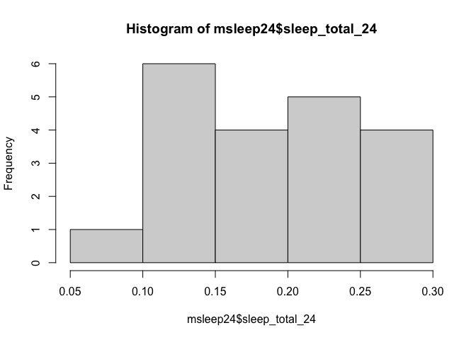

## Learning Goals
*At the end of this exercise, you will be able to:*    
1. Use a combination of `select()`, `filter()`, and `mutate()` to transform data frames.  
2. Use the `skimr` package to produce summaries of data.  
3. Produce clean summaries of data using `summarize()`.  
4. Use `group_by()` in combination with `summarize()` to produce grouped summaries of data.  

## Review
At this point, you should be comfortable using the functions of `dplyr`. If you need extra help, please [email me](mailto: jmledford@ucdavis.edu).  

## Package updates
In order to use some of the new function in the second part of lab today, you need to update your installed R packages. Please navigate to `Tools` >`Check for Package Updates...`. Follow the directions to update the packages.  

## Load the tidyverse and janitor

```r
library("tidyverse")
library("janitor")
```

## Install `skimr`

```r
library("skimr")
```

## Load the data
For this lab, we will use the built-in data on mammal sleep patterns. From: _V. M. Savage and G. B. West. A quantitative, theoretical framework for understanding mammalian sleep. Proceedings of the National Academy of Sciences, 104 (3):1051-1056, 2007_.

```r
?msleep
names(msleep)
```

```
##  [1] "name"         "genus"        "vore"         "order"        "conservation"
##  [6] "sleep_total"  "sleep_rem"    "sleep_cycle"  "awake"        "brainwt"     
## [11] "bodywt"
```

We will also use the awesome [palmerpenguins](https://allisonhorst.github.io/palmerpenguins/articles/intro.html) data in the second part of lab so let's install it now.

```r
remotes::install_github("allisonhorst/palmerpenguins")
```

```
## Skipping install of 'palmerpenguins' from a github remote, the SHA1 (69530276) has not changed since last install.
##   Use `force = TRUE` to force installation
```

## dplyr Practice
1. Let's do a bit more practice to make sure that we understand `select()`, `filter()`, and `mutate()`. Start by building a new data frame `msleep24` from the `msleep` data that: contains the `name` and `vore` variables along with a new column called `sleep_total_24` which is the amount of time a species sleeps expressed as a proportion of a 24-hour day. Remove any rows with NA's and restrict the `sleep_total_24` values to less than 0.3. Arrange the output in descending order.  

```r
msleep24 <-  
  mutate(msleep, sleep_total_24 = sleep_total /24) %>%
  select(name, vore, sleep_total_24) %>%
  filter(sleep_total_24 < 0.3) %>%
  arrange(desc(sleep_total_24))
msleep24
```

```
## # A tibble: 20 x 3
##    name                 vore  sleep_total_24
##    <chr>                <chr>          <dbl>
##  1 Vesper mouse         <NA>          0.292 
##  2 Gray hyrax           herbi         0.262 
##  3 Genet                carni         0.262 
##  4 Gray seal            carni         0.258 
##  5 Common porpoise      carni         0.233 
##  6 Rock hyrax           <NA>          0.225 
##  7 Goat                 herbi         0.221 
##  8 Tree hyrax           herbi         0.221 
##  9 Bottle-nosed dolphin carni         0.217 
## 10 Brazilian tapir      herbi         0.183 
## 11 Cow                  herbi         0.167 
## 12 Asian elephant       herbi         0.162 
## 13 Sheep                herbi         0.158 
## 14 Caspian seal         carni         0.146 
## 15 African elephant     herbi         0.137 
## 16 Donkey               herbi         0.129 
## 17 Roe deer             herbi         0.125 
## 18 Horse                herbi         0.121 
## 19 Pilot whale          carni         0.112 
## 20 Giraffe              herbi         0.0792
```

Did `dplyr` do what we expected? How do we check our output? Remember, just because your code runs it doesn't mean that it did what you intended.

```r
summary(msleep24)
```

```
##      name               vore           sleep_total_24   
##  Length:20          Length:20          Min.   :0.07917  
##  Class :character   Class :character   1st Qu.:0.13542  
##  Mode  :character   Mode  :character   Median :0.17500  
##                                        Mean   :0.18563  
##                                        3rd Qu.:0.22708  
##                                        Max.   :0.29167
```

Try out the new function `skim()` as part of the `skimr` package.

```r
skim(msleep24)
```


Table: Data summary

|                         |         |
|:------------------------|:--------|
|Name                     |msleep24 |
|Number of rows           |20       |
|Number of columns        |3        |
|_______________________  |         |
|Column type frequency:   |         |
|character                |2        |
|numeric                  |1        |
|________________________ |         |
|Group variables          |None     |


**Variable type: character**

|skim_variable | n_missing| complete_rate| min| max| empty| n_unique| whitespace|
|:-------------|---------:|-------------:|---:|---:|-----:|--------:|----------:|
|name          |         0|           1.0|   3|  20|     0|       20|          0|
|vore          |         2|           0.9|   5|   5|     0|        2|          0|


**Variable type: numeric**

|skim_variable  | n_missing| complete_rate| mean|   sd|   p0|  p25|  p50|  p75| p100|hist  |
|:--------------|---------:|-------------:|----:|----:|----:|----:|----:|----:|----:|:-----|
|sleep_total_24 |         0|             1| 0.19| 0.06| 0.08| 0.14| 0.17| 0.23| 0.29|▃▇▂▇▅ |

Histograms are also a quick way to check the output.

```r
hist(msleep24$sleep_total_24)
```

<!-- -->

Don't forget we can also use `tabyl()` across one or many variables.

```r
tabyl(msleep24$sleep_total_24)
```

```
##  msleep24$sleep_total_24 n percent
##               0.07916667 1    0.05
##               0.11250000 1    0.05
##               0.12083333 1    0.05
##               0.12500000 1    0.05
##               0.12916667 1    0.05
##               0.13750000 1    0.05
##               0.14583333 1    0.05
##               0.15833333 1    0.05
##               0.16250000 1    0.05
##               0.16666667 1    0.05
##               0.18333333 1    0.05
##               0.21666667 1    0.05
##               0.22083333 2    0.10
##               0.22500000 1    0.05
##               0.23333333 1    0.05
##               0.25833333 1    0.05
##               0.26250000 2    0.10
##               0.29166667 1    0.05
```

## Practice
1. Which taxonomic orders have species that belong to more than one class of `vore`?

```r
tabyl(msleep24$vore)
```

```
##  msleep24$vore  n percent valid_percent
##          carni  6     0.3     0.3333333
##          herbi 12     0.6     0.6666667
##           <NA>  2     0.1            NA
```

## `summarize()`
`summarize()` will produce summary statistics for a given variable in a data frame. For example, if you are asked to calculate the mean of `sleep_total` for large and small mammals you could do this using a combination of commands, but it isn't very efficient or clean. We can do better!  

```r
head(msleep)
```

```
## # A tibble: 6 x 11
##   name  genus vore  order conservation sleep_total sleep_rem sleep_cycle awake
##   <chr> <chr> <chr> <chr> <chr>              <dbl>     <dbl>       <dbl> <dbl>
## 1 Chee… Acin… carni Carn… lc                  12.1      NA        NA      11.9
## 2 Owl … Aotus omni  Prim… <NA>                17         1.8      NA       7  
## 3 Moun… Aplo… herbi Rode… nt                  14.4       2.4      NA       9.6
## 4 Grea… Blar… omni  Sori… lc                  14.9       2.3       0.133   9.1
## 5 Cow   Bos   herbi Arti… domesticated         4         0.7       0.667  20  
## 6 Thre… Brad… herbi Pilo… <NA>                14.4       2.2       0.767   9.6
## # … with 2 more variables: brainwt <dbl>, bodywt <dbl>
```

For example, if we define "large" as having a `bodywt` greater than 200 then we get the following:

```r
large <- 
  msleep %>% 
  select(name, genus, bodywt, sleep_total) %>% 
  filter(bodywt > 200) %>% 
  arrange(desc(bodywt))
large
```

```
## # A tibble: 7 x 4
##   name             genus         bodywt sleep_total
##   <chr>            <chr>          <dbl>       <dbl>
## 1 African elephant Loxodonta      6654          3.3
## 2 Asian elephant   Elephas        2547          3.9
## 3 Giraffe          Giraffa         900.         1.9
## 4 Pilot whale      Globicephalus   800          2.7
## 5 Cow              Bos             600          4  
## 6 Horse            Equus           521          2.9
## 7 Brazilian tapir  Tapirus         208.         4.4
```


```r
mean(large$sleep_total)
```

```
## [1] 3.3
```

We can accomplish the same task using the `summarize()` function to make things cleaner.

```r
msleep %>% 
  filter(bodywt > 200) %>%
  summarize(mean_sleep_lg = mean(sleep_total))
```

```
## # A tibble: 1 x 1
##   mean_sleep_lg
##           <dbl>
## 1           3.3
```

You can also combine functions to make useful summaries for multiple variables.

```r
msleep %>% 
    filter(bodywt > 200) %>% 
    summarize(mean_sleep_lg = mean(sleep_total), 
              min_sleep_lg = min(sleep_total),
              max_sleep_lg = max(sleep_total),
              total = n())
```

```
## # A tibble: 1 x 4
##   mean_sleep_lg min_sleep_lg max_sleep_lg total
##           <dbl>        <dbl>        <dbl> <int>
## 1           3.3          1.9          4.4     7
```

## Practice
1. What is the mean, min, and max `bodywt` for the taxonomic order Primates? Provide the total number of observations.

```r
msleep %>%
  filter(order == "Primates") %>%
  summarize(mean_bodywt = mean(bodywt),
            min_bodywt = min(bodywt),
            max_bodywt = max(bodywt),
            total = n())
```

```
## # A tibble: 1 x 4
##   mean_bodywt min_bodywt max_bodywt total
##         <dbl>      <dbl>      <dbl> <int>
## 1        13.9        0.2         62    12
```

`n_distinct()` is a very handy way of cleanly presenting the number of distinct observations. Here we show the number of distinct genera over 100 in body weight.

```r
msleep %>% 
  filter(bodywt > 100) %>% 
  summarise(n_genera=n_distinct(genus))
```

```
## # A tibble: 1 x 1
##   n_genera
##      <int>
## 1        9
```

There are many other useful summary statistics, depending on your needs: sd(), min(), max(), median(), sum(), n() (returns the length of a column), first() (returns first value in a column), last() (returns last value in a column) and n_distinct() (number of distinct values in a column).

## Practice
1. How many genera are represented in the msleep data frame?

```r
msleep %>%
  summarise(n_genera = n_distinct(genus))
```

```
## # A tibble: 1 x 1
##   n_genera
##      <int>
## 1       77
```

2. What are the min, max, and mean `sleep_total` for all of the mammals? Be sure to include the total n.

```r
msleep %>%
  summarize(mean_sleep_total = mean(sleep_total),
            min_sleep_total = min(sleep_total),
            max_sleep_total = max(sleep_total),
            total = n())
```

```
## # A tibble: 1 x 4
##   mean_sleep_total min_sleep_total max_sleep_total total
##              <dbl>           <dbl>           <dbl> <int>
## 1             10.4             1.9            19.9    83
```

## `group_by()`
The `summarize()` function is most useful when used in conjunction with `group_by()`. Although producing a summary of body weight for all of the mammals in the data set is helpful, what if we were interested in body weight by feeding ecology?

```r
msleep %>%
  group_by(vore) %>% #we are grouping by feeding ecology
  summarize(min_bodywt = min(bodywt),
            max_bodywt = max(bodywt),
            mean_bodywt = mean(bodywt),
            total=n())
```

```
## `summarise()` ungrouping output (override with `.groups` argument)
```

```
## # A tibble: 5 x 5
##   vore    min_bodywt max_bodywt mean_bodywt total
##   <chr>        <dbl>      <dbl>       <dbl> <int>
## 1 carni        0.028      800        90.8      19
## 2 herbi        0.022     6654       367.       32
## 3 insecti      0.01        60        12.9       5
## 4 omni         0.005       86.2      12.7      20
## 5 <NA>         0.021        3.6       0.858     7
```

## Practice
1. Calculate mean brain weight by taxonomic order in the msleep data.

```r
msleep %>%
  group_by(order) %>%
  summarize(mean_brainwt = mean(brainwt),
           total=n())
```

```
## `summarise()` ungrouping output (override with `.groups` argument)
```

```
## # A tibble: 19 x 3
##    order           mean_brainwt total
##    <chr>                  <dbl> <int>
##  1 Afrosoricida        0.0026       1
##  2 Artiodactyla       NA            6
##  3 Carnivora          NA           12
##  4 Cetacea            NA            3
##  5 Chiroptera          0.000275     2
##  6 Cingulata           0.0459       2
##  7 Didelphimorphia    NA            2
##  8 Diprotodontia      NA            2
##  9 Erinaceomorpha      0.00295      2
## 10 Hyracoidea          0.0152       3
## 11 Lagomorpha          0.0121       1
## 12 Monotremata         0.025        1
## 13 Perissodactyla      0.414        3
## 14 Pilosa             NA            1
## 15 Primates           NA           12
## 16 Proboscidea         5.16         2
## 17 Rodentia           NA           22
## 18 Scandentia          0.0025       1
## 19 Soricomorpha        0.000592     5
```

2. What does `NA` mean? How are NA's being treated by the summarize function?
NA indicates missing values in a dataset. If any value = NA, the summarize function outputs NA.

3. Try running the code again, but this time add `na.rm=TRUE`. What is the problem with Cetacea? Compare this to Carnivora. 

```r
msleep %>%
  group_by(order) %>%
  summarize(mean_brainwt = mean(brainwt, na.rm = TRUE),
           total=n())
```

```
## `summarise()` ungrouping output (override with `.groups` argument)
```

```
## # A tibble: 19 x 3
##    order           mean_brainwt total
##    <chr>                  <dbl> <int>
##  1 Afrosoricida        0.0026       1
##  2 Artiodactyla        0.198        6
##  3 Carnivora           0.0986      12
##  4 Cetacea           NaN            3
##  5 Chiroptera          0.000275     2
##  6 Cingulata           0.0459       2
##  7 Didelphimorphia     0.0063       2
##  8 Diprotodontia       0.0114       2
##  9 Erinaceomorpha      0.00295      2
## 10 Hyracoidea          0.0152       3
## 11 Lagomorpha          0.0121       1
## 12 Monotremata         0.025        1
## 13 Perissodactyla      0.414        3
## 14 Pilosa            NaN            1
## 15 Primates            0.254       12
## 16 Proboscidea         5.16         2
## 17 Rodentia            0.00357     22
## 18 Scandentia          0.0025       1
## 19 Soricomorpha        0.000592     5
```

## That's it! Take a break and I will see you on Zoom!  

-->[Home](https://jmledford3115.github.io/datascibiol/)  
