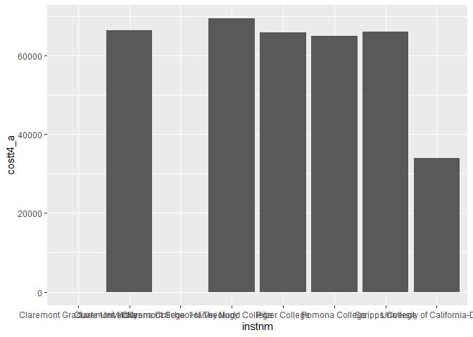
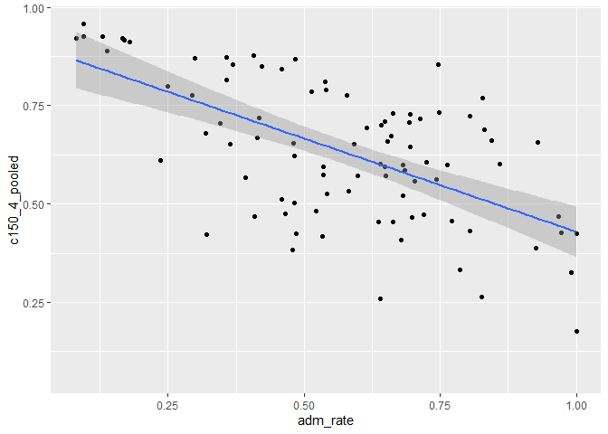
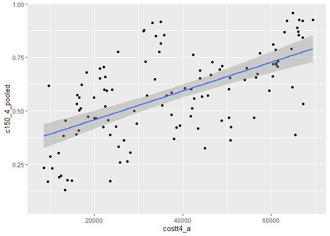

## Instructions
Answer the following questions and complete the exercises in RMarkdown. Please embed all of your code and push your final work to your repository. Your final lab report should be organized, clean, and run free from errors. Remember, you must remove the `#` for the included code chunks to run. Be sure to add your name to the author header above.  

Make sure to use the formatting conventions of RMarkdown to make your report neat and clean!  

## Load the libraries

```r
library(tidyverse)
library(janitor)
library(here)
library(naniar)
```

For this homework, we will take a departure from biological data and use data about California colleges. These data are a subset of the national college scorecard (https://collegescorecard.ed.gov/data/). Load the `ca_college_data.csv` as a new object called `colleges`.

```r
colleges <- read_csv(here("lab9", "data", "ca_college_data.csv")) %>%
  janitor::clean_names()
```

```
## 
## ── Column specification ────────────────────────────────────────────────────────
## cols(
##   INSTNM = col_character(),
##   CITY = col_character(),
##   STABBR = col_character(),
##   ZIP = col_character(),
##   ADM_RATE = col_double(),
##   SAT_AVG = col_double(),
##   PCIP26 = col_double(),
##   COSTT4_A = col_double(),
##   C150_4_POOLED = col_double(),
##   PFTFTUG1_EF = col_double()
## )
```

```r
colleges
```

```
## # A tibble: 341 x 10
##    instnm city  stabbr zip   adm_rate sat_avg pcip26 costt4_a c150_4_pooled
##    <chr>  <chr> <chr>  <chr>    <dbl>   <dbl>  <dbl>    <dbl>         <dbl>
##  1 Gross… El C… CA     9202…       NA      NA 0.0016     7956        NA    
##  2 Colle… Visa… CA     9327…       NA      NA 0.0066     8109        NA    
##  3 Colle… San … CA     9440…       NA      NA 0.0038     8278        NA    
##  4 Ventu… Vent… CA     9300…       NA      NA 0.0035     8407        NA    
##  5 Oxnar… Oxna… CA     9303…       NA      NA 0.0085     8516        NA    
##  6 Moorp… Moor… CA     9302…       NA      NA 0.0151     8577        NA    
##  7 Skyli… San … CA     9406…       NA      NA 0          8580         0.233
##  8 Glend… Glen… CA     9120…       NA      NA 0.002      9181        NA    
##  9 Citru… Glen… CA     9174…       NA      NA 0.0021     9281        NA    
## 10 Fresn… Fres… CA     93741       NA      NA 0.0324     9370        NA    
## # … with 331 more rows, and 1 more variable: pftftug1_ef <dbl>
```

The variables are a bit hard to decipher, here is a key:  

INSTNM: Institution name  
CITY: California city  
STABBR: Location state  
ZIP: Zip code  
ADM_RATE: Admission rate  
SAT_AVG: SAT average score  
PCIP26: Percentage of degrees awarded in Biological And Biomedical Sciences  
COSTT4_A: Annual cost of attendance  
C150_4_POOLED: 4-year completion rate  
PFTFTUG1_EF: Percentage of undergraduate students who are first-time, full-time degree/certificate-seeking undergraduate students  

1. Use your preferred function(s) to have a look at the data and get an idea of its structure. Make sure you summarize NA's and determine whether or not the data are tidy. You may also consider dealing with any naming issues.

```r
glimpse(colleges)
```

```
## Rows: 341
## Columns: 10
## $ instnm        <chr> "Grossmont College", "College of the Sequoias", "Colleg…
## $ city          <chr> "El Cajon", "Visalia", "San Mateo", "Ventura", "Oxnard"…
## $ stabbr        <chr> "CA", "CA", "CA", "CA", "CA", "CA", "CA", "CA", "CA", "…
## $ zip           <chr> "92020-1799", "93277-2214", "94402-3784", "93003-3872",…
## $ adm_rate      <dbl> NA, NA, NA, NA, NA, NA, NA, NA, NA, NA, NA, NA, NA, NA,…
## $ sat_avg       <dbl> NA, NA, NA, NA, NA, NA, NA, NA, NA, NA, NA, NA, NA, NA,…
## $ pcip26        <dbl> 0.0016, 0.0066, 0.0038, 0.0035, 0.0085, 0.0151, 0.0000,…
## $ costt4_a      <dbl> 7956, 8109, 8278, 8407, 8516, 8577, 8580, 9181, 9281, 9…
## $ c150_4_pooled <dbl> NA, NA, NA, NA, NA, NA, 0.2334, NA, NA, NA, NA, 0.1704,…
## $ pftftug1_ef   <dbl> 0.3546, 0.5413, 0.3567, 0.3824, 0.2753, 0.4286, 0.2307,…
```
Using the glimpse(), we can already see that many of the NA's are represented by "NA" only and not a value.

```r
colleges %>%
  summarise(number_nas = sum(is.na(colleges)))
```

```
## # A tibble: 1 x 1
##   number_nas
##        <int>
## 1        949
```


```r
colleges
```

```
## # A tibble: 341 x 10
##    instnm city  stabbr zip   adm_rate sat_avg pcip26 costt4_a c150_4_pooled
##    <chr>  <chr> <chr>  <chr>    <dbl>   <dbl>  <dbl>    <dbl>         <dbl>
##  1 Gross… El C… CA     9202…       NA      NA 0.0016     7956        NA    
##  2 Colle… Visa… CA     9327…       NA      NA 0.0066     8109        NA    
##  3 Colle… San … CA     9440…       NA      NA 0.0038     8278        NA    
##  4 Ventu… Vent… CA     9300…       NA      NA 0.0035     8407        NA    
##  5 Oxnar… Oxna… CA     9303…       NA      NA 0.0085     8516        NA    
##  6 Moorp… Moor… CA     9302…       NA      NA 0.0151     8577        NA    
##  7 Skyli… San … CA     9406…       NA      NA 0          8580         0.233
##  8 Glend… Glen… CA     9120…       NA      NA 0.002      9181        NA    
##  9 Citru… Glen… CA     9174…       NA      NA 0.0021     9281        NA    
## 10 Fresn… Fres… CA     93741       NA      NA 0.0324     9370        NA    
## # … with 331 more rows, and 1 more variable: pftftug1_ef <dbl>
```
The data appears tidy. Every variable has its own column, every observation has its own row, and each value has its own cell. It is in long format, with at least one type of observation appearing multiple times in a column (e.g. Los Angeles appears more than once under the city column).

2. Which cities in California have the highest number of colleges?

```r
colleges_in_city <- 
  colleges %>%
  filter(stabbr == "CA") %>%
  group_by(city) %>%
  summarise(total_colleges = n_distinct(instnm)) %>%
  arrange(desc(total_colleges))
```

```
## `summarise()` ungrouping output (override with `.groups` argument)
```

```r
colleges_in_city
```

```
## # A tibble: 159 x 2
##    city          total_colleges
##    <chr>                  <int>
##  1 Los Angeles               24
##  2 San Diego                 18
##  3 San Francisco             15
##  4 Sacramento                10
##  5 Berkeley                   9
##  6 Oakland                    9
##  7 Claremont                  7
##  8 Pasadena                   6
##  9 Fresno                     5
## 10 Irvine                     5
## # … with 149 more rows
```

3. Based on your answer to #2, make a plot that shows the number of colleges in the top 10 cities.

```r
colleges_in_city %>%
  filter(total_colleges >= 5 & city != "Riverside" & city != "San Jose") %>%
  ggplot(aes(x=city, y=total_colleges)) +
  geom_col()
```

<!-- -->


4. The column `COSTT4_A` is the annual cost of each institution. Which city has the highest average cost? Where is it located?


```r
city_costs <- 
  colleges %>%
  select(instnm, city, stabbr, zip, costt4_a) %>%
  arrange(desc(costt4_a))
city_costs
```

```
## # A tibble: 341 x 5
##    instnm                                  city        stabbr zip       costt4_a
##    <chr>                                   <chr>       <chr>  <chr>        <dbl>
##  1 Harvey Mudd College                     Claremont   CA     91711        69355
##  2 Southern California Institute of Archi… Los Angeles CA     90013-18…    67225
##  3 University of Southern California       Los Angeles CA     90089        67064
##  4 Occidental College                      Los Angeles CA     90041-33…    67046
##  5 Claremont McKenna College               Claremont   CA     91711-64…    66325
##  6 Pepperdine University                   Malibu      CA     90263        66152
##  7 Scripps College                         Claremont   CA     91711-39…    66060
##  8 Pitzer College                          Claremont   CA     91711-61…    65880
##  9 San Francisco Art Institute             San Franci… CA     94133-22…    65453
## 10 Pomona College                          Claremont   CA     91711-63…    64870
## # … with 331 more rows
```
Harvey Mudd College has the highest overall annual cost of $69,355. It is located in Claremont, CA 91711.

```r
city_total_costs <- 
  colleges %>%
  group_by(city) %>%
  summarise(avg_costs = mean(costt4_a, na.rm=T)) %>%
  arrange(desc(avg_costs))
```

```
## `summarise()` ungrouping output (override with `.groups` argument)
```

```r
city_total_costs
```

```
## # A tibble: 161 x 2
##    city                avg_costs
##    <chr>                   <dbl>
##  1 Claremont               66498
##  2 Malibu                  66152
##  3 Valencia                64686
##  4 Orange                  64501
##  5 Redlands                61542
##  6 Moraga                  61095
##  7 Atherton                56035
##  8 Thousand Oaks           54373
##  9 Rancho Palos Verdes     50758
## 10 La Verne                50603
## # … with 151 more rows
```
Claremont, CA has the highest average annual cost for their institutions.

5. Based on your answer to #4, make a plot that compares the cost of the individual colleges in the most expensive city. Bonus! Add UC Davis here to see how it compares :>).

```r
colleges %>%
  filter(city == "Claremont" | instnm == "University of California-Davis") %>%
  ggplot(aes(x=instnm, y=costt4_a)) +
  geom_col()
```

```
## Warning: Removed 2 rows containing missing values (position_stack).
```

<!-- -->
Here is a summary of the plot, showing the exact annual costs for each institution.

```r
colleges %>%
  filter(city == "Claremont" | instnm == "University of California-Davis") %>%
  select(city, instnm, costt4_a) %>%
  arrange(desc(costt4_a))
```

```
## # A tibble: 8 x 3
##   city      instnm                         costt4_a
##   <chr>     <chr>                             <dbl>
## 1 Claremont Harvey Mudd College               69355
## 2 Claremont Claremont McKenna College         66325
## 3 Claremont Scripps College                   66060
## 4 Claremont Pitzer College                    65880
## 5 Claremont Pomona College                    64870
## 6 Davis     University of California-Davis    33904
## 7 Claremont Claremont Graduate University        NA
## 8 Claremont Claremont School of Theology         NA
```

6. The column `ADM_RATE` is the admissions rate by college and `C150_4_POOLED` is the four-year completion rate. Use a scatterplot to show the relationship between these two variables. What do you think this means?

```r
ggplot(data=colleges, mapping=aes(x=adm_rate, y=c150_4_pooled)) +
  geom_point()+
  geom_smooth(method=lm, se=T)
```

```
## `geom_smooth()` using formula 'y ~ x'
```

```
## Warning: Removed 251 rows containing non-finite values (stat_smooth).
```

```
## Warning: Removed 251 rows containing missing values (geom_point).
```

<!-- -->
Generally, it appears as though the four-year completion rate decreases as admission rate increases. In other words, colleges that are easier to be accepted to have a lower rate of students earning a degree in four years.

7. Is there a relationship between cost and four-year completion rate? (You don't need to do the stats, just produce a plot). What do you think this means?

```r
ggplot(data=colleges, mapping=aes(x=costt4_a, y=c150_4_pooled)) +
  geom_point()+
  geom_smooth(method=lm, se=T)
```

```
## `geom_smooth()` using formula 'y ~ x'
```

```
## Warning: Removed 225 rows containing non-finite values (stat_smooth).
```

```
## Warning: Removed 225 rows containing missing values (geom_point).
```

<!-- -->
The points on the scatterplot are quite all over the place. Using the regression line, you could say that, generally, institutions that have a higher annual cost also have a higher four-year completion rate. However, there are a lot of points that deviate from the regression line. R^2 is, therefore, likely small and there is not a good identifiable relationship between costs and completion rates.

8. The column titled `INSTNM` is the institution name. We are only interested in the University of California colleges. Make a new data frame that is restricted to UC institutions. You can remove `Hastings College of Law` and `UC San Francisco` as we are only interested in undergraduate institutions.

```r
uc_schools <- 
  colleges %>%
  filter(str_detect(instnm, "University of California"))
uc_schools
```

```
## # A tibble: 10 x 10
##    instnm city  stabbr zip   adm_rate sat_avg pcip26 costt4_a c150_4_pooled
##    <chr>  <chr> <chr>  <chr>    <dbl>   <dbl>  <dbl>    <dbl>         <dbl>
##  1 Unive… La J… CA     92093    0.357    1324  0.216    31043         0.872
##  2 Unive… Irvi… CA     92697    0.406    1206  0.107    31198         0.876
##  3 Unive… Rive… CA     92521    0.663    1078  0.149    31494         0.73 
##  4 Unive… Los … CA     9009…    0.180    1334  0.155    33078         0.911
##  5 Unive… Davis CA     9561…    0.423    1218  0.198    33904         0.850
##  6 Unive… Sant… CA     9506…    0.578    1201  0.193    34608         0.776
##  7 Unive… Berk… CA     94720    0.169    1422  0.105    34924         0.916
##  8 Unive… Sant… CA     93106    0.358    1281  0.108    34998         0.816
##  9 Unive… San … CA     9410…   NA          NA NA           NA        NA    
## 10 Unive… San … CA     9414…   NA          NA NA           NA        NA    
## # … with 1 more variable: pftftug1_ef <dbl>
```
Remove `Hastings College of Law` and `UC San Francisco` and store the final data frame as a new object `univ_calif_final`.

```r
univ_calif_final <- 
  uc_schools %>%
  filter(instnm != "University of California-Hastings College of Law" & instnm != "University of California-San Francisco")
univ_calif_final
```

```
## # A tibble: 8 x 10
##   instnm city  stabbr zip   adm_rate sat_avg pcip26 costt4_a c150_4_pooled
##   <chr>  <chr> <chr>  <chr>    <dbl>   <dbl>  <dbl>    <dbl>         <dbl>
## 1 Unive… La J… CA     92093    0.357    1324  0.216    31043         0.872
## 2 Unive… Irvi… CA     92697    0.406    1206  0.107    31198         0.876
## 3 Unive… Rive… CA     92521    0.663    1078  0.149    31494         0.73 
## 4 Unive… Los … CA     9009…    0.180    1334  0.155    33078         0.911
## 5 Unive… Davis CA     9561…    0.423    1218  0.198    33904         0.850
## 6 Unive… Sant… CA     9506…    0.578    1201  0.193    34608         0.776
## 7 Unive… Berk… CA     94720    0.169    1422  0.105    34924         0.916
## 8 Unive… Sant… CA     93106    0.358    1281  0.108    34998         0.816
## # … with 1 more variable: pftftug1_ef <dbl>
```

Use `separate()` to separate institution name into two new columns "UNIV" and "CAMPUS".

```r
univ_calif_final2 <- 
  univ_calif_final %>%
  separate(instnm, into = c("univ", "campus"), sep = "-")
```

9. The column `ADM_RATE` is the admissions rate by campus. Which UC has the lowest and highest admissions rates? Produce a numerical summary and an appropriate plot.

```r
univ_calif_final2 %>%
  select(campus, adm_rate) %>%
  arrange(desc(adm_rate))
```

```
## # A tibble: 8 x 2
##   campus        adm_rate
##   <chr>            <dbl>
## 1 Riverside        0.663
## 2 Santa Cruz       0.578
## 3 Davis            0.423
## 4 Irvine           0.406
## 5 Santa Barbara    0.358
## 6 San Diego        0.357
## 7 Los Angeles      0.180
## 8 Berkeley         0.169
```


```r
univ_calif_final2 %>%
  ggplot(aes(x=campus, y=adm_rate)) +
  geom_col()
```

<!-- -->
UC Riverside has the highest admission rate of 66.34%, whereas UC Berkley has the lowest with only 16.93%.

10. If you wanted to get a degree in biological or biomedical sciences, which campus confers the majority of these degrees? Produce a numerical summary and an appropriate plot.

```r
univ_calif_final2 %>%
  select(campus, pcip26) %>%
  arrange(desc(pcip26))
```

```
## # A tibble: 8 x 2
##   campus        pcip26
##   <chr>          <dbl>
## 1 San Diego      0.216
## 2 Davis          0.198
## 3 Santa Cruz     0.193
## 4 Los Angeles    0.155
## 5 Riverside      0.149
## 6 Santa Barbara  0.108
## 7 Irvine         0.107
## 8 Berkeley       0.105
```

```r
univ_calif_final2 %>%
  ggplot(aes(x=campus, y=pcip26)) +
  geom_col()
```

<!-- -->
UC San Diego awards the most degrees in the biological or biomedical sciences.

## Knit Your Output and Post to [GitHub](https://github.com/FRS417-DataScienceBiologists)
