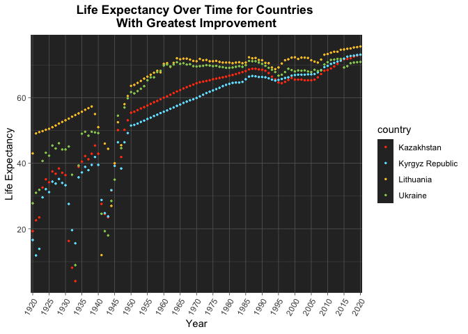
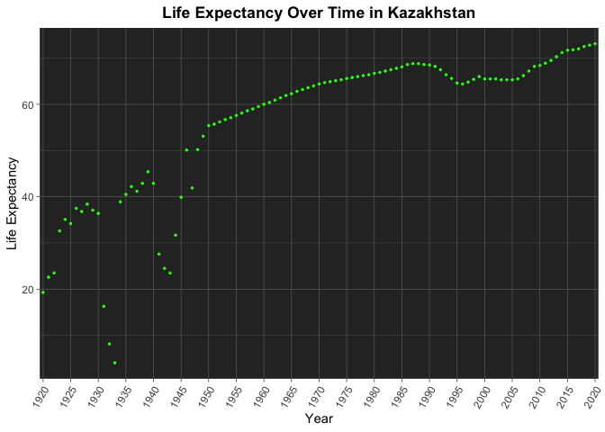
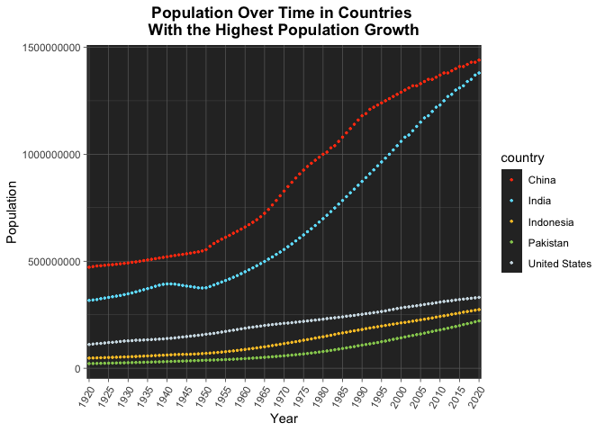
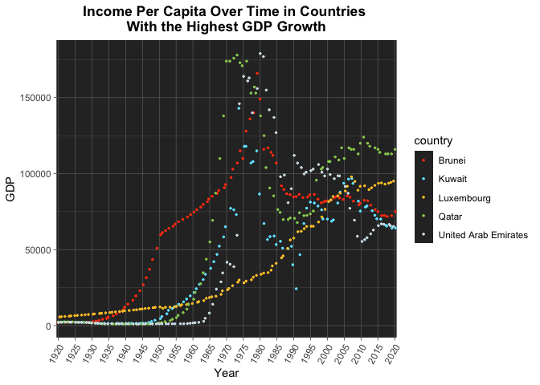
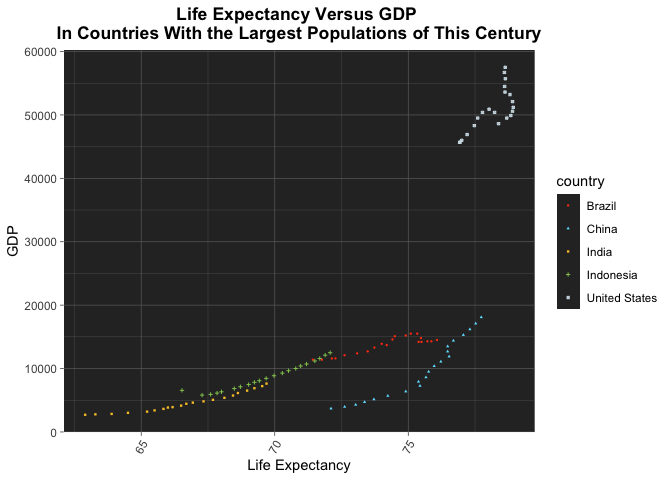

## Instructions
Answer the following questions and complete the exercises in RMarkdown. Please embed all of your code and push your final work to your repository. Your code should be organized, clean, and run free from errors. Be sure to **add your name** to the author header above. You may use any resources to answer these questions (including each other), but you may not post questions to Open Stacks or external help sites. There are 10 total questions.  

Make sure to use the formatting conventions of RMarkdown to make your report neat and clean! Your plots should use consistent aesthetics throughout. Feel free to be creative- there are many possible solutions to these questions!  

This exam is due by **12:00p on Tuesday, February 23**.  

## Load the libraries
# I am not 100% sure about these libraries and the diamonds data. Were you testing something here?

```r
library(tidyverse)
library(janitor)
library(here)
library(paletteer)
library(RColorBrewer)
options(scipen=999) #disables scientific notation when printing
```

```r
library("ggsci")
library("ggplot2")
library("gridExtra")

data("diamonds")

p1 = ggplot(subset(diamonds, carat >= 2.2),
       aes(x = table, y = price, colour = cut)) +
  geom_point(alpha = 0.7) +
  geom_smooth(method = "loess", alpha = 0.05, size = 1, span = 1) +
  theme_bw()

p2 = ggplot(subset(diamonds, carat > 2.2 & depth > 55 & depth < 70),
       aes(x = depth, fill = cut)) +
  geom_histogram(colour = "black", binwidth = 1, position = "dodge") +
  theme_bw()
```

## Gapminder
For this assignment, we are going to use data from  [gapminder](https://www.gapminder.org/). Gapminder includes information about economics, population, social issues, and life expectancy from countries all over the world. We will use three data sets, so please load all three.  

One thing to note is that the data include years beyond 2021. These are projections based on modeling done by the gapminder organization. Start by importing the data.

```r
population <- read_csv(here("midterm2", "data", "population_total.csv"))
population
```

```
# A tibble: 195 x 302
   country `1800` `1801` `1802` `1803` `1804` `1805` `1806` `1807` `1808` `1809`
   <chr>    <dbl>  <dbl>  <dbl>  <dbl>  <dbl>  <dbl>  <dbl>  <dbl>  <dbl>  <dbl>
 1 Afghan… 3.28e6 3.28e6 3.28e6 3.28e6 3.28e6 3.28e6 3.28e6 3.28e6 3.28e6 3.28e6
 2 Albania 4.00e5 4.02e5 4.04e5 4.05e5 4.07e5 4.09e5 4.11e5 4.13e5 4.14e5 4.16e5
 3 Algeria 2.50e6 2.51e6 2.52e6 2.53e6 2.54e6 2.55e6 2.56e6 2.56e6 2.57e6 2.58e6
 4 Andorra 2.65e3 2.65e3 2.65e3 2.65e3 2.65e3 2.65e3 2.65e3 2.65e3 2.65e3 2.65e3
 5 Angola  1.57e6 1.57e6 1.57e6 1.57e6 1.57e6 1.57e6 1.57e6 1.57e6 1.57e6 1.57e6
 6 Antigu… 3.70e4 3.70e4 3.70e4 3.70e4 3.70e4 3.70e4 3.70e4 3.70e4 3.70e4 3.70e4
 7 Argent… 5.34e5 5.20e5 5.06e5 4.92e5 4.79e5 4.66e5 4.53e5 4.41e5 4.29e5 4.17e5
 8 Armenia 4.13e5 4.13e5 4.13e5 4.13e5 4.13e5 4.13e5 4.13e5 4.13e5 4.13e5 4.13e5
 9 Austra… 2.00e5 2.05e5 2.11e5 2.16e5 2.22e5 2.27e5 2.33e5 2.39e5 2.46e5 2.52e5
10 Austria 3.00e6 3.02e6 3.04e6 3.05e6 3.07e6 3.09e6 3.11e6 3.12e6 3.14e6 3.16e6
# … with 185 more rows, and 291 more variables: 1810 <dbl>, 1811 <dbl>,
#   1812 <dbl>, 1813 <dbl>, 1814 <dbl>, 1815 <dbl>, 1816 <dbl>, 1817 <dbl>,
#   1818 <dbl>, 1819 <dbl>, 1820 <dbl>, 1821 <dbl>, 1822 <dbl>, 1823 <dbl>,
#   1824 <dbl>, 1825 <dbl>, 1826 <dbl>, 1827 <dbl>, 1828 <dbl>, 1829 <dbl>,
#   1830 <dbl>, 1831 <dbl>, 1832 <dbl>, 1833 <dbl>, 1834 <dbl>, 1835 <dbl>,
#   1836 <dbl>, 1837 <dbl>, 1838 <dbl>, 1839 <dbl>, 1840 <dbl>, 1841 <dbl>,
#   1842 <dbl>, 1843 <dbl>, 1844 <dbl>, 1845 <dbl>, 1846 <dbl>, 1847 <dbl>,
#   1848 <dbl>, 1849 <dbl>, 1850 <dbl>, 1851 <dbl>, 1852 <dbl>, 1853 <dbl>,
#   1854 <dbl>, 1855 <dbl>, 1856 <dbl>, 1857 <dbl>, 1858 <dbl>, 1859 <dbl>,
#   1860 <dbl>, 1861 <dbl>, 1862 <dbl>, 1863 <dbl>, 1864 <dbl>, 1865 <dbl>,
#   1866 <dbl>, 1867 <dbl>, 1868 <dbl>, 1869 <dbl>, 1870 <dbl>, 1871 <dbl>,
#   1872 <dbl>, 1873 <dbl>, 1874 <dbl>, 1875 <dbl>, 1876 <dbl>, 1877 <dbl>,
#   1878 <dbl>, 1879 <dbl>, 1880 <dbl>, 1881 <dbl>, 1882 <dbl>, 1883 <dbl>,
#   1884 <dbl>, 1885 <dbl>, 1886 <dbl>, 1887 <dbl>, 1888 <dbl>, 1889 <dbl>,
#   1890 <dbl>, 1891 <dbl>, 1892 <dbl>, 1893 <dbl>, 1894 <dbl>, 1895 <dbl>,
#   1896 <dbl>, 1897 <dbl>, 1898 <dbl>, 1899 <dbl>, 1900 <dbl>, 1901 <dbl>,
#   1902 <dbl>, 1903 <dbl>, 1904 <dbl>, 1905 <dbl>, 1906 <dbl>, 1907 <dbl>,
#   1908 <dbl>, 1909 <dbl>, …
```


```r
income <- read_csv(here("midterm2", "data", "income_per_person_gdppercapita_ppp_inflation_adjusted.csv"))
income
```

```
# A tibble: 193 x 242
   country `1800` `1801` `1802` `1803` `1804` `1805` `1806` `1807` `1808` `1809`
   <chr>    <dbl>  <dbl>  <dbl>  <dbl>  <dbl>  <dbl>  <dbl>  <dbl>  <dbl>  <dbl>
 1 Afghan…    603    603    603    603    603    603    603    603    603    603
 2 Albania    667    667    667    667    667    668    668    668    668    668
 3 Algeria    715    716    717    718    719    720    721    722    723    724
 4 Andorra   1200   1200   1200   1200   1210   1210   1210   1210   1220   1220
 5 Angola     618    620    623    626    628    631    634    637    640    642
 6 Antigu…    757    757    757    757    757    757    757    758    758    758
 7 Argent…   1640   1640   1650   1650   1660   1660   1670   1680   1680   1690
 8 Armenia    514    514    514    514    514    514    514    514    514    514
 9 Austra…    817    822    826    831    836    841    845    850    855    860
10 Austria   1850   1850   1860   1870   1880   1880   1890   1900   1910   1920
# … with 183 more rows, and 231 more variables: 1810 <dbl>, 1811 <dbl>,
#   1812 <dbl>, 1813 <dbl>, 1814 <dbl>, 1815 <dbl>, 1816 <dbl>, 1817 <dbl>,
#   1818 <dbl>, 1819 <dbl>, 1820 <dbl>, 1821 <dbl>, 1822 <dbl>, 1823 <dbl>,
#   1824 <dbl>, 1825 <dbl>, 1826 <dbl>, 1827 <dbl>, 1828 <dbl>, 1829 <dbl>,
#   1830 <dbl>, 1831 <dbl>, 1832 <dbl>, 1833 <dbl>, 1834 <dbl>, 1835 <dbl>,
#   1836 <dbl>, 1837 <dbl>, 1838 <dbl>, 1839 <dbl>, 1840 <dbl>, 1841 <dbl>,
#   1842 <dbl>, 1843 <dbl>, 1844 <dbl>, 1845 <dbl>, 1846 <dbl>, 1847 <dbl>,
#   1848 <dbl>, 1849 <dbl>, 1850 <dbl>, 1851 <dbl>, 1852 <dbl>, 1853 <dbl>,
#   1854 <dbl>, 1855 <dbl>, 1856 <dbl>, 1857 <dbl>, 1858 <dbl>, 1859 <dbl>,
#   1860 <dbl>, 1861 <dbl>, 1862 <dbl>, 1863 <dbl>, 1864 <dbl>, 1865 <dbl>,
#   1866 <dbl>, 1867 <dbl>, 1868 <dbl>, 1869 <dbl>, 1870 <dbl>, 1871 <dbl>,
#   1872 <dbl>, 1873 <dbl>, 1874 <dbl>, 1875 <dbl>, 1876 <dbl>, 1877 <dbl>,
#   1878 <dbl>, 1879 <dbl>, 1880 <dbl>, 1881 <dbl>, 1882 <dbl>, 1883 <dbl>,
#   1884 <dbl>, 1885 <dbl>, 1886 <dbl>, 1887 <dbl>, 1888 <dbl>, 1889 <dbl>,
#   1890 <dbl>, 1891 <dbl>, 1892 <dbl>, 1893 <dbl>, 1894 <dbl>, 1895 <dbl>,
#   1896 <dbl>, 1897 <dbl>, 1898 <dbl>, 1899 <dbl>, 1900 <dbl>, 1901 <dbl>,
#   1902 <dbl>, 1903 <dbl>, 1904 <dbl>, 1905 <dbl>, 1906 <dbl>, 1907 <dbl>,
#   1908 <dbl>, 1909 <dbl>, …
```


```r
life_expectancy <- read_csv(here("midterm2", "data", "life_expectancy_years.csv"))
life_expectancy
```

```
# A tibble: 187 x 302
   country `1800` `1801` `1802` `1803` `1804` `1805` `1806` `1807` `1808` `1809`
   <chr>    <dbl>  <dbl>  <dbl>  <dbl>  <dbl>  <dbl>  <dbl>  <dbl>  <dbl>  <dbl>
 1 Afghan…   28.2   28.2   28.2   28.2   28.2   28.2   28.1   28.1   28.1   28.1
 2 Albania   35.4   35.4   35.4   35.4   35.4   35.4   35.4   35.4   35.4   35.4
 3 Algeria   28.8   28.8   28.8   28.8   28.8   28.8   28.8   28.8   28.8   28.8
 4 Andorra   NA     NA     NA     NA     NA     NA     NA     NA     NA     NA  
 5 Angola    27     27     27     27     27     27     27     27     27     27  
 6 Antigu…   33.5   33.5   33.5   33.5   33.5   33.5   33.5   33.5   33.5   33.5
 7 Argent…   33.2   33.2   33.2   33.2   33.2   33.2   33.2   33.2   33.2   33.2
 8 Armenia   34     34     34     34     34     34     34     34     34     34  
 9 Austra…   34     34     34     34     34     34     34     34     34     34  
10 Austria   34.4   34.4   34.4   34.4   34.4   34.4   34.4   34.4   34.4   34.4
# … with 177 more rows, and 291 more variables: 1810 <dbl>, 1811 <dbl>,
#   1812 <dbl>, 1813 <dbl>, 1814 <dbl>, 1815 <dbl>, 1816 <dbl>, 1817 <dbl>,
#   1818 <dbl>, 1819 <dbl>, 1820 <dbl>, 1821 <dbl>, 1822 <dbl>, 1823 <dbl>,
#   1824 <dbl>, 1825 <dbl>, 1826 <dbl>, 1827 <dbl>, 1828 <dbl>, 1829 <dbl>,
#   1830 <dbl>, 1831 <dbl>, 1832 <dbl>, 1833 <dbl>, 1834 <dbl>, 1835 <dbl>,
#   1836 <dbl>, 1837 <dbl>, 1838 <dbl>, 1839 <dbl>, 1840 <dbl>, 1841 <dbl>,
#   1842 <dbl>, 1843 <dbl>, 1844 <dbl>, 1845 <dbl>, 1846 <dbl>, 1847 <dbl>,
#   1848 <dbl>, 1849 <dbl>, 1850 <dbl>, 1851 <dbl>, 1852 <dbl>, 1853 <dbl>,
#   1854 <dbl>, 1855 <dbl>, 1856 <dbl>, 1857 <dbl>, 1858 <dbl>, 1859 <dbl>,
#   1860 <dbl>, 1861 <dbl>, 1862 <dbl>, 1863 <dbl>, 1864 <dbl>, 1865 <dbl>,
#   1866 <dbl>, 1867 <dbl>, 1868 <dbl>, 1869 <dbl>, 1870 <dbl>, 1871 <dbl>,
#   1872 <dbl>, 1873 <dbl>, 1874 <dbl>, 1875 <dbl>, 1876 <dbl>, 1877 <dbl>,
#   1878 <dbl>, 1879 <dbl>, 1880 <dbl>, 1881 <dbl>, 1882 <dbl>, 1883 <dbl>,
#   1884 <dbl>, 1885 <dbl>, 1886 <dbl>, 1887 <dbl>, 1888 <dbl>, 1889 <dbl>,
#   1890 <dbl>, 1891 <dbl>, 1892 <dbl>, 1893 <dbl>, 1894 <dbl>, 1895 <dbl>,
#   1896 <dbl>, 1897 <dbl>, 1898 <dbl>, 1899 <dbl>, 1900 <dbl>, 1901 <dbl>,
#   1902 <dbl>, 1903 <dbl>, 1904 <dbl>, 1905 <dbl>, 1906 <dbl>, 1907 <dbl>,
#   1908 <dbl>, 1909 <dbl>, …
```

1. (3 points) Once you have an idea of the structure of the data, please make each data set tidy and store them as new objects. You will need both the original and tidy data!

```r
head(population)
```

```
# A tibble: 6 x 302
  country  `1800` `1801` `1802` `1803` `1804` `1805` `1806` `1807` `1808` `1809`
  <chr>     <dbl>  <dbl>  <dbl>  <dbl>  <dbl>  <dbl>  <dbl>  <dbl>  <dbl>  <dbl>
1 Afghani… 3.28e6 3.28e6 3.28e6 3.28e6 3.28e6 3.28e6 3.28e6 3.28e6 3.28e6 3.28e6
2 Albania  4.00e5 4.02e5 4.04e5 4.05e5 4.07e5 4.09e5 4.11e5 4.13e5 4.14e5 4.16e5
3 Algeria  2.50e6 2.51e6 2.52e6 2.53e6 2.54e6 2.55e6 2.56e6 2.56e6 2.57e6 2.58e6
4 Andorra  2.65e3 2.65e3 2.65e3 2.65e3 2.65e3 2.65e3 2.65e3 2.65e3 2.65e3 2.65e3
5 Angola   1.57e6 1.57e6 1.57e6 1.57e6 1.57e6 1.57e6 1.57e6 1.57e6 1.57e6 1.57e6
6 Antigua… 3.70e4 3.70e4 3.70e4 3.70e4 3.70e4 3.70e4 3.70e4 3.70e4 3.70e4 3.70e4
# … with 291 more variables: 1810 <dbl>, 1811 <dbl>, 1812 <dbl>, 1813 <dbl>,
#   1814 <dbl>, 1815 <dbl>, 1816 <dbl>, 1817 <dbl>, 1818 <dbl>, 1819 <dbl>,
#   1820 <dbl>, 1821 <dbl>, 1822 <dbl>, 1823 <dbl>, 1824 <dbl>, 1825 <dbl>,
#   1826 <dbl>, 1827 <dbl>, 1828 <dbl>, 1829 <dbl>, 1830 <dbl>, 1831 <dbl>,
#   1832 <dbl>, 1833 <dbl>, 1834 <dbl>, 1835 <dbl>, 1836 <dbl>, 1837 <dbl>,
#   1838 <dbl>, 1839 <dbl>, 1840 <dbl>, 1841 <dbl>, 1842 <dbl>, 1843 <dbl>,
#   1844 <dbl>, 1845 <dbl>, 1846 <dbl>, 1847 <dbl>, 1848 <dbl>, 1849 <dbl>,
#   1850 <dbl>, 1851 <dbl>, 1852 <dbl>, 1853 <dbl>, 1854 <dbl>, 1855 <dbl>,
#   1856 <dbl>, 1857 <dbl>, 1858 <dbl>, 1859 <dbl>, 1860 <dbl>, 1861 <dbl>,
#   1862 <dbl>, 1863 <dbl>, 1864 <dbl>, 1865 <dbl>, 1866 <dbl>, 1867 <dbl>,
#   1868 <dbl>, 1869 <dbl>, 1870 <dbl>, 1871 <dbl>, 1872 <dbl>, 1873 <dbl>,
#   1874 <dbl>, 1875 <dbl>, 1876 <dbl>, 1877 <dbl>, 1878 <dbl>, 1879 <dbl>,
#   1880 <dbl>, 1881 <dbl>, 1882 <dbl>, 1883 <dbl>, 1884 <dbl>, 1885 <dbl>,
#   1886 <dbl>, 1887 <dbl>, 1888 <dbl>, 1889 <dbl>, 1890 <dbl>, 1891 <dbl>,
#   1892 <dbl>, 1893 <dbl>, 1894 <dbl>, 1895 <dbl>, 1896 <dbl>, 1897 <dbl>,
#   1898 <dbl>, 1899 <dbl>, 1900 <dbl>, 1901 <dbl>, 1902 <dbl>, 1903 <dbl>,
#   1904 <dbl>, 1905 <dbl>, 1906 <dbl>, 1907 <dbl>, 1908 <dbl>, 1909 <dbl>, …
```


```r
population_tidy <- population %>% 
  pivot_longer(-country,
               names_to = "year",
               values_to = "population"
               )
population_tidy
```

```
# A tibble: 58,695 x 3
   country     year  population
   <chr>       <chr>      <dbl>
 1 Afghanistan 1800     3280000
 2 Afghanistan 1801     3280000
 3 Afghanistan 1802     3280000
 4 Afghanistan 1803     3280000
 5 Afghanistan 1804     3280000
 6 Afghanistan 1805     3280000
 7 Afghanistan 1806     3280000
 8 Afghanistan 1807     3280000
 9 Afghanistan 1808     3280000
10 Afghanistan 1809     3280000
# … with 58,685 more rows
```


```r
glimpse(population_tidy)
```

```
Rows: 58,695
Columns: 3
$ country    <chr> "Afghanistan", "Afghanistan", "Afghanistan", "Afghanistan",…
$ year       <chr> "1800", "1801", "1802", "1803", "1804", "1805", "1806", "18…
$ population <dbl> 3280000, 3280000, 3280000, 3280000, 3280000, 3280000, 32800…
```


```r
head(income)
```

```
# A tibble: 6 x 242
  country  `1800` `1801` `1802` `1803` `1804` `1805` `1806` `1807` `1808` `1809`
  <chr>     <dbl>  <dbl>  <dbl>  <dbl>  <dbl>  <dbl>  <dbl>  <dbl>  <dbl>  <dbl>
1 Afghani…    603    603    603    603    603    603    603    603    603    603
2 Albania     667    667    667    667    667    668    668    668    668    668
3 Algeria     715    716    717    718    719    720    721    722    723    724
4 Andorra    1200   1200   1200   1200   1210   1210   1210   1210   1220   1220
5 Angola      618    620    623    626    628    631    634    637    640    642
6 Antigua…    757    757    757    757    757    757    757    758    758    758
# … with 231 more variables: 1810 <dbl>, 1811 <dbl>, 1812 <dbl>, 1813 <dbl>,
#   1814 <dbl>, 1815 <dbl>, 1816 <dbl>, 1817 <dbl>, 1818 <dbl>, 1819 <dbl>,
#   1820 <dbl>, 1821 <dbl>, 1822 <dbl>, 1823 <dbl>, 1824 <dbl>, 1825 <dbl>,
#   1826 <dbl>, 1827 <dbl>, 1828 <dbl>, 1829 <dbl>, 1830 <dbl>, 1831 <dbl>,
#   1832 <dbl>, 1833 <dbl>, 1834 <dbl>, 1835 <dbl>, 1836 <dbl>, 1837 <dbl>,
#   1838 <dbl>, 1839 <dbl>, 1840 <dbl>, 1841 <dbl>, 1842 <dbl>, 1843 <dbl>,
#   1844 <dbl>, 1845 <dbl>, 1846 <dbl>, 1847 <dbl>, 1848 <dbl>, 1849 <dbl>,
#   1850 <dbl>, 1851 <dbl>, 1852 <dbl>, 1853 <dbl>, 1854 <dbl>, 1855 <dbl>,
#   1856 <dbl>, 1857 <dbl>, 1858 <dbl>, 1859 <dbl>, 1860 <dbl>, 1861 <dbl>,
#   1862 <dbl>, 1863 <dbl>, 1864 <dbl>, 1865 <dbl>, 1866 <dbl>, 1867 <dbl>,
#   1868 <dbl>, 1869 <dbl>, 1870 <dbl>, 1871 <dbl>, 1872 <dbl>, 1873 <dbl>,
#   1874 <dbl>, 1875 <dbl>, 1876 <dbl>, 1877 <dbl>, 1878 <dbl>, 1879 <dbl>,
#   1880 <dbl>, 1881 <dbl>, 1882 <dbl>, 1883 <dbl>, 1884 <dbl>, 1885 <dbl>,
#   1886 <dbl>, 1887 <dbl>, 1888 <dbl>, 1889 <dbl>, 1890 <dbl>, 1891 <dbl>,
#   1892 <dbl>, 1893 <dbl>, 1894 <dbl>, 1895 <dbl>, 1896 <dbl>, 1897 <dbl>,
#   1898 <dbl>, 1899 <dbl>, 1900 <dbl>, 1901 <dbl>, 1902 <dbl>, 1903 <dbl>,
#   1904 <dbl>, 1905 <dbl>, 1906 <dbl>, 1907 <dbl>, 1908 <dbl>, 1909 <dbl>, …
```


```r
income_tidy <- income %>%
  pivot_longer(-country,
               names_to = "year",
               values_to = "gdp_per_capita"
               )
income_tidy
```

```
# A tibble: 46,513 x 3
   country     year  gdp_per_capita
   <chr>       <chr>          <dbl>
 1 Afghanistan 1800             603
 2 Afghanistan 1801             603
 3 Afghanistan 1802             603
 4 Afghanistan 1803             603
 5 Afghanistan 1804             603
 6 Afghanistan 1805             603
 7 Afghanistan 1806             603
 8 Afghanistan 1807             603
 9 Afghanistan 1808             603
10 Afghanistan 1809             603
# … with 46,503 more rows
```


```r
glimpse(income_tidy)
```

```
Rows: 46,513
Columns: 3
$ country        <chr> "Afghanistan", "Afghanistan", "Afghanistan", "Afghanist…
$ year           <chr> "1800", "1801", "1802", "1803", "1804", "1805", "1806",…
$ gdp_per_capita <dbl> 603, 603, 603, 603, 603, 603, 603, 603, 603, 603, 604, …
```


```r
head(life_expectancy)
```

```
# A tibble: 6 x 302
  country  `1800` `1801` `1802` `1803` `1804` `1805` `1806` `1807` `1808` `1809`
  <chr>     <dbl>  <dbl>  <dbl>  <dbl>  <dbl>  <dbl>  <dbl>  <dbl>  <dbl>  <dbl>
1 Afghani…   28.2   28.2   28.2   28.2   28.2   28.2   28.1   28.1   28.1   28.1
2 Albania    35.4   35.4   35.4   35.4   35.4   35.4   35.4   35.4   35.4   35.4
3 Algeria    28.8   28.8   28.8   28.8   28.8   28.8   28.8   28.8   28.8   28.8
4 Andorra    NA     NA     NA     NA     NA     NA     NA     NA     NA     NA  
5 Angola     27     27     27     27     27     27     27     27     27     27  
6 Antigua…   33.5   33.5   33.5   33.5   33.5   33.5   33.5   33.5   33.5   33.5
# … with 291 more variables: 1810 <dbl>, 1811 <dbl>, 1812 <dbl>, 1813 <dbl>,
#   1814 <dbl>, 1815 <dbl>, 1816 <dbl>, 1817 <dbl>, 1818 <dbl>, 1819 <dbl>,
#   1820 <dbl>, 1821 <dbl>, 1822 <dbl>, 1823 <dbl>, 1824 <dbl>, 1825 <dbl>,
#   1826 <dbl>, 1827 <dbl>, 1828 <dbl>, 1829 <dbl>, 1830 <dbl>, 1831 <dbl>,
#   1832 <dbl>, 1833 <dbl>, 1834 <dbl>, 1835 <dbl>, 1836 <dbl>, 1837 <dbl>,
#   1838 <dbl>, 1839 <dbl>, 1840 <dbl>, 1841 <dbl>, 1842 <dbl>, 1843 <dbl>,
#   1844 <dbl>, 1845 <dbl>, 1846 <dbl>, 1847 <dbl>, 1848 <dbl>, 1849 <dbl>,
#   1850 <dbl>, 1851 <dbl>, 1852 <dbl>, 1853 <dbl>, 1854 <dbl>, 1855 <dbl>,
#   1856 <dbl>, 1857 <dbl>, 1858 <dbl>, 1859 <dbl>, 1860 <dbl>, 1861 <dbl>,
#   1862 <dbl>, 1863 <dbl>, 1864 <dbl>, 1865 <dbl>, 1866 <dbl>, 1867 <dbl>,
#   1868 <dbl>, 1869 <dbl>, 1870 <dbl>, 1871 <dbl>, 1872 <dbl>, 1873 <dbl>,
#   1874 <dbl>, 1875 <dbl>, 1876 <dbl>, 1877 <dbl>, 1878 <dbl>, 1879 <dbl>,
#   1880 <dbl>, 1881 <dbl>, 1882 <dbl>, 1883 <dbl>, 1884 <dbl>, 1885 <dbl>,
#   1886 <dbl>, 1887 <dbl>, 1888 <dbl>, 1889 <dbl>, 1890 <dbl>, 1891 <dbl>,
#   1892 <dbl>, 1893 <dbl>, 1894 <dbl>, 1895 <dbl>, 1896 <dbl>, 1897 <dbl>,
#   1898 <dbl>, 1899 <dbl>, 1900 <dbl>, 1901 <dbl>, 1902 <dbl>, 1903 <dbl>,
#   1904 <dbl>, 1905 <dbl>, 1906 <dbl>, 1907 <dbl>, 1908 <dbl>, 1909 <dbl>, …
```


```r
life_exp_tidy <- life_expectancy %>%
  pivot_longer(-country,
               names_to = "year",
               values_to = "life_expectancy"
              )
life_exp_tidy
```

```
# A tibble: 56,287 x 3
   country     year  life_expectancy
   <chr>       <chr>           <dbl>
 1 Afghanistan 1800             28.2
 2 Afghanistan 1801             28.2
 3 Afghanistan 1802             28.2
 4 Afghanistan 1803             28.2
 5 Afghanistan 1804             28.2
 6 Afghanistan 1805             28.2
 7 Afghanistan 1806             28.1
 8 Afghanistan 1807             28.1
 9 Afghanistan 1808             28.1
10 Afghanistan 1809             28.1
# … with 56,277 more rows
```


```r
glimpse(life_exp_tidy)
```

```
Rows: 56,287
Columns: 3
$ country         <chr> "Afghanistan", "Afghanistan", "Afghanistan", "Afghanis…
$ year            <chr> "1800", "1801", "1802", "1803", "1804", "1805", "1806"…
$ life_expectancy <dbl> 28.2, 28.2, 28.2, 28.2, 28.2, 28.2, 28.1, 28.1, 28.1, …
```


2. (1 point) How many different countries are represented in the data? Provide the total number and their names. Since each data set includes different numbers of countries, you will need to do this for each one.

I have chosen to not include unnamed countries as we are unable to determine whether or not all or some of the countries listed as "NA" are the same or distinct.

```r
population_tidy %>%
  summarise(n_countries = n_distinct(country, na.rm=T))
```

```
# A tibble: 1 x 1
  n_countries
        <int>
1         195
```

```r
tabyl(population_tidy$country)
```

```
        population_tidy$country   n     percent
                    Afghanistan 301 0.005128205
                        Albania 301 0.005128205
                        Algeria 301 0.005128205
                        Andorra 301 0.005128205
                         Angola 301 0.005128205
            Antigua and Barbuda 301 0.005128205
                      Argentina 301 0.005128205
                        Armenia 301 0.005128205
                      Australia 301 0.005128205
                        Austria 301 0.005128205
                     Azerbaijan 301 0.005128205
                        Bahamas 301 0.005128205
                        Bahrain 301 0.005128205
                     Bangladesh 301 0.005128205
                       Barbados 301 0.005128205
                        Belarus 301 0.005128205
                        Belgium 301 0.005128205
                         Belize 301 0.005128205
                          Benin 301 0.005128205
                         Bhutan 301 0.005128205
                        Bolivia 301 0.005128205
         Bosnia and Herzegovina 301 0.005128205
                       Botswana 301 0.005128205
                         Brazil 301 0.005128205
                         Brunei 301 0.005128205
                       Bulgaria 301 0.005128205
                   Burkina Faso 301 0.005128205
                        Burundi 301 0.005128205
                       Cambodia 301 0.005128205
                       Cameroon 301 0.005128205
                         Canada 301 0.005128205
                     Cape Verde 301 0.005128205
       Central African Republic 301 0.005128205
                           Chad 301 0.005128205
                          Chile 301 0.005128205
                          China 301 0.005128205
                       Colombia 301 0.005128205
                        Comoros 301 0.005128205
               Congo, Dem. Rep. 301 0.005128205
                    Congo, Rep. 301 0.005128205
                     Costa Rica 301 0.005128205
                  Cote d'Ivoire 301 0.005128205
                        Croatia 301 0.005128205
                           Cuba 301 0.005128205
                         Cyprus 301 0.005128205
                 Czech Republic 301 0.005128205
                        Denmark 301 0.005128205
                       Djibouti 301 0.005128205
                       Dominica 301 0.005128205
             Dominican Republic 301 0.005128205
                        Ecuador 301 0.005128205
                          Egypt 301 0.005128205
                    El Salvador 301 0.005128205
              Equatorial Guinea 301 0.005128205
                        Eritrea 301 0.005128205
                        Estonia 301 0.005128205
                       Eswatini 301 0.005128205
                       Ethiopia 301 0.005128205
                           Fiji 301 0.005128205
                        Finland 301 0.005128205
                         France 301 0.005128205
                          Gabon 301 0.005128205
                         Gambia 301 0.005128205
                        Georgia 301 0.005128205
                        Germany 301 0.005128205
                          Ghana 301 0.005128205
                         Greece 301 0.005128205
                        Grenada 301 0.005128205
                      Guatemala 301 0.005128205
                         Guinea 301 0.005128205
                  Guinea-Bissau 301 0.005128205
                         Guyana 301 0.005128205
                          Haiti 301 0.005128205
                       Holy See 301 0.005128205
                       Honduras 301 0.005128205
                        Hungary 301 0.005128205
                        Iceland 301 0.005128205
                          India 301 0.005128205
                      Indonesia 301 0.005128205
                           Iran 301 0.005128205
                           Iraq 301 0.005128205
                        Ireland 301 0.005128205
                         Israel 301 0.005128205
                          Italy 301 0.005128205
                        Jamaica 301 0.005128205
                          Japan 301 0.005128205
                         Jordan 301 0.005128205
                     Kazakhstan 301 0.005128205
                          Kenya 301 0.005128205
                       Kiribati 301 0.005128205
                         Kuwait 301 0.005128205
                Kyrgyz Republic 301 0.005128205
                            Lao 301 0.005128205
                         Latvia 301 0.005128205
                        Lebanon 301 0.005128205
                        Lesotho 301 0.005128205
                        Liberia 301 0.005128205
                          Libya 301 0.005128205
                  Liechtenstein 301 0.005128205
                      Lithuania 301 0.005128205
                     Luxembourg 301 0.005128205
                     Madagascar 301 0.005128205
                         Malawi 301 0.005128205
                       Malaysia 301 0.005128205
                       Maldives 301 0.005128205
                           Mali 301 0.005128205
                          Malta 301 0.005128205
               Marshall Islands 301 0.005128205
                     Mauritania 301 0.005128205
                      Mauritius 301 0.005128205
                         Mexico 301 0.005128205
          Micronesia, Fed. Sts. 301 0.005128205
                        Moldova 301 0.005128205
                         Monaco 301 0.005128205
                       Mongolia 301 0.005128205
                     Montenegro 301 0.005128205
                        Morocco 301 0.005128205
                     Mozambique 301 0.005128205
                        Myanmar 301 0.005128205
                        Namibia 301 0.005128205
                          Nauru 301 0.005128205
                          Nepal 301 0.005128205
                    Netherlands 301 0.005128205
                    New Zealand 301 0.005128205
                      Nicaragua 301 0.005128205
                          Niger 301 0.005128205
                        Nigeria 301 0.005128205
                    North Korea 301 0.005128205
                North Macedonia 301 0.005128205
                         Norway 301 0.005128205
                           Oman 301 0.005128205
                       Pakistan 301 0.005128205
                          Palau 301 0.005128205
                      Palestine 301 0.005128205
                         Panama 301 0.005128205
               Papua New Guinea 301 0.005128205
                       Paraguay 301 0.005128205
                           Peru 301 0.005128205
                    Philippines 301 0.005128205
                         Poland 301 0.005128205
                       Portugal 301 0.005128205
                          Qatar 301 0.005128205
                        Romania 301 0.005128205
                         Russia 301 0.005128205
                         Rwanda 301 0.005128205
                          Samoa 301 0.005128205
                     San Marino 301 0.005128205
          Sao Tome and Principe 301 0.005128205
                   Saudi Arabia 301 0.005128205
                        Senegal 301 0.005128205
                         Serbia 301 0.005128205
                     Seychelles 301 0.005128205
                   Sierra Leone 301 0.005128205
                      Singapore 301 0.005128205
                Slovak Republic 301 0.005128205
                       Slovenia 301 0.005128205
                Solomon Islands 301 0.005128205
                        Somalia 301 0.005128205
                   South Africa 301 0.005128205
                    South Korea 301 0.005128205
                    South Sudan 301 0.005128205
                          Spain 301 0.005128205
                      Sri Lanka 301 0.005128205
            St. Kitts and Nevis 301 0.005128205
                      St. Lucia 301 0.005128205
 St. Vincent and the Grenadines 301 0.005128205
                          Sudan 301 0.005128205
                       Suriname 301 0.005128205
                         Sweden 301 0.005128205
                    Switzerland 301 0.005128205
                          Syria 301 0.005128205
                     Tajikistan 301 0.005128205
                       Tanzania 301 0.005128205
                       Thailand 301 0.005128205
                    Timor-Leste 301 0.005128205
                           Togo 301 0.005128205
                          Tonga 301 0.005128205
            Trinidad and Tobago 301 0.005128205
                        Tunisia 301 0.005128205
                         Turkey 301 0.005128205
                   Turkmenistan 301 0.005128205
                         Tuvalu 301 0.005128205
                         Uganda 301 0.005128205
                        Ukraine 301 0.005128205
           United Arab Emirates 301 0.005128205
                 United Kingdom 301 0.005128205
                  United States 301 0.005128205
                        Uruguay 301 0.005128205
                     Uzbekistan 301 0.005128205
                        Vanuatu 301 0.005128205
                      Venezuela 301 0.005128205
                        Vietnam 301 0.005128205
                          Yemen 301 0.005128205
                         Zambia 301 0.005128205
                       Zimbabwe 301 0.005128205
```


```r
income_tidy %>%
  summarise(n_countries = n_distinct(country, na.rm=T))
```

```
# A tibble: 1 x 1
  n_countries
        <int>
1         193
```


```r
tabyl(income_tidy$country)
```

```
            income_tidy$country   n     percent
                    Afghanistan 241 0.005181347
                        Albania 241 0.005181347
                        Algeria 241 0.005181347
                        Andorra 241 0.005181347
                         Angola 241 0.005181347
            Antigua and Barbuda 241 0.005181347
                      Argentina 241 0.005181347
                        Armenia 241 0.005181347
                      Australia 241 0.005181347
                        Austria 241 0.005181347
                     Azerbaijan 241 0.005181347
                        Bahamas 241 0.005181347
                        Bahrain 241 0.005181347
                     Bangladesh 241 0.005181347
                       Barbados 241 0.005181347
                        Belarus 241 0.005181347
                        Belgium 241 0.005181347
                         Belize 241 0.005181347
                          Benin 241 0.005181347
                         Bhutan 241 0.005181347
                        Bolivia 241 0.005181347
         Bosnia and Herzegovina 241 0.005181347
                       Botswana 241 0.005181347
                         Brazil 241 0.005181347
                         Brunei 241 0.005181347
                       Bulgaria 241 0.005181347
                   Burkina Faso 241 0.005181347
                        Burundi 241 0.005181347
                       Cambodia 241 0.005181347
                       Cameroon 241 0.005181347
                         Canada 241 0.005181347
                     Cape Verde 241 0.005181347
       Central African Republic 241 0.005181347
                           Chad 241 0.005181347
                          Chile 241 0.005181347
                          China 241 0.005181347
                       Colombia 241 0.005181347
                        Comoros 241 0.005181347
               Congo, Dem. Rep. 241 0.005181347
                    Congo, Rep. 241 0.005181347
                     Costa Rica 241 0.005181347
                  Cote d'Ivoire 241 0.005181347
                        Croatia 241 0.005181347
                           Cuba 241 0.005181347
                         Cyprus 241 0.005181347
                 Czech Republic 241 0.005181347
                        Denmark 241 0.005181347
                       Djibouti 241 0.005181347
                       Dominica 241 0.005181347
             Dominican Republic 241 0.005181347
                        Ecuador 241 0.005181347
                          Egypt 241 0.005181347
                    El Salvador 241 0.005181347
              Equatorial Guinea 241 0.005181347
                        Eritrea 241 0.005181347
                        Estonia 241 0.005181347
                       Eswatini 241 0.005181347
                       Ethiopia 241 0.005181347
                           Fiji 241 0.005181347
                        Finland 241 0.005181347
                         France 241 0.005181347
                          Gabon 241 0.005181347
                         Gambia 241 0.005181347
                        Georgia 241 0.005181347
                        Germany 241 0.005181347
                          Ghana 241 0.005181347
                         Greece 241 0.005181347
                        Grenada 241 0.005181347
                      Guatemala 241 0.005181347
                         Guinea 241 0.005181347
                  Guinea-Bissau 241 0.005181347
                         Guyana 241 0.005181347
                          Haiti 241 0.005181347
                       Honduras 241 0.005181347
                        Hungary 241 0.005181347
                        Iceland 241 0.005181347
                          India 241 0.005181347
                      Indonesia 241 0.005181347
                           Iran 241 0.005181347
                           Iraq 241 0.005181347
                        Ireland 241 0.005181347
                         Israel 241 0.005181347
                          Italy 241 0.005181347
                        Jamaica 241 0.005181347
                          Japan 241 0.005181347
                         Jordan 241 0.005181347
                     Kazakhstan 241 0.005181347
                          Kenya 241 0.005181347
                       Kiribati 241 0.005181347
                         Kuwait 241 0.005181347
                Kyrgyz Republic 241 0.005181347
                            Lao 241 0.005181347
                         Latvia 241 0.005181347
                        Lebanon 241 0.005181347
                        Lesotho 241 0.005181347
                        Liberia 241 0.005181347
                          Libya 241 0.005181347
                      Lithuania 241 0.005181347
                     Luxembourg 241 0.005181347
                     Madagascar 241 0.005181347
                         Malawi 241 0.005181347
                       Malaysia 241 0.005181347
                       Maldives 241 0.005181347
                           Mali 241 0.005181347
                          Malta 241 0.005181347
               Marshall Islands 241 0.005181347
                     Mauritania 241 0.005181347
                      Mauritius 241 0.005181347
                         Mexico 241 0.005181347
          Micronesia, Fed. Sts. 241 0.005181347
                        Moldova 241 0.005181347
                         Monaco 241 0.005181347
                       Mongolia 241 0.005181347
                     Montenegro 241 0.005181347
                        Morocco 241 0.005181347
                     Mozambique 241 0.005181347
                        Myanmar 241 0.005181347
                        Namibia 241 0.005181347
                          Nauru 241 0.005181347
                          Nepal 241 0.005181347
                    Netherlands 241 0.005181347
                    New Zealand 241 0.005181347
                      Nicaragua 241 0.005181347
                          Niger 241 0.005181347
                        Nigeria 241 0.005181347
                    North Korea 241 0.005181347
                North Macedonia 241 0.005181347
                         Norway 241 0.005181347
                           Oman 241 0.005181347
                       Pakistan 241 0.005181347
                          Palau 241 0.005181347
                      Palestine 241 0.005181347
                         Panama 241 0.005181347
               Papua New Guinea 241 0.005181347
                       Paraguay 241 0.005181347
                           Peru 241 0.005181347
                    Philippines 241 0.005181347
                         Poland 241 0.005181347
                       Portugal 241 0.005181347
                          Qatar 241 0.005181347
                        Romania 241 0.005181347
                         Russia 241 0.005181347
                         Rwanda 241 0.005181347
                          Samoa 241 0.005181347
                     San Marino 241 0.005181347
          Sao Tome and Principe 241 0.005181347
                   Saudi Arabia 241 0.005181347
                        Senegal 241 0.005181347
                         Serbia 241 0.005181347
                     Seychelles 241 0.005181347
                   Sierra Leone 241 0.005181347
                      Singapore 241 0.005181347
                Slovak Republic 241 0.005181347
                       Slovenia 241 0.005181347
                Solomon Islands 241 0.005181347
                        Somalia 241 0.005181347
                   South Africa 241 0.005181347
                    South Korea 241 0.005181347
                    South Sudan 241 0.005181347
                          Spain 241 0.005181347
                      Sri Lanka 241 0.005181347
            St. Kitts and Nevis 241 0.005181347
                      St. Lucia 241 0.005181347
 St. Vincent and the Grenadines 241 0.005181347
                          Sudan 241 0.005181347
                       Suriname 241 0.005181347
                         Sweden 241 0.005181347
                    Switzerland 241 0.005181347
                          Syria 241 0.005181347
                     Tajikistan 241 0.005181347
                       Tanzania 241 0.005181347
                       Thailand 241 0.005181347
                    Timor-Leste 241 0.005181347
                           Togo 241 0.005181347
                          Tonga 241 0.005181347
            Trinidad and Tobago 241 0.005181347
                        Tunisia 241 0.005181347
                         Turkey 241 0.005181347
                   Turkmenistan 241 0.005181347
                         Tuvalu 241 0.005181347
                         Uganda 241 0.005181347
                        Ukraine 241 0.005181347
           United Arab Emirates 241 0.005181347
                 United Kingdom 241 0.005181347
                  United States 241 0.005181347
                        Uruguay 241 0.005181347
                     Uzbekistan 241 0.005181347
                        Vanuatu 241 0.005181347
                      Venezuela 241 0.005181347
                        Vietnam 241 0.005181347
                          Yemen 241 0.005181347
                         Zambia 241 0.005181347
                       Zimbabwe 241 0.005181347
```


```r
life_exp_tidy %>%
  summarise(n_countries = n_distinct(country, na.rm=T))
```

```
# A tibble: 1 x 1
  n_countries
        <int>
1         187
```


```r
tabyl(life_exp_tidy$country)
```

```
          life_exp_tidy$country   n     percent
                    Afghanistan 301 0.005347594
                        Albania 301 0.005347594
                        Algeria 301 0.005347594
                        Andorra 301 0.005347594
                         Angola 301 0.005347594
            Antigua and Barbuda 301 0.005347594
                      Argentina 301 0.005347594
                        Armenia 301 0.005347594
                      Australia 301 0.005347594
                        Austria 301 0.005347594
                     Azerbaijan 301 0.005347594
                        Bahamas 301 0.005347594
                        Bahrain 301 0.005347594
                     Bangladesh 301 0.005347594
                       Barbados 301 0.005347594
                        Belarus 301 0.005347594
                        Belgium 301 0.005347594
                         Belize 301 0.005347594
                          Benin 301 0.005347594
                         Bhutan 301 0.005347594
                        Bolivia 301 0.005347594
         Bosnia and Herzegovina 301 0.005347594
                       Botswana 301 0.005347594
                         Brazil 301 0.005347594
                         Brunei 301 0.005347594
                       Bulgaria 301 0.005347594
                   Burkina Faso 301 0.005347594
                        Burundi 301 0.005347594
                       Cambodia 301 0.005347594
                       Cameroon 301 0.005347594
                         Canada 301 0.005347594
                     Cape Verde 301 0.005347594
       Central African Republic 301 0.005347594
                           Chad 301 0.005347594
                          Chile 301 0.005347594
                          China 301 0.005347594
                       Colombia 301 0.005347594
                        Comoros 301 0.005347594
               Congo, Dem. Rep. 301 0.005347594
                    Congo, Rep. 301 0.005347594
                     Costa Rica 301 0.005347594
                  Cote d'Ivoire 301 0.005347594
                        Croatia 301 0.005347594
                           Cuba 301 0.005347594
                         Cyprus 301 0.005347594
                 Czech Republic 301 0.005347594
                        Denmark 301 0.005347594
                       Djibouti 301 0.005347594
                       Dominica 301 0.005347594
             Dominican Republic 301 0.005347594
                        Ecuador 301 0.005347594
                          Egypt 301 0.005347594
                    El Salvador 301 0.005347594
              Equatorial Guinea 301 0.005347594
                        Eritrea 301 0.005347594
                        Estonia 301 0.005347594
                       Eswatini 301 0.005347594
                       Ethiopia 301 0.005347594
                           Fiji 301 0.005347594
                        Finland 301 0.005347594
                         France 301 0.005347594
                          Gabon 301 0.005347594
                         Gambia 301 0.005347594
                        Georgia 301 0.005347594
                        Germany 301 0.005347594
                          Ghana 301 0.005347594
                         Greece 301 0.005347594
                        Grenada 301 0.005347594
                      Guatemala 301 0.005347594
                         Guinea 301 0.005347594
                  Guinea-Bissau 301 0.005347594
                         Guyana 301 0.005347594
                          Haiti 301 0.005347594
                       Honduras 301 0.005347594
                        Hungary 301 0.005347594
                        Iceland 301 0.005347594
                          India 301 0.005347594
                      Indonesia 301 0.005347594
                           Iran 301 0.005347594
                           Iraq 301 0.005347594
                        Ireland 301 0.005347594
                         Israel 301 0.005347594
                          Italy 301 0.005347594
                        Jamaica 301 0.005347594
                          Japan 301 0.005347594
                         Jordan 301 0.005347594
                     Kazakhstan 301 0.005347594
                          Kenya 301 0.005347594
                       Kiribati 301 0.005347594
                         Kuwait 301 0.005347594
                Kyrgyz Republic 301 0.005347594
                            Lao 301 0.005347594
                         Latvia 301 0.005347594
                        Lebanon 301 0.005347594
                        Lesotho 301 0.005347594
                        Liberia 301 0.005347594
                          Libya 301 0.005347594
                      Lithuania 301 0.005347594
                     Luxembourg 301 0.005347594
                     Madagascar 301 0.005347594
                         Malawi 301 0.005347594
                       Malaysia 301 0.005347594
                       Maldives 301 0.005347594
                           Mali 301 0.005347594
                          Malta 301 0.005347594
               Marshall Islands 301 0.005347594
                     Mauritania 301 0.005347594
                      Mauritius 301 0.005347594
                         Mexico 301 0.005347594
          Micronesia, Fed. Sts. 301 0.005347594
                        Moldova 301 0.005347594
                       Mongolia 301 0.005347594
                     Montenegro 301 0.005347594
                        Morocco 301 0.005347594
                     Mozambique 301 0.005347594
                        Myanmar 301 0.005347594
                        Namibia 301 0.005347594
                          Nepal 301 0.005347594
                    Netherlands 301 0.005347594
                    New Zealand 301 0.005347594
                      Nicaragua 301 0.005347594
                          Niger 301 0.005347594
                        Nigeria 301 0.005347594
                    North Korea 301 0.005347594
                North Macedonia 301 0.005347594
                         Norway 301 0.005347594
                           Oman 301 0.005347594
                       Pakistan 301 0.005347594
                      Palestine 301 0.005347594
                         Panama 301 0.005347594
               Papua New Guinea 301 0.005347594
                       Paraguay 301 0.005347594
                           Peru 301 0.005347594
                    Philippines 301 0.005347594
                         Poland 301 0.005347594
                       Portugal 301 0.005347594
                          Qatar 301 0.005347594
                        Romania 301 0.005347594
                         Russia 301 0.005347594
                         Rwanda 301 0.005347594
                          Samoa 301 0.005347594
          Sao Tome and Principe 301 0.005347594
                   Saudi Arabia 301 0.005347594
                        Senegal 301 0.005347594
                         Serbia 301 0.005347594
                     Seychelles 301 0.005347594
                   Sierra Leone 301 0.005347594
                      Singapore 301 0.005347594
                Slovak Republic 301 0.005347594
                       Slovenia 301 0.005347594
                Solomon Islands 301 0.005347594
                        Somalia 301 0.005347594
                   South Africa 301 0.005347594
                    South Korea 301 0.005347594
                    South Sudan 301 0.005347594
                          Spain 301 0.005347594
                      Sri Lanka 301 0.005347594
                      St. Lucia 301 0.005347594
 St. Vincent and the Grenadines 301 0.005347594
                          Sudan 301 0.005347594
                       Suriname 301 0.005347594
                         Sweden 301 0.005347594
                    Switzerland 301 0.005347594
                          Syria 301 0.005347594
                     Tajikistan 301 0.005347594
                       Tanzania 301 0.005347594
                       Thailand 301 0.005347594
                    Timor-Leste 301 0.005347594
                           Togo 301 0.005347594
                          Tonga 301 0.005347594
            Trinidad and Tobago 301 0.005347594
                        Tunisia 301 0.005347594
                         Turkey 301 0.005347594
                   Turkmenistan 301 0.005347594
                         Uganda 301 0.005347594
                        Ukraine 301 0.005347594
           United Arab Emirates 301 0.005347594
                 United Kingdom 301 0.005347594
                  United States 301 0.005347594
                        Uruguay 301 0.005347594
                     Uzbekistan 301 0.005347594
                        Vanuatu 301 0.005347594
                      Venezuela 301 0.005347594
                        Vietnam 301 0.005347594
                          Yemen 301 0.005347594
                         Zambia 301 0.005347594
                       Zimbabwe 301 0.005347594
```

## Life Expectancy  

3. (2 points) Let's limit the data to the past 100 years (1920-2020). For these years, which country has the highest life expectancy? How about the lowest life expectancy?  

Highest

```r
life_exp_tidy %>%
  filter(between(year, 1920, 2020)) %>%
  group_by(country) %>%
  summarise(mean_exp = mean(life_expectancy, na.rm=T)) %>%
  arrange(desc(mean_exp))
```

```
# A tibble: 187 x 2
   country     mean_exp
   <chr>          <dbl>
 1 Andorra         79.8
 2 Sweden          73.5
 3 Norway          73.2
 4 Netherlands     73.0
 5 Dominica        73.0
 6 Iceland         72.9
 7 Australia       72.7
 8 Switzerland     72.7
 9 Denmark         71.9
10 Canada          71.8
# … with 177 more rows
```

Lowest

```r
life_exp_tidy %>%
  filter(between(year, 1920, 2020)) %>%
  group_by(country) %>%
  summarise(mean_exp = mean(life_expectancy, na.rm=T)) %>%
  arrange(mean_exp)
```

```
# A tibble: 187 x 2
   country                  mean_exp
   <chr>                       <dbl>
 1 Central African Republic     41.8
 2 Mali                         41.8
 3 Ethiopia                     42.6
 4 Sierra Leone                 42.6
 5 Guinea-Bissau                42.6
 6 Burundi                      42.8
 7 Malawi                       42.8
 8 Uganda                       43.3
 9 Eritrea                      43.4
10 Yemen                        43.6
# … with 177 more rows
```
<style>
div.blue { background-color:#e6f0ff; border-radius: 5px; padding: 20px;}
</style>
<div class = "blue">

4. (3 points) Although we can see which country has the highest life expectancy for the past 100 years, we don't know which countries have changed the most. What are the top 5 countries that have experienced the biggest improvement in life expectancy between 1920-2020?

```r
life_exp_tidy %>%
  filter(between(year, 1920, 2020)) %>%
  group_by(country) %>%
  summarise(min_exp = min(life_expectancy, na.rm=T),
            max_exp = max(life_expectancy, na.rm=T),
            change_in_exp = max_exp-min_exp) %>%
  arrange(desc(change_in_exp)) %>%
  top_n(5, change_in_exp)
```

```
# A tibble: 5 x 4
  country         min_exp max_exp change_in_exp
  <chr>             <dbl>   <dbl>         <dbl>
1 Kazakhstan         4.07    73.1          69.0
2 Lithuania         12       75.6          63.6
3 Poland            15.4     78.5          63.1
4 Ukraine            8.94    71.8          62.9
5 Kyrgyz Republic   11.9     73.1          61.2
```


```r
life_exp_tidy %>%
  filter(country=="Kazakhstan" | country=="Polan" | country=="Lithuania" | country=="Ukraine" | country=="Kyrgyz Republic") %>%
  filter(between(year, 1920, 2020)) %>%
  ggplot(aes(x=year, y=life_expectancy, color=country)) +
  geom_point(size=0.5, na.rm=T) +
  scale_color_tron(palette = "legacy") +
  theme_dark() +
  theme(panel.background = element_rect(fill = "#2D2D2D"),
    legend.key = element_rect(fill = "#2D2D2D")) +
  scale_x_discrete(breaks=c("1920", "1925", "1930", "1935", "1940", "1945", "1950", "1955", "1960", "1965", "1970", "1975", "1980", "1985", "1990", "1995", "2000", "2005", "2010", "2015", "2020")) +
  theme(axis.text.x = element_text(angle = 60, hjust = 1),
        plot.title=element_text(face="bold", hjust=0.5)) +
  labs(title="Life Expectancy Over Time for Countries \nWith Greatest Improvement", x="Year", y="Life Expectancy")
```

<!-- -->
</div>

5. (3 points) Make a plot that shows the change over the past 100 years for the country with the biggest improvement in life expectancy. Be sure to add appropriate aesthetics to make the plot clean and clear. Once you have made the plot, do a little internet searching and see if you can discover what historical event may have contributed to this remarkable change.  


```r
life_exp_tidy %>%
  filter(country=="Kazakhstan") %>%
  filter(between(year, 1920, 2020)) %>%
  ggplot(aes(x=year, y=life_expectancy)) +
  geom_point(size=0.5, na.rm=T, color="green") +
  scale_color_tron(palette = "legacy") +
  theme_dark() +
  theme(panel.background = element_rect(fill = "#2D2D2D"),
    legend.key = element_rect(fill = "#2D2D2D")) +
  scale_x_discrete(breaks=c("1920", "1925", "1930", "1935", "1940", "1945", "1950", "1955", "1960", "1965", "1970", "1975", "1980", "1985", "1990", "1995", "2000", "2005", "2010", "2015", "2020")) +
  theme(axis.text.x = element_text(angle = 60, hjust = 1),
        plot.title=element_text(face="bold", hjust=0.5)) +
  labs(title="Life Expectancy Over Time in Kazakhstan", x="Year", y="Life Expectancy")
```

<!-- -->

From 1929-1934, Kazakhstan suffered from repeated occurrences of [famine](https://en.wikipedia.org/wiki/History_of_Kazakhstan). Being unable to sustain the population at this time, gave way to low life expectancies, as well as a major drop in life expectancy between 1930-1935. The country's involvement in [World War 2](https://astanatimes.com/2013/07/researcher-examines-kazakhstans-role-in-world-war-ii/) between the early to late 1940s may also be a contributing factor. After 1950, where we start to see consistent growth, Kazakhstan adopted the [Virgin Lands Campaign](https://en.wikipedia.org/wiki/Kazakhstan#Independence), increasing its agricultural sector and allowing the support of a large demographic.

## Population Growth
6. (3 points) Which 5 countries have had the highest population growth over the past 100 years (1920-2020)?


```r
change_pop <- population_tidy %>%
  filter(between(year, 1920, 2020)) %>%
  group_by(country) %>%
  summarise(min_pop = min(population, na.rm=T),
            max_pop = max(population, na.rm=T),
            change_in_pop = max_pop-min_pop) %>%
  arrange(desc(change_in_pop)) %>%
  top_n(5, change_in_pop)
change_pop
```

```
# A tibble: 5 x 4
  country         min_pop    max_pop change_in_pop
  <chr>             <dbl>      <dbl>         <dbl>
1 India         317000000 1380000000    1063000000
2 China         472000000 1440000000     968000000
3 Indonesia      47300000  274000000     226700000
4 United States 111000000  331000000     220000000
5 Pakistan       21700000  221000000     199300000
```

7. (4 points) Produce a plot that shows the 5 countries that have had the highest population growth over the past 100 years (1920-2020). Which countries appear to have had exponential growth?  

```r
population_tidy %>%
  filter(country=="India" | country=="China" | country=="Indonesia" | country=="United States" | country=="Pakistan") %>%
  filter(between(year, 1920, 2020)) %>%
  ggplot(aes(x=year, y=population, color=country)) +
  geom_point(size=0.5, na.rm=T) +
  scale_color_tron(palette = "legacy") +
  theme_dark() +
  theme(panel.background = element_rect(fill = "#2D2D2D"),
    legend.key = element_rect(fill = "#2D2D2D")) +
  scale_x_discrete(breaks=c("1920", "1925", "1930", "1935", "1940", "1945", "1950", "1955", "1960", "1965", "1970", "1975", "1980", "1985", "1990", "1995", "2000", "2005", "2010", "2015", "2020")) +
  theme(axis.text.x = element_text(angle = 60, hjust = 1),
        plot.title=element_text(face="bold", hjust=0.5)) +
  labs(title="Population Over Time in Countries \nWith the Highest Population Growth", x="Year", y="Population")
```

<!-- -->

Out of the top 5 countries with the highest population growth over the past 100 years, China and India appear to have had an exponential growth. 

## Income
The units used for income are gross domestic product per person adjusted for differences in purchasing power in international dollars.

<style>
div.blue { background-color:#e6f0ff; border-radius: 5px; padding: 20px;}
</style>
<div class = "blue">

8. (4 points) As in the previous questions, which countries have experienced the biggest growth in per person GDP. Show this as a table and then plot the changes for the top 5 countries. With a bit of research, you should be able to explain the dramatic downturns of the wealthiest economies that occurred during the 1980's.

```r
change_gdp <- income_tidy %>%
  filter(between(year, 1920, 2020)) %>%
  group_by(country) %>%
  summarise(min_gdp = min(gdp_per_capita, na.rm=T),
            max_gdp = max(gdp_per_capita, na.rm=T),
            change_in_gdp = max_gdp-min_gdp) %>%
  arrange(desc(change_in_gdp)) %>%
  top_n(5, change_in_gdp)
change_gdp
```

```
# A tibble: 5 x 4
  country              min_gdp max_gdp change_in_gdp
  <chr>                  <dbl>   <dbl>         <dbl>
1 United Arab Emirates    1160  179000        177840
2 Qatar                   1080  178000        176920
3 Brunei                  2130  166000        163870
4 Kuwait                  1440  143000        141560
5 Luxembourg              5730   97900         92170
```

```r
income_tidy %>%
  filter(country=="United Arab Emirates" | country=="Qatar" | country=="Brunei" | country=="Kuwait" | country=="Luxembourg") %>%
  filter(between(year, 1920, 2020)) %>%
  ggplot(aes(x=year, y=gdp_per_capita, color=country)) +
  geom_jitter(size=0.5, na.rm=T) +
  scale_x_discrete(breaks=c("1920", "1925", "1930", "1935", "1940", "1945", "1950", "1955", "1960", "1965", "1970", "1975", "1980", "1985", "1990", "1995", "2000", "2005", "2010", "2015", "2020")) +
  scale_color_tron(palette = "legacy") +
  theme_dark() +
  theme(panel.background = element_rect(fill = "#2D2D2D"),
    legend.key = element_rect(fill = "#2D2D2D")) +
  theme(axis.text.x = element_text(angle = 60, hjust = 1),
        plot.title=element_text(face="bold", hjust=0.5)) +
  labs(title="Income Per Capita Over Time in Countries \nWith the Highest GDP Growth", x="Year", y="GDP")
```

<!-- -->

[Brunei's](https://en.wikipedia.org/wiki/Economy_of_Brunei#Macroeconomic_trend), [Kuwait's](https://en.wikipedia.org/wiki/Economy_of_Kuwait),[Qatar](https://en.wikipedia.org/wiki/Economy_of_Qatar#Macro-economic_trend), and [UAE's](http://countrystudies.us/persian-gulf-states/84.htm#:~:text=The%20mid%2D1980s%20were%20a,58%20percent%20compared%20with%201985.) heavy investment in petroleum exports to support their governments' financial deficits allowed for the peak of their economy in the 1970s. However, significant decreases in petroleum prices in the world markets and increased government spending are the likely major causes of the quick decline in their GDPs.
</div>

9. (3 points) Create three new objects that restrict each data set (life expectancy, population, income) to the years 1920-2020. Hint: I suggest doing this with the long form of your data. Once this is done, merge all three data sets using the code I provide below. You may need to adjust the code depending on how you have named your objects. I called mine `life_expectancy_100`, `population_100`, and `income_100`. For some of you, learning these `joins` will be important for your project.  

life_expectancy_100

```r
life_expectancy_100 <- life_exp_tidy %>%
  filter(between(year, 1920, 2020))
life_expectancy_100
```

```
# A tibble: 18,887 x 3
   country     year  life_expectancy
   <chr>       <chr>           <dbl>
 1 Afghanistan 1920             30.6
 2 Afghanistan 1921             30.7
 3 Afghanistan 1922             30.8
 4 Afghanistan 1923             30.8
 5 Afghanistan 1924             30.9
 6 Afghanistan 1925             31  
 7 Afghanistan 1926             31  
 8 Afghanistan 1927             31.1
 9 Afghanistan 1928             31.1
10 Afghanistan 1929             31.2
# … with 18,877 more rows
```

population_100

```r
population_100 <- population_tidy %>%
  filter(between(year, 1920, 2020))
population_100
```

```
# A tibble: 19,695 x 3
   country     year  population
   <chr>       <chr>      <dbl>
 1 Afghanistan 1920    10600000
 2 Afghanistan 1921    10500000
 3 Afghanistan 1922    10300000
 4 Afghanistan 1923     9710000
 5 Afghanistan 1924     9200000
 6 Afghanistan 1925     8720000
 7 Afghanistan 1926     8260000
 8 Afghanistan 1927     7830000
 9 Afghanistan 1928     7420000
10 Afghanistan 1929     7100000
# … with 19,685 more rows
```

income_100

```r
income_100 <- income_tidy %>%
  filter(between(year, 1920, 2020))
income_100
```

```
# A tibble: 19,493 x 3
   country     year  gdp_per_capita
   <chr>       <chr>          <dbl>
 1 Afghanistan 1920            1490
 2 Afghanistan 1921            1520
 3 Afghanistan 1922            1550
 4 Afghanistan 1923            1570
 5 Afghanistan 1924            1600
 6 Afghanistan 1925            1630
 7 Afghanistan 1926            1650
 8 Afghanistan 1927            1680
 9 Afghanistan 1928            1710
10 Afghanistan 1929            1740
# … with 19,483 more rows
```


```r
gapminder_join <- inner_join(life_expectancy_100, population_100, by= c("country", "year"))
gapminder_join <- inner_join(gapminder_join, income_100, by= c("country", "year"))
gapminder_join
```

```
# A tibble: 18,887 x 5
   country     year  life_expectancy population gdp_per_capita
   <chr>       <chr>           <dbl>      <dbl>          <dbl>
 1 Afghanistan 1920             30.6   10600000           1490
 2 Afghanistan 1921             30.7   10500000           1520
 3 Afghanistan 1922             30.8   10300000           1550
 4 Afghanistan 1923             30.8    9710000           1570
 5 Afghanistan 1924             30.9    9200000           1600
 6 Afghanistan 1925             31      8720000           1630
 7 Afghanistan 1926             31      8260000           1650
 8 Afghanistan 1927             31.1    7830000           1680
 9 Afghanistan 1928             31.1    7420000           1710
10 Afghanistan 1929             31.2    7100000           1740
# … with 18,877 more rows
```

10. (4 points) Use the joined data to perform an analysis of your choice. The analysis should include a comparison between two or more of the variables `life_expectancy`, `population`, or `income.`

```r
gapminder_join %>%
  filter(between(year, 2000, 2020)) %>%
  group_by(country) %>%
  summarise(mean_population = mean(population)) %>%
  arrange(desc(mean_population)) %>%
  top_n(5, mean_population)
```

```
# A tibble: 5 x 2
  country       mean_population
  <chr>                   <dbl>
1 China             1368095238.
2 India             1228095238.
3 United States      307857143.
4 Indonesia          242238095.
5 Brazil             195047619.
```

```r
gapminder_join %>%
  filter(between(year, 2000, 2020) & (country=="China" | country=="India" | country=="United States" | country=="Indonesia" | country=="Brazil")) %>%
  ggplot(aes(x=life_expectancy, y=gdp_per_capita, color=country, shape=country)) +
  geom_jitter(size=0.5, na.rm=T) +
  scale_color_tron(palette = "legacy") +
  theme_dark() +
  theme(panel.background = element_rect(fill = "#2D2D2D"),
    legend.key = element_rect(fill = "#2D2D2D")) +
  theme(axis.text.x = element_text(angle = 60, hjust = 1),
        plot.title=element_text(face="bold", hjust=0.5)) +
  labs(title="Life Expectancy Versus GDP \nIn Countries With the Largest Populations of This Century", x="Life Expectancy", y="GDP")
```

<!-- -->

## Good job Geralin. There are some places that I have highlighted with errors. They mostly relate to your use of the min and max functions as part of your summary. Since we are looking for the biggest overall change, it should be the year 2020-1920. Have a look at the key for details. Lastly, your graphs are very colorful but you might consider what they convey- especially your last question. It may be that different aesthetics send a stronger message.
